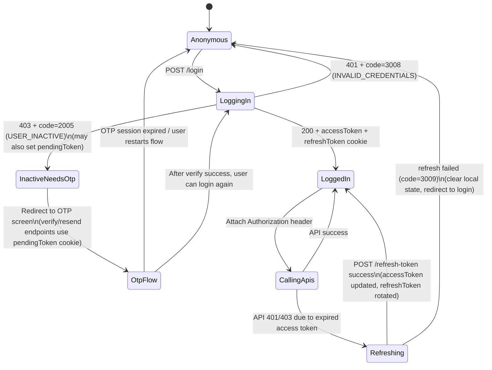
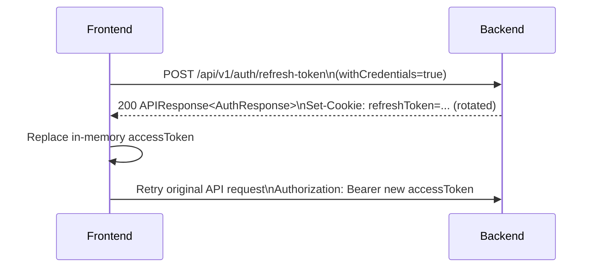
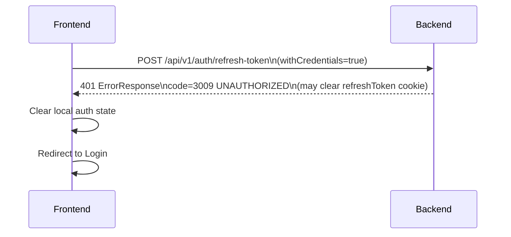

# FE API Contract - Login + Refresh Token

## 1. Scope
This document covers only:
- `POST /api/v1/auth/login`
- `POST /api/v1/auth/refresh-token`

No register/verify/resend OTP is included here.

## 2. Base
- Base path: `/api/v1/auth`
- Content type: `application/json`
- FE must call with credentials included:
  - `fetch`: `credentials: "include"`
  - `axios`: `withCredentials: true`

Reason:
- Server sets HttpOnly cookie `refreshToken` on login and rotates it on refresh.
- In the special case of inactive user login, server may also set HttpOnly cookie `pendingToken` to continue OTP flow.

## 3. Cookie Contract

### 3.1 `refreshToken` cookie
Server sets cookie:
- Name: `refreshToken`
- `HttpOnly: true`
- `Secure: true`
- `Path: /`
- `Max-Age: 604800` seconds (7 days)

Important behavior:
- On `POST /refresh-token`, server **rotates** refresh token:
  - sets a new `refreshToken` cookie
  - updates Redis value for this user
- On refresh failure, server usually clears the cookie (`Max-Age=0`).

### 3.2 Related OTP cookie (`pendingToken`) on inactive login
If login is attempted for an inactive account, server returns error `2005 USER_INACTIVE`,
but may also:
- generate/renew OTP state (depending on cooldown/attempt rules)
- set/renew cookie `pendingToken` (used by OTP endpoints)

FE should treat `USER_INACTIVE` as a signal to redirect user to OTP verification UI.

### 3.3 Local dev note (HTTPS)
Because cookies are set with `Secure=true`, browsers only attach them over HTTPS.
If FE/BE are running on plain HTTP, cookie-based flows can fail in browser:
- `refreshToken` not attached → refresh fails
- `pendingToken` not attached → OTP flow fails

## 4. Response Format

### 4.1 Success format
Endpoints return wrapper `APIResponse`:

```json
{
  "code": 1000,
  "message": "Success",
  "data": {}
}
```

### 4.2 Error format
Business/validation errors return `ErrorResponse`:

```json
{
  "status": 401,
  "code": 3008,
  "message": "Invalid credentials",
  "errors": null,
  "timestamp": "2026-04-25T13:00:00Z"
}
```

Validation error example:

```json
{
  "status": 400,
  "code": null,
  "message": "Validation failed",
  "errors": {
    "email": [
      "Invalid email format"
    ]
  },
  "timestamp": "2026-04-25T13:00:00Z"
}
```

## 5. Auth Model Used by FE

### 5.1 Access token (Bearer)
- Access token is returned in response body (`data.accessToken`).
- FE must attach it to protected API calls:
  - Header: `Authorization: Bearer <accessToken>`

### 5.2 Refresh token (HttpOnly cookie)
- Refresh token is **not** in response body.
- It is stored in HttpOnly cookie `refreshToken`, so FE JS cannot read it.
- FE must call refresh endpoint with credentials included to let browser attach the cookie.

## 6. Endpoint Details

## 6.1 `POST /login`
Authenticate by email + password.

Request body:

```json
{
  "email": "john@example.com",
  "password": "12345678"
}
```

Validation rules:
- `email`: not blank, valid email
- `password`: not blank, min 8

Success:
- Returns `APIResponse.success(data)` where `data` is `AuthResponse`
- Sets `refreshToken` cookie

Success response example:

```json
{
  "code": 1000,
  "message": "Success",
  "data": {
    "username": "john_doe",
    "roles": [
      { "id": 1, "name": "USER" }
    ],
    "accessToken": "eyJhbGciOiJIUzI1NiIsInR5cCI6IkpXVCJ9..."
  }
}
```

Notes about `roles`:
- Response contains `Set<Role> roles` from backend.
- Each role object is serialized from `Role` entity:
  - `id`: number
  - `name`: enum string (`USER`, `ADMIN`)

Main error codes:
- `3008 INVALID_CREDENTIALS` (wrong email/password)
- `2005 USER_INACTIVE` (account not activated yet)
  - Server may also set/renew `pendingToken` cookie and send/renew OTP state
- `2007 ACCOUNT_BANNED` (deleted/banned)
- `3001 UNAUTHENTICATED` (other authentication failures)
- Validation codes (`1001`, `1003`, `1006`)
- `2001 USER_NOT_FOUND` (edge case; depends on data consistency)

## 6.2 `POST /refresh-token`
Issue a new access token using refresh token cookie.

Request:
- Body: none
- Cookie required: `refreshToken`

Success:
- Returns `APIResponse.success(data)` where `data` is `AuthResponse`
- Rotates refresh token cookie (`refreshToken` is replaced)

Success response example:

```json
{
  "code": 1000,
  "message": "Success",
  "data": {
    "username": "john_doe",
    "roles": [
      { "id": 1, "name": "USER" }
    ],
    "accessToken": "eyJhbGciOiJIUzI1NiIsInR5cCI6IkpXVCJ9..."
  }
}
```

Main error codes:
- `3009 UNAUTHORIZED`
  - missing refresh cookie
  - refresh token invalid/expired/malformed
  - refresh token does not match stored value in Redis (token reuse / rotated token)
  - server clears refresh cookie on these failures
- `2007 ACCOUNT_BANNED`
- `2005 USER_INACTIVE`
- `2001 USER_NOT_FOUND`

## 7. FE Handling Suggestions

## 7.0 FE-friendly Auth State Machine (Recommended)

This backend uses a **hybrid model**:
- Access token: FE-managed (in memory) and sent via `Authorization: Bearer ...`
- Refresh token: server-managed (HttpOnly cookie) and used via `POST /refresh-token`
- OTP activation session (inactive login/register): server-managed (HttpOnly `pendingToken` cookie)

### 7.0.1 State diagram



### 7.0.2 Practical rule of thumb for FE
- If you have an `accessToken` in memory → treat user as **LoggedIn**.
- If you don't have `accessToken`, but you still have a valid `refreshToken` cookie → you can recover session by calling refresh.
- If refresh fails with `3009 UNAUTHORIZED` → session is **not recoverable**, go to login.
- If login fails with `2005 USER_INACTIVE` → go to OTP screen (cookie `pendingToken` is the server “handle” for that session).

### 7.1 Login success
- Save `accessToken` in memory (recommended) or in a safe storage.
- Treat `refreshToken` as cookie-managed; do not attempt to read it in JS.
- Begin calling protected APIs with `Authorization: Bearer <accessToken>`.

### 7.2 `2005 USER_INACTIVE` on login
Server uses `USER_INACTIVE` to force OTP activation flow.
Recommended FE behavior:
- Navigate to OTP screen immediately.
- Keep calling OTP endpoints with credentials included (cookie `pendingToken`).

### 7.3 Refresh strategy
- On app start (or when API returns 401), call `POST /api/v1/auth/refresh-token`.
- If refresh succeeds: replace in-memory access token with the new one.
- If refresh fails with `3009 UNAUTHORIZED`: clear local auth state and redirect to login.

### 7.4 Avoid refresh loops (Must)
Recommended FE policy:
- Only allow **one** refresh request in-flight at a time.
- Queue/retry failed API calls after refresh succeeds.
- If refresh fails → reject queued requests and redirect to login.
- Never call refresh endpoint when the failing request itself is `/refresh-token` (prevent infinite loop).

### 7.5 Concurrency expectations (Refresh Token Rotation)
The backend **rotates** refresh token on every successful refresh.
This implies the following FE expectations:
- If multiple requests trigger refresh at nearly the same time, **only one refresh should be allowed in-flight**.
- If two refresh requests do happen concurrently, one may succeed and the other may fail with `3009 UNAUTHORIZED`
  because the refresh token was rotated and the older token no longer matches Redis.
- FE must treat **any non-200 refresh response as terminal failure** for the current session:
  - clear local auth state
  - redirect to login
  - do not retry refresh in a tight loop

## 9. Sequence Diagrams (Implementation-ready)

### 9.1 Login success

```mermaid
sequenceDiagram
  participant FE as Frontend
  participant BE as Backend

  FE->>BE: POST /api/v1/auth/login (email, password)\n(withCredentials=true)
  BE-->>FE: 200 APIResponse<AuthResponse>\nSet-Cookie: refreshToken=...; HttpOnly; Secure
  FE->>FE: Store accessToken in memory
  FE->>BE: Call protected APIs\nAuthorization: Bearer accessToken
```

### 9.2 Login with inactive account (OTP continuation)

```mermaid
sequenceDiagram
  participant FE as Frontend
  participant BE as Backend

  FE->>BE: POST /api/v1/auth/login (email, password)\n(withCredentials=true)
  BE-->>FE: 403 ErrorResponse\ncode=2005 USER_INACTIVE\n(may Set-Cookie: pendingToken=...; HttpOnly; Secure)
  FE->>FE: Redirect to OTP screen
  FE->>BE: POST /api/v1/auth/verify-otp (otp)\n(withCredentials=true)
  BE-->>FE: 200 APIResponse.success()\n(clears pendingToken on success)
  FE->>FE: Redirect to Login screen (or auto-login if FE chooses)
```

### 9.3 Refresh token success (rotate cookie)



### 9.4 Refresh token failure (session expired)




## 8. Recommended Popup Messages
Use these as default popup/toast messages per error code:

- `3008 INVALID_CREDENTIALS`
  - Popup title: `Login failed`
  - Popup message: `Email or password is incorrect.`

- `2005 USER_INACTIVE`
  - Popup title: `Account not activated`
  - Popup message: `Please verify OTP to activate your account.`

- `2007 ACCOUNT_BANNED`
  - Popup title: `Account unavailable`
  - Popup message: `This account is banned. Please contact support.`

- `3009 UNAUTHORIZED` (refresh)
  - Popup title: `Session expired`
  - Popup message: `Your session has expired. Please log in again.`

- `1001/1003/1006` (validation)
  - Popup title: `Invalid input`
  - Popup message: `Please review your input and try again.`

