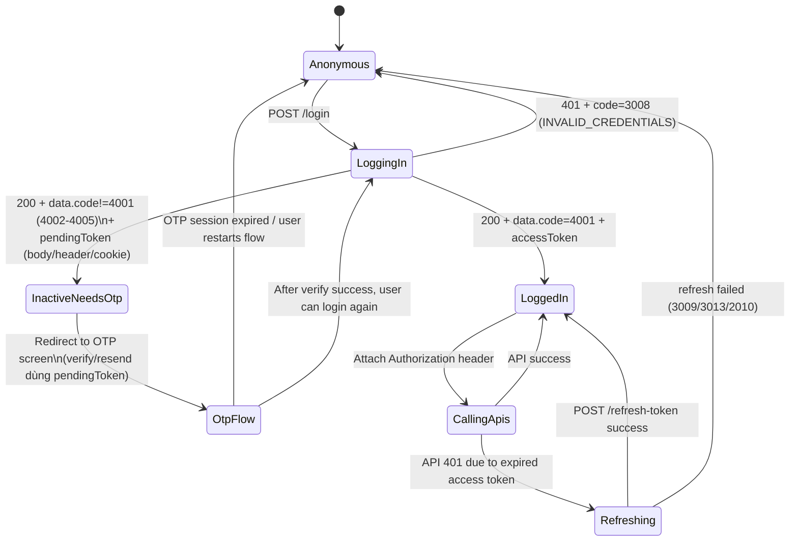
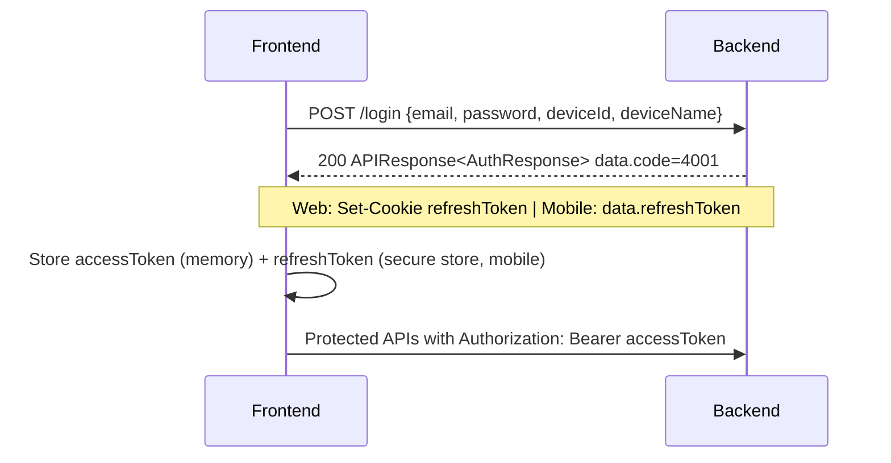
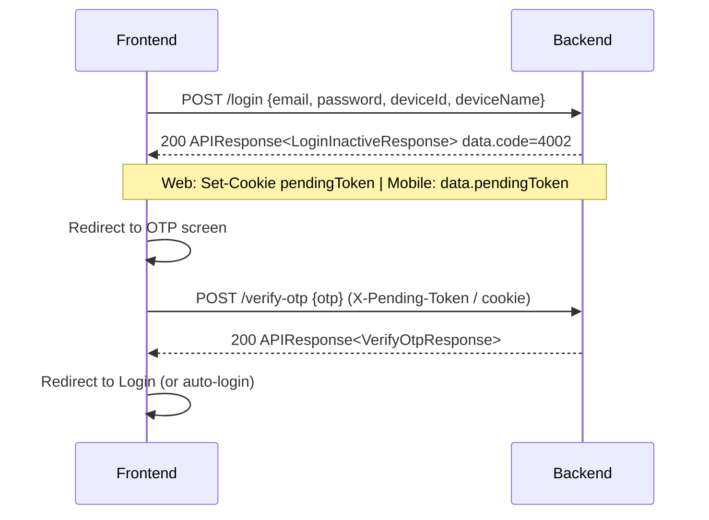
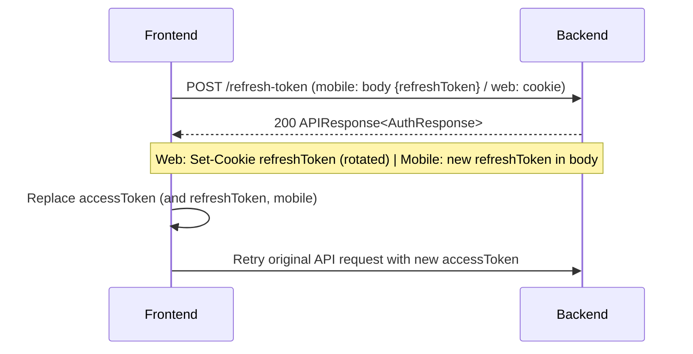
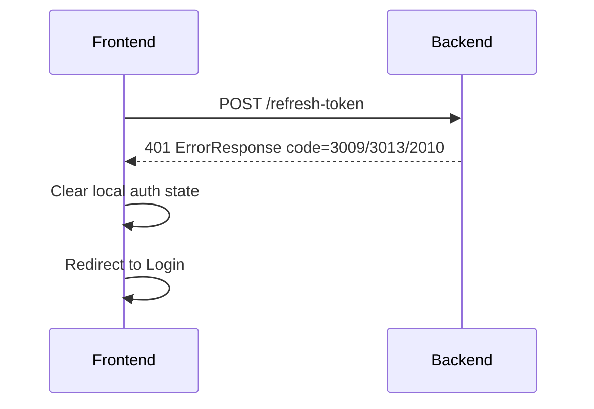

# FE API Contract - Login + Refresh Token

> **Cập nhật 2026-08-06:** Contract viết lại theo **dual-mode** hiện tại — Web dùng cookie HttpOnly, Mobile dùng body JSON + header `X-Pending-Token`. Đối chiếu trực tiếp với `AuthController`, `LoginRequest`, `AuthResponse`, `LoginInactiveResponse`.

## 1. Scope
This document covers only:
- `POST /api/v1/auth/login`
- `POST /api/v1/auth/refresh-token`

No register/verify/resend OTP is included here (xem `03-register-otp.md`).

## 2. Base
- Base path: `/api/v1/auth`
- Content type: `application/json`

### 2.1 Dual-mode (quan trọng — phân biệt Web vs Mobile)

| | Web (React SPA) | Mobile (React Native) |
|---|---|---|
| **refreshToken** | Cookie HttpOnly `refreshToken` — FE không đọc được, browser tự gửi | **Trả trong body** `data.refreshToken` — app lưu vào secure store |
| **Gửi refreshToken khi refresh/logout** | Cookie tự động | **Body JSON `{ "refreshToken": "..." }`** |
| **pendingToken (OTP)** | Cookie HttpOnly `pendingToken` | **Header `X-Pending-Token: <token>`** |
| **withCredentials / credentials** | `fetch: credentials:"include"` / `axios: withCredentials:true` | Không cần (không dùng cookie) |

> ⚠️ Đây là điểm khác biệt lớn nhất so với version doc cũ (chỉ mô tả cookie). Server chấp nhận **cả 2 cách** cho cùng endpoint — nhận body trước, nếu không có thì fallback cookie.

## 3. Cookie Contract (CHỈ áp dụng cho Web)

### 3.1 `refreshToken` cookie
Server sets cookie:
- Name: `refreshToken`
- `HttpOnly: true`
- `Secure: true`
- `Path: /`
- `Max-Age: 604800` seconds (7 days)

Important behavior:
- On `POST /refresh-token`, server **rotates** refresh token:
  - sets a new `refreshToken` cookie
  - updates Redis value for this user
- On refresh failure, server usually clears the cookie (`Max-Age=0`).

### 3.2 Related OTP cookie (`pendingToken`) on inactive login
Khi login tài khoản chưa active, server trả **HTTP 200** kèm `data.code = 4002/4003/4004/4005` (xem §6.1) và:
- Web: set/renew cookie `pendingToken`
- Mobile: trả `data.pendingToken` trong body — app dùng header `X-Pending-Token` cho các request OTP tiếp theo

### 3.3 Local dev note (HTTPS)
Cookies có `Secure=true` → browser chỉ gửi qua HTTPS. Nếu FE/BE chạy plain HTTP, cookie-based flow (web) có thể fail — mobile không bị ảnh hưởng vì không dùng cookie.

## 4. Response Format

### 4.1 Success format
Endpoints return wrapper `APIResponse`:

```json
{
  "code": 1000,
  "message": "Success",
  "data": {}
}
```

### 4.2 Error format
Business/validation errors return `ErrorResponse`:

```json
{
  "status": 401,
  "code": 3008,
  "message": "Invalid credentials",
  "errors": null,
  "timestamp": "2026-04-25T13:00:00Z"
}
```

Validation error example:

```json
{
  "status": 400,
  "code": null,
  "message": "Validation failed",
  "errors": {
    "email": [
      "Invalid email format"
    ]
  },
  "timestamp": "2026-04-25T13:00:00Z"
}
```

## 5. Auth Model Used by FE

### 5.1 Access token (Bearer)
- Access token is returned in response body (`data.accessToken`).
- FE must attach it to protected API calls:
  - Header: `Authorization: Bearer <accessToken>`
- Cả web lẫn mobile đều làm như nhau.

### 5.2 Refresh token — KHÁC NHAU giữa Web và Mobile
- **Web:** HttpOnly cookie `refreshToken` — FE JS không đọc được, browser tự đính kèm.
- **Mobile:** Trả trong body `data.refreshToken` — app lưu vào secure store, gửi lại trong body khi refresh/logout.
- Cả 2 cách đều được server chấp nhận (dual-mode).

## 6. Endpoint Details

## 6.1 `POST /login`
Authenticate by email + password.

Request body:

```json
{
  "email": "john@example.com",
  "password": "12345678",
  "deviceId": "550e8400-e29b-41d4-a716-446655440000",
  "deviceName": "iPhone 15 / Android Emulator / Postman"
}
```

Validation rules (từ `LoginRequest`):
- `email`: not blank, valid email, max 254
- `password`: not blank, min 8, max 1000
- `deviceId`: **bắt buộc** (`@NotNull`), UUID — định danh thiết bị, server lưu vào session
- `deviceName`: not blank, max 100 — tên thiết bị hiển thị trong danh sách session

Success (tài khoản ACTIVE):
- HTTP `200`, `APIResponse<AuthResponse>`
- Web: server set `refreshToken` cookie; Mobile: `data.refreshToken` có giá trị

```json
{
  "code": 1000,
  "message": "Success",
  "data": {
    "code": 4001,
    "id": 1,
    "username": "john_doe",
    "roles": [ { "id": 1, "name": "USER" } ],
    "accessToken": "eyJhbGciOiJIUzUxMiJ9...",
    "refreshToken": "eyJhbGciOiJIUzUxMiJ9...",
    "hasPassword": true
  }
}
```

Giải thích field `data` (từ `AuthResponse`):
- `code`: SuccessCode `4001 LOGIN_SUCCESS`
- `id`: user id
- `username`: username
- `roles`: `[{ id, name }]` — `name` là enum (`USER`, `COMPANY`, `ADMIN`)
- `accessToken`: dùng cho `Authorization: Bearer`
- `refreshToken`: **`null` với web** (dùng cookie), **có giá trị với mobile**
- `hasPassword`: user đã có mật khẩu cũ chưa — `false` với user Google (`password = null`). FE dựa vào đây để hiện form "đổi mật khẩu" (3 field) hay "đặt mật khẩu lần đầu" (2 field)

### 6.1.1 Login tài khoản CHƯA ACTIVE — KHÔNG phải lỗi HTTP nữa

> 🔄 **Thay đổi so với doc cũ:** trước đây trả `403 + code 2005 USER_INACTIVE`. Hiện tại trả **HTTP 200** với `data` là `LoginInactiveResponse`:

```json
{
  "code": 1000,
  "message": "Success",
  "data": {
    "code": 4002,
    "message": "Account inactive, OTP sent for verification",
    "otpExpiresIn": 300,
    "cooldownRemaining": 0,
    "wrongRemaining": 5,
    "attemptsTTL": 600,
    "pendingToken": "eyJhbGciOiJIUzUxMiJ9..."   // null với web (dùng cookie)
  }
}
```

- `data.code` ∈ {4002, 4003, 4004, 4005} (SuccessCode login-inactive) — **khác 4001 là inactive**
- Cách FE phát hiện: `data.code !== 4001` hoặc tồn tại `data.pendingToken`
- FE redirect sang màn verify OTP, dùng `pendingToken` (header mobile / cookie web) cho các request OTP

Main error codes (login):
- `3008 INVALID_CREDENTIALS` (sai email/password)
- `2007 ACCOUNT_BANNED` (deleted/banned)
- `3011 INVALID_DEVICE_ID` (deviceId sai format)
- Validation codes: `1001` (blank), `1003` (email), `1006` (password)
- `2001 USER_NOT_FOUND` (edge case)

## 6.2 `POST /refresh-token`
Issue a new access token.

Request:
- **Mobile:** body `{ "refreshToken": "..." }`
- **Web:** cookie `refreshToken` (body rỗng)
- Server ưu tiên body, nếu không có → fallback cookie.

```json
{
  "refreshToken": "eyJhbGciOiJIUzUxMiJ9..."
}
```

Success:
- Returns `APIResponse<AuthResponse>` (cùng shape như login — có `hasPassword`, `refreshToken` null với web / mới với mobile)
- **Rotates** refresh token (cookie web được thay mới / mobile nhận refreshToken mới trong body)

```json
{
  "code": 1000,
  "message": "Success",
  "data": {
    "code": 4001,
    "id": 1,
    "username": "john_doe",
    "roles": [ { "id": 1, "name": "USER" } ],
    "accessToken": "eyJhbGciOiJIUzUxMiJ9...",
    "refreshToken": "eyJhbGciOiJIUzUxMiJ9...",
    "hasPassword": true
  }
}
```

Main error codes:
- `3009 UNAUTHORIZED` — thiếu/sai/expired/malformed refresh token (server clear cookie nếu web)
- `3013 TOKEN_REUSE_DETECTED` — token đã bị dùng (rotation)
- `2010 TOKEN_REVOKED` — token đã revoke (logout)
- `3012 SESSION_INACTIVE` — session hết hạn
- `2007 ACCOUNT_BANNED`, `2001 USER_NOT_FOUND`

## 7. FE Handling Suggestions

## 7.0 FE-friendly Auth State Machine (Recommended)

Backend dùng **hybrid model**:
- Access token: FE-managed (memory) + `Authorization: Bearer`
- Refresh token: web = HttpOnly cookie; mobile = secure store (body khi refresh)
- OTP activation session: web = `pendingToken` cookie; mobile = `X-Pending-Token` header

### 7.0.1 State diagram



### 7.0.2 Practical rule of thumb for FE
- Có `accessToken` trong memory → **LoggedIn**.
- Chưa có accessToken nhưng còn `refreshToken` (cookie web / secure store mobile) → gọi refresh để phục hồi session.
- Refresh fail với `3009` → session không phục hồi được → về login.
- Login trả `data.code` khác `4001` → **inactive**, sang màn OTP.

### 7.1 Login success
- Lưu `accessToken` (memory), `hasPassword` (để quyết định UI đổi mật khẩu).
- Web: không đọc `refreshToken` cookie. Mobile: lưu `data.refreshToken` vào secure store.

### 7.2 `data.code != 4001` (inactive) on login
- Navigate sang màn OTP ngay.
- Mobile: dùng `data.pendingToken` đặt vào header `X-Pending-Token`. Web: dùng cookie.

### 7.3 Refresh strategy
- App start / API trả 401 → gọi `POST /refresh-token` (mobile gửi body, web để cookie).
- Refresh thành công → thay accessToken mới (và refreshToken mới — mobile).
- Refresh fail → clear auth state, về login.

### 7.4 Avoid refresh loops (Must)
- Chỉ cho **1** refresh in-flight cùng lúc (queue các request còn lại).
- Refresh thành công → resolve queue với token mới; thất bại → reject + về login.
- Không bao giờ gọi refresh khi chính request fail đó là `/refresh-token`.

### 7.5 Concurrency expectations (Refresh Token Rotation)
- Backend **rotate** refresh token mỗi lần refresh thành công.
- 2 refresh đồng thời → 1 thành công, 1 fail (`3013 TOKEN_REUSE_DETECTED`) vì token cũ không còn khớp Redis.
- FE xử lý mọi refresh non-200 là **terminal**: clear state + về login, không retry loop.

## 9. Sequence Diagrams (Implementation-ready)

### 9.1 Login success



### 9.2 Login with inactive account (OTP continuation)



### 9.3 Refresh token success (rotation)



### 9.4 Refresh token failure (session expired)



## 8. Recommended Popup Messages
Use these as default popup/toast messages per error code:

- `3008 INVALID_CREDENTIALS`
  - Popup title: `Login failed`
  - Popup message: `Email or password is incorrect.`

- `data.code != 4001` khi login (4002–4005, inactive)
  - Popup title: `Account not activated`
  - Popup message: `Please verify OTP to activate your account.`

- `2007 ACCOUNT_BANNED`
  - Popup title: `Account unavailable`
  - Popup message: `This account is banned. Please contact support.`

- `3009 UNAUTHORIZED` / `3013 TOKEN_REUSE_DETECTED` / `2010 TOKEN_REVOKED` (refresh)
  - Popup title: `Session expired`
  - Popup message: `Your session has expired. Please log in again.`

- `1001/1003/1006` (validation)
  - Popup title: `Invalid input`
  - Popup message: `Please review your input and try again.`
