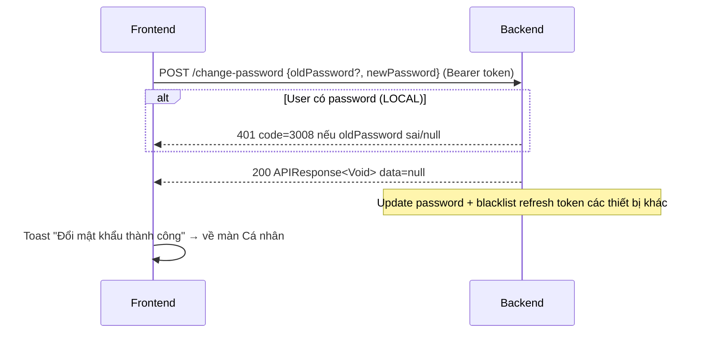

# FE API Contract - Change Password (Đổi / Đặt mật khẩu)

> **Cập nhật 2026-08-06:** Contract viết theo code hiện tại (`AuthController.changePassword` + `AuthServiceImplement.changePassword`). Điểm mấu chốt: endpoint này **kiêm luôn vai trò "đặt mật khẩu lần đầu"** cho user đăng ký bằng Google (password = NULL).

## 1. Overview

- **Endpoint:** `POST /api/v1/auth/change-password`
- **Base path:** `/api/v1/auth`
- **Content type:** `application/json`
- **Auth:** **BẮT BUỘC phải đăng nhập** (`@PreAuthorize("isAuthenticated()")`) — gửi `Authorization: Bearer <accessToken>`

### Hành vi theo loại user

| Loại user | `password` trong DB | Hành vi |
|---|---|---|
| Đăng ký bằng email/password (LOCAL) | Có hash | **Phải nhập đúng mật khẩu cũ** → sai thì lỗi `3008` |
| Đăng ký bằng Google (GOOGLE) | `NULL` | **Bỏ qua check mật khẩu cũ** → endpoint trở thành "đặt mật khẩu lần đầu" |

> FE phát hiện loại user qua field `hasPassword` trong response login/refresh (`true` = LOCAL, `false` = Google). Dựa vào đó hiện **3 field** (mật khẩu cũ + mới + nhập lại) hay **2 field** (mới + nhập lại).

## 2. Request

```json
{
  "oldPassword": "old-password-123",   // OPTIONAL — null/rỗng hợp lệ với user Google
  "newPassword": "new-password-456"    // BẮT BUỘC
}
```

Validation rules (từ `ChangePasswordRequest`):

| Field | Rule | Error code |
|---|---|---|
| `oldPassword` | **Không còn `@NotBlank`** — chỉ `@Size(max = 72)`. null/rỗng là hợp lệ; service tự quyết định | — |
| `newPassword` | `@NotBlank` + `@Size(min = 8, max = 72)` | `1001 BLANK_FIELD` / `1006 INVALID_PASSWORD` |

## 3. Response

### 3.1 Success

- HTTP `200`, body rỗng data:

```json
{
  "code": 1000,
  "message": "Success",
  "data": null
}
```

### 3.2 Error

| HTTP | `code` | Ý nghĩa |
|---|---|---|
| 401 | `3001 UNAUTHENTICATED` | Chưa đăng nhập / token hết hạn (refresh-token interceptor xử lý) |
| 401 | `3008 INVALID_CREDENTIALS` | **User có mật khẩu cũ nhưng nhập sai** (hoặc bỏ trống) |
| 400 | `1001` / `1006` | `newPassword` blank / sai format |

Error body (chuẩn `ErrorResponse`):

```json
{
  "status": 401,
  "code": 3008,
  "message": "Invalid credentials",
  "errors": null,
  "timestamp": "2026-08-06T12:00:00Z"
}
```

## 4. Logic phía backend (để FE hiểu quy ước)

1. `hasPassword = (userDetails.getPassword() != null)` — lấy từ SecurityContext, **không query DB lại**
2. Nếu `hasPassword`:
   - `oldPassword` null/rỗng **hoặc** `passwordEncoder.matches(oldPassword, hash)` sai → ném `3008 INVALID_CREDENTIALS`
   - (Guard này cố ý: user LOCAL không được bỏ trống mật khẩu cũ)
3. Nếu **không** `hasPassword` (Google) → bỏ qua bước 2
4. Update password mới (JPQL `updatePassword`, không load entity) — lúc này user Google **bắt đầu có** mật khẩu, lần sau đổi phải nhập mật khẩu cũ
5. **`forceLogoutOtherDevices`**: thu hồi mọi session của **các thiết bị khác** (trừ thiết bị đang gọi). Access token cũ vẫn sống tới hết hạn (JWT stateless) nhưng refresh token bị blacklist ngay → không refresh được → buộc đăng nhập lại

> ⚠️ **Lưu ý FE:** sau khi đổi mật khẩu thành công, các session thiết bị khác sẽ mất — đây là hành vi **có chủ đích** (bảo mật), không phải lỗi.

## 5. FE Handling Suggestions

- Gọi xong thành công → thông báo "Đổi mật khẩu thành công" → **điều hướng về màn Cá nhân** (không cần đăng nhập lại ở thiết bị hiện tại).
- Lỗi `3008` → giữ nguyên form, hiện "Mật khẩu cũ không đúng".
- Lỗi `1006` → hiện "Mật khẩu mới phải tối thiểu 8 ký tự".
- Sau khi đổi, nên cập nhật `hasPassword = true` trong state local (nếu có lưu) để lần sau hiện đúng 3 field.

## 6. Sequence


