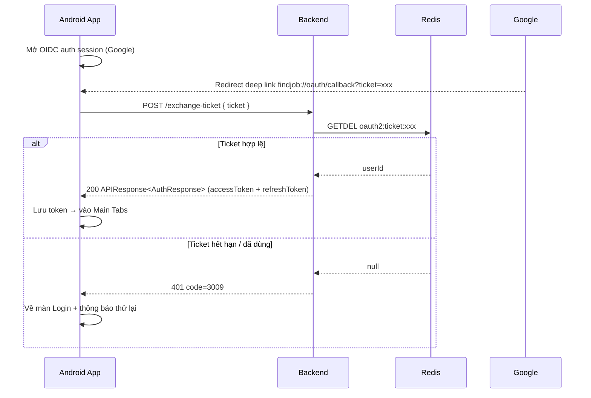

# FE API Contract - Exchange Ticket (OIDC Mobile Login)

> **Cập nhật 2026-08-06:** Contract viết theo code hiện tại (`AuthController.exchangeTicket` + `AuthServiceImplement.exchangeTicket` + `OidcLoginSuccessHandler`). Đây là endpoint **mobile-only** dùng trong flow OIDC để đổi one-time ticket lấy JWT.

## 1. Overview

- **Endpoint:** `POST /api/v1/auth/exchange-ticket`
- **Base path:** `/api/v1/auth`
- **Content type:** `application/json`
- **Auth:** **KHÔNG cần** (ticket chính là credential)

### Flow tổng quan (Backend → Frontend)

```
Google login success (OIDC)
      ↓
OidcLoginSuccessHandler tạo ticket = UUID.randomUUID()
      ↓
Lưu Redis: "oauth2:ticket:<uuid>" → userId  (TTL 60s)
      ↓
Redirect về deep link: findjob://oauth/callback?ticket=<uuid>
      ↓
App mobile gọi: POST /api/v1/auth/exchange-ticket { "ticket": "<uuid>" }
      ↓
Backend GETDEL ticket → lấy userId → tạo session + JWT (access + refresh)
```

> Endpoint này thay thế `POST /google-login` (**DEPRECATED** — sắp bị Google shutdown, không hỗ trợ PKCE).

## 2. Request

```json
{
  "ticket": "6f1e2d3c-8a4b-4c5d-9e0f-123456789abc"
}
```

Validation rules (từ `ExchangeTicketRequest`):

| Field | Rule | Error code |
|---|---|---|
| `ticket` | `@NotBlank` + `@Size(min = 1, max = 200)` | `1001 BLANK_FIELD` / `1002 OUT_OF_SIZE` |

## 3. Response

### 3.1 Success

- HTTP `200`, `APIResponse<AuthResponse>` — **cùng shape với login**:

```json
{
  "code": 1000,
  "message": "Success",
  "data": {
    "code": 4001,
    "id": 5,
    "username": "username_nhuan_123",
    "roles": [ { "id": 3, "name": "COMPANY" } ],
    "accessToken": "eyJhbGciOiJIUzUxMiJ9...",
    "refreshToken": "eyJhbGciOiJIUzUxMiJ9...",
    "hasPassword": false
  }
}
```

Giải thích field đặc thù của flow này:
- `refreshToken`: **luôn có giá trị** (mobile không dùng cookie) — app lưu vào secure store
- `hasPassword`: `false` với user vừa tạo từ Google (password = NULL) — FE hiện form "đặt mật khẩu lần đầu" (2 field)
- Server tự sinh `deviceId` (UUID) + `deviceName = "Google Login"` — **mobile không cần gửi** deviceId/deviceName (khác với login thường)

### 3.2 Error

| HTTP | `code` | Ý nghĩa |
|---|---|---|
| 401 | `3009 UNAUTHORIZED` | Ticket không tồn tại / hết hạn (TTL 60s) / **đã dùng rồi** (single-use) |
| 400 | `1001` / `1002` | `ticket` blank / quá 200 ký tự |

```json
{
  "status": 401,
  "code": 3009,
  "message": "Unauthorized",
  "errors": null,
  "timestamp": "2026-08-06T12:00:00Z"
}
```

## 4. Logic phía backend

1. `redisKey = Oauth2Constant.TICKET_PREFIX + ticket` — prefix `"oauth2:ticket:"` định nghĩa trong `common/constant/Oauth2Constant`
2. **Atomic `GETDEL`** (`getAndDelete`) — đọc + xoá trong 1 lệnh → **chỉ 1 request dùng được ticket** (chống replay): 2 request song song cùng ticket → chỉ 1 thành công, 1 lỗi `3009`
3. `userIdStr` null/blank hoặc parse số thất bại → `3009 UNAUTHORIZED`
4. Sinh `deviceId` (UUID mới) + `deviceName = "Google Login"` → gọi chung `createUserSession()` (giống login thường/OIDC): tạo session Redis + access token + refresh token, **set cookie `refreshToken`** (chỉ web cần, mobile bỏ qua)

### Bảo mật ticket (từ `OidcLoginSuccessHandler`)

- **One-time:** GETDEL → dùng đúng 1 lần
- **TTL 60 giây:** tự hủy nhanh, hạn chế cửa sổ tấn công
- **Không log nguyên ticket:** chỉ log 8 ký tự đầu
- **Redirect có whitelist scheme** (VD `findjob://`) → chặn open redirect

## 5. FE Handling Suggestions (Android)

1. Nhận deep link `findjob://oauth/callback?ticket=xxx` (hoặc `error=3008` nếu Google login fail) → parse `ticket`
2. Gọi `POST /exchange-ticket { ticket }` **ngay lập tức** (ticket sống 60s)
3. Thành công → lưu `accessToken` (memory) + `refreshToken` (secure store) → navigate vào Main Tabs
4. Lỗi `3009` → ticket hết hạn/đã dùng → quay lại màn Login, báo "Phiên đăng nhập Google đã hết hạn, thử lại"

## 6. Sequence


