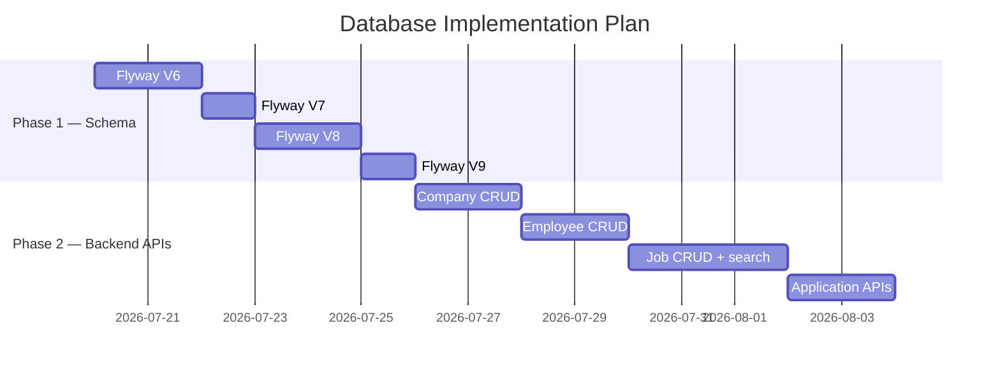

# 🗄️ Database Design — FINDJOB Platform

> **Ý tưởng thiết kế CSDL cho nền tảng tìm kiếm việc làm IT**
> Dựa trên schema cũ (PostgreSQL dump) + phân tích từ dự án hiện tại
> Ngày: 2026-07-18

---

## 📐 Triết lý thiết kế

1. **Kế thừa từ project hiện tại**: Giữ nguyên `users`, `roles`, `user_role` đã có sẵn.
2. **Phân biệt rõ User vs Company bằng Role**: Khi đăng ký, user chọn 1 trong 2:
   - **🧑‍💻 "Tôi là Ứng viên"** → role `ROLE_USER` → có hồ sơ `employees`
   - **🏢 "Tôi là Công ty"** → role `ROLE_COMPANY` → có hồ sơ `companies`
3. **User Company = Đại diện công ty**: 1 user COMPANY sở hữu 1 company, tự đăng job, tự xử lý applications. Không cần bảng `recruiters` riêng.
4. **Không cần duyệt**: Cả company lẫn job đều được tạo tự do, không qua admin.
5. **JSONB cho profile dữ liệu biến động**: Skills, experiences, education lưu JSONB — AI-friendly, ít JOIN.

---

## 🧩 1. Core Auth — Giữ nguyên + thêm ROLE_COMPANY

```sql
-- ============================================
-- KHÔNG THAY ĐỔI — đã có sẵn từ project
-- ============================================

CREATE TABLE users (
    id              BIGSERIAL       PRIMARY KEY,
    username        VARCHAR(255)    NOT NULL UNIQUE,
    email           VARCHAR(255)    NOT NULL UNIQUE,
    password        VARCHAR(255)    NOT NULL,
    full_name       VARCHAR(100),
    is_active       BOOLEAN         NOT NULL DEFAULT false,
    is_deleted      BOOLEAN         NOT NULL DEFAULT false,
    auth_provider   VARCHAR(20)     NOT NULL DEFAULT 'LOCAL',   -- LOCAL / GOOGLE / GITHUB
    social_id       VARCHAR(200),
    avatar_url      VARCHAR(500),
    created_at      TIMESTAMPTZ     NOT NULL DEFAULT now(),
    updated_at      TIMESTAMPTZ     NOT NULL DEFAULT now()
);

CREATE TABLE roles (
    id              BIGSERIAL       PRIMARY KEY,
    name            VARCHAR(50)     NOT NULL UNIQUE
);

CREATE TABLE user_role (
    user_id         BIGINT          NOT NULL REFERENCES users(id) ON DELETE CASCADE,
    role_id         BIGINT          NOT NULL REFERENCES roles(id) ON DELETE CASCADE,
    PRIMARY KEY (user_id, role_id)
);
```

```sql
-- ============================================
-- THÊM — seed roles mới
-- ============================================

INSERT INTO roles (name) VALUES ('ROLE_USER');      -- Ứng viên
INSERT INTO roles (name) VALUES ('ROLE_COMPANY');   -- Công ty / Nhà tuyển dụng
INSERT INTO roles (name) VALUES ('ROLE_ADMIN');     -- Admin (nếu cần)
```

---

## 👤 2. Employee — Hồ sơ ứng viên

```sql
-- ============================================
-- EMPLOYEES — Dành cho user có role ROLE_USER
-- Lưu skills, experiences, education dạng JSONB
-- ============================================

CREATE TABLE employees (
    id              BIGSERIAL       PRIMARY KEY,
    user_id         BIGINT          NOT NULL UNIQUE REFERENCES users(id),

    -- Thông tin cơ bản
    phone           VARCHAR(20),
    date_of_birth   DATE,
    gender          VARCHAR(10),                                 -- MALE / FEMALE / OTHER

    -- Địa chỉ
    city            VARCHAR(100),                                -- "Hồ Chí Minh", "Hà Nội"
    address         VARCHAR(500),

    -- CV & Portfolio
    cv_url          VARCHAR(500),                                -- Cloudinary URL
    github_url      VARCHAR(255),
    linkedin_url    VARCHAR(255),
    portfolio_url   VARCHAR(255),

    -- Trạng thái
    is_public       BOOLEAN         DEFAULT true,                -- Cho phép company tìm thấy
    is_open_to_work BOOLEAN         DEFAULT false,               -- Đang tìm việc
    title           VARCHAR(255),                                -- "Senior Java Developer"
    bio             TEXT,

    -- JSONB data
    skills          JSONB           DEFAULT '[]'::jsonb,         -- ["Java", "Spring Boot", "React"]
    experiences     JSONB           DEFAULT '[]'::jsonb,         -- [{ company, title, startDate, endDate, description, isCurrent }]
    education       JSONB           DEFAULT '[]'::jsonb,         -- [{ school, degree, major, gpa, startDate, endDate }]

    created_at      TIMESTAMPTZ     NOT NULL DEFAULT now(),
    updated_at      TIMESTAMPTZ     NOT NULL DEFAULT now()
);

-- GIN index cho search JSONB
CREATE INDEX idx_employee_skills ON employees USING GIN(skills);
CREATE INDEX idx_employee_experiences ON employees USING GIN(experiences);
CREATE INDEX idx_employee_title ON employees(title);
CREATE INDEX idx_employee_city ON employees(city);
CREATE INDEX idx_employee_open_to_work ON employees(is_open_to_work);
```

### 2.1. Certificates (bảng riêng)

```sql
CREATE TABLE certificates (
    id              BIGSERIAL       PRIMARY KEY,
    employee_id     BIGINT          NOT NULL REFERENCES employees(id) ON DELETE CASCADE,
    name            VARCHAR(255)    NOT NULL,
    issuer          VARCHAR(255),
    issue_date      DATE,
    expiry_date     DATE,
    credential_url  VARCHAR(500),
    created_at      TIMESTAMPTZ     NOT NULL DEFAULT now()
);

CREATE INDEX idx_certificates_employee ON certificates(employee_id);
```

---

## 🏢 3. Company — Hồ sơ công ty

```sql
-- ============================================
-- COMPANIES — Dành cho user có role ROLE_COMPANY
-- 1 user COMPANY = 1 company (owner_id UNIQUE)
-- KHÔNG cần duyệt — tự tạo, tự đăng job
-- KHÔNG có bảng recruiters riêng
-- ============================================

CREATE TABLE companies (
    id              BIGSERIAL       PRIMARY KEY,
    owner_id        BIGINT          NOT NULL UNIQUE REFERENCES users(id),
    -- ^ Chủ sở hữu công ty (user có role COMPANY)

    -- Thông tin công ty
    name            VARCHAR(255)    NOT NULL,
    slug            VARCHAR(255)    NOT NULL UNIQUE,              -- "fpt-software" (URL-friendly)
    description     TEXT,
    logo_url        VARCHAR(500),                                 -- Cloudinary
    cover_url       VARCHAR(500),
    website         VARCHAR(255),
    company_size    VARCHAR(50),                                   -- "1-50", "50-200", "200-1000", "1000+"
    industry        VARCHAR(100),                                  -- "IT", "Fintech", "E-commerce"

    -- Địa chỉ
    city            VARCHAR(100)    NOT NULL,
    address         VARCHAR(500),

    -- Liên hệ
    email           VARCHAR(255),
    phone           VARCHAR(20),

    -- Social
    facebook_url    VARCHAR(255),
    linkedin_url    VARCHAR(255),

    -- Thông tin người đại diện (lấy user.full_name làm tên)
    contact_position VARCHAR(255),                                 -- "HR Manager", "Tech Lead"

    created_at      TIMESTAMPTZ     NOT NULL DEFAULT now(),
    updated_at      TIMESTAMPTZ     NOT NULL DEFAULT now(),
    is_deleted      BOOLEAN         NOT NULL DEFAULT false
);

CREATE INDEX idx_companies_slug ON companies(slug);
CREATE INDEX idx_companies_city ON companies(city);
CREATE INDEX idx_companies_industry ON companies(industry);
```

> **So với schema cũ**: Bỏ hẳn bảng `recruiters`. User COMPANY tự quản lý company, không qua duyệt (bỏ status, approved_by, rejected_reason...).

---

## 💼 4. Jobs — Bài đăng tuyển dụng

```sql
-- ============================================
-- JOBS — Đăng bởi user COMPANY
-- Skills yêu cầu dạng JSONB (free-text, AI-friendly)
-- KHÔNG cần duyệt, KHÔNG cần is_urgent
-- ============================================

CREATE TABLE jobs (
    id              BIGSERIAL       PRIMARY KEY,
    company_id      BIGINT          NOT NULL REFERENCES companies(id),
    created_by      BIGINT          NOT NULL REFERENCES users(id),

    -- Core
    title           VARCHAR(255)    NOT NULL,                     -- "Senior Java Developer"
    slug            VARCHAR(255)    NOT NULL,
    description     TEXT            NOT NULL,                     -- JD chi tiết
    requirements    TEXT            NOT NULL,                     -- Yêu cầu
    benefits        TEXT,                                          -- Quyền lợi

    -- Lương
    salary_min      NUMERIC(12, 2),
    salary_max      NUMERIC(12, 2),
    salary_currency  VARCHAR(10)    DEFAULT 'VND',

    -- Phân loại
    years_of_experience VARCHAR(30),                               -- "1-3 years", "3-5 years", "5+ years"
    seniority       VARCHAR(30)     NOT NULL,                     -- INTERN / FRESHER / JUNIOR / MID / SENIOR / LEAD
    job_type        VARCHAR(30)     NOT NULL,                     -- FULLTIME / PARTTIME / REMOTE / HYBRID / ONSITE
    location        VARCHAR(255),
    city            VARCHAR(100)    NOT NULL,

    -- Skills yêu cầu
    skills_required JSONB           DEFAULT '[]'::jsonb,          -- ["Java", "Spring Boot", "Docker"]

    -- Thời gian
    expiry_date     DATE            NOT NULL,

    -- Stats
    apply_count     INT             DEFAULT 0,

    -- Status
    status          VARCHAR(20)     NOT NULL DEFAULT 'ACTIVE',    -- ACTIVE / CLOSED / EXPIRED

    created_at      TIMESTAMPTZ     NOT NULL DEFAULT now(),
    updated_at      TIMESTAMPTZ     NOT NULL DEFAULT now(),
    is_deleted      BOOLEAN         NOT NULL DEFAULT false
);

-- Index cho search
CREATE INDEX idx_jobs_status ON jobs(status);
CREATE INDEX idx_jobs_city ON jobs(city);
CREATE INDEX idx_jobs_seniority ON jobs(seniority);
CREATE INDEX idx_jobs_job_type ON jobs(job_type);
CREATE INDEX idx_jobs_expiry ON jobs(expiry_date);
CREATE INDEX idx_jobs_company ON jobs(company_id);
CREATE INDEX idx_jobs_created_by ON jobs(created_by);
CREATE INDEX idx_jobs_skills ON jobs USING GIN(skills_required);

-- Full-text search
CREATE INDEX idx_jobs_search ON jobs USING GIN(
    to_tsvector('vietnamese',
        coalesce(title, '') || ' ' ||
        coalesce(description, '') || ' ' ||
        coalesce(requirements, '')
    )
);
```

### 4.1. Categories — Danh mục nghề nghiệp

```sql
CREATE TABLE categories (
    id              BIGSERIAL       PRIMARY KEY,
    name            VARCHAR(100)    NOT NULL UNIQUE,
    slug            VARCHAR(100)    NOT NULL UNIQUE,
    description     TEXT,
    created_at      TIMESTAMPTZ     NOT NULL DEFAULT now()
);

CREATE TABLE job_categories (
    job_id          BIGINT          NOT NULL REFERENCES jobs(id) ON DELETE CASCADE,
    category_id     BIGINT          NOT NULL REFERENCES categories(id) ON DELETE CASCADE,
    PRIMARY KEY (job_id, category_id)
);
```

> **So với schema cũ**: 
> - `experience_level` → tách thành `years_of_experience` (filter) + `seniority` (hiển thị)
> - Bỏ: `salary_visible`, `is_urgent`, `view_count`, `approved_by`, `approved_at`, `closed_at`, `rejected_reason`
> - Status chỉ còn: `ACTIVE` / `CLOSED` / `EXPIRED`

---

## 📝 5. Applications — Đơn ứng tuyển

```sql
-- ============================================
-- APPLICATIONS — Mở rộng từ schema cũ
-- ============================================

CREATE TABLE applications (
    id              BIGSERIAL       PRIMARY KEY,
    job_id          BIGINT          NOT NULL REFERENCES jobs(id),
    employee_id     BIGINT          NOT NULL REFERENCES employees(id),

    -- Nội dung
    cover_letter    TEXT,
    cv_url          VARCHAR(500),                                 -- Cloudinary URL

    -- Trạng thái
    status          VARCHAR(30)     NOT NULL DEFAULT 'PENDING',   -- PENDING / REVIEWED / ACCEPTED / REJECTED / CANCELLED
    recruiter_note  TEXT,
    rejected_reason TEXT,

    -- Timeline
    applied_at      TIMESTAMPTZ     NOT NULL DEFAULT now(),
    reviewed_at     TIMESTAMPTZ,
    responded_at    TIMESTAMPTZ,

    UNIQUE (job_id, employee_id)
);

CREATE INDEX idx_applications_job ON applications(job_id);
CREATE INDEX idx_applications_employee ON applications(employee_id);
CREATE INDEX idx_applications_status ON applications(status);
```

---

## ⭐ 6. Saved Jobs & Following

```sql
CREATE TABLE saved_jobs (
    employee_id     BIGINT          NOT NULL REFERENCES employees(id) ON DELETE CASCADE,
    job_id          BIGINT          NOT NULL REFERENCES jobs(id) ON DELETE CASCADE,
    saved_at        TIMESTAMPTZ     NOT NULL DEFAULT now(),
    note            TEXT,
    PRIMARY KEY (employee_id, job_id)
);

CREATE TABLE followed_companies (
    employee_id     BIGINT          NOT NULL REFERENCES employees(id) ON DELETE CASCADE,
    company_id      BIGINT          NOT NULL REFERENCES companies(id) ON DELETE CASCADE,
    followed_at     TIMESTAMPTZ     NOT NULL DEFAULT now(),
    PRIMARY KEY (employee_id, company_id)
);
```

---

## 🔔 7. Notifications

```sql
CREATE TABLE notifications (
    id              BIGSERIAL       PRIMARY KEY,
    user_id         BIGINT          NOT NULL REFERENCES users(id) ON DELETE CASCADE,
    type            VARCHAR(50)     NOT NULL,
    title           VARCHAR(255)    NOT NULL,
    content         TEXT            NOT NULL,
    link            VARCHAR(500),
    is_read         BOOLEAN         DEFAULT false,
    created_at      TIMESTAMPTZ     NOT NULL DEFAULT now()
);

CREATE INDEX idx_notifications_user ON notifications(user_id, is_read, created_at DESC);
```

---

## 🗺️ Sơ đồ quan hệ tổng thể

```
users (đã có)
├── ROLE_USER     ──1:1──► employees (skills JSONB, experiences JSONB, education JSONB)
│                             ├── certificates
│                             ├── applications ──N:1──► jobs
│                             ├── saved_jobs ────N:N──► jobs
│                             └── followed_companies ──N:N──► companies
│
├── ROLE_COMPANY  ──1:1──► companies
│                             └── 1:N──► jobs (skills_required JSONB)
│                                           ├── job_categories ──N:N──► categories
│                                           ├── applications
│                                           └── interview_reviews
│
├── ROLE_ADMIN    (không có bảng riêng)
└── roles (qua user_role)

notifications ──N:1──► users
```

---

## 📦 Danh sách bảng tổng hợp

| # | Bảng | Module | Ghi chú |
|---|------|--------|---------|
| 1 | `users` | Auth | ✅ Đã có |
| 2 | `roles` | Auth | ✅ Đã có (thêm ROLE_COMPANY) |
| 3 | `user_role` | Auth | ✅ Đã có |
| 4 | `employees` | Employee | 🔄 JSONB: skills, experiences, education |
| 5 | `certificates` | Employee | ✅ Bảng riêng |
| 6 | `companies` | Company | 🔄 Gộp từ recruiters cũ, bỏ approval flow |
| 7 | `jobs` | Job | 🔄 JSONB: skills_required, bỏ approval |
| 8 | `categories` | Job | 🆕 Mới |
| 9 | `job_categories` | Job | 🆕 Mới |
| 10 | `applications` | Application | 🔄 Mở rộng từ cũ |
| 11 | `saved_jobs` | Employee | ✅ Giữ từ cũ |
| 12 | `followed_companies` | Employee | 🆕 Mới |
| 13 | `notifications` | Chung | 🔄 Mở rộng từ cũ |

> **Đã bỏ so với version trước**: `recruiters`, `skills`, `employee_skills`, `experiences`, `education`, `job_skills`

---

## ⚡ AI Matching Flow

```jsonc
// employees.skills
["Java", "Spring Boot", "PostgreSQL", "Docker"]

// jobs.skills_required
["Java", "Spring Boot", "Kubernetes"]

// AI match — ko cần JOIN, đọc trực tiếp từ JSON
// Employee: Java, Spring Boot, PostgreSQL, Docker
// Job:      Java, Spring Boot, Kubernetes
// Match: 2/3 kỹ năng chung = 67%
```

Query SQL thuần vẫn dùng được nhờ GIN index:
```sql
-- Tìm employee biết Java
SELECT * FROM employees WHERE skills @> '["Java"]'::jsonb;

-- Tìm job cần React
SELECT * FROM jobs WHERE skills_required @> '["React"]'::jsonb;

-- Tìm job senior Java ở HCM
SELECT * FROM jobs
WHERE seniority = 'SENIOR'
  AND city = 'Hồ Chí Minh'
  AND skills_required @> '["Java"]'::jsonb
  AND status = 'ACTIVE';
```

---

## 🔜 Kế hoạch implement



---

*Tài liệu này sẽ được cập nhật khi có thay đổi trong quá trình phát triển.*
