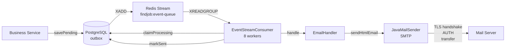
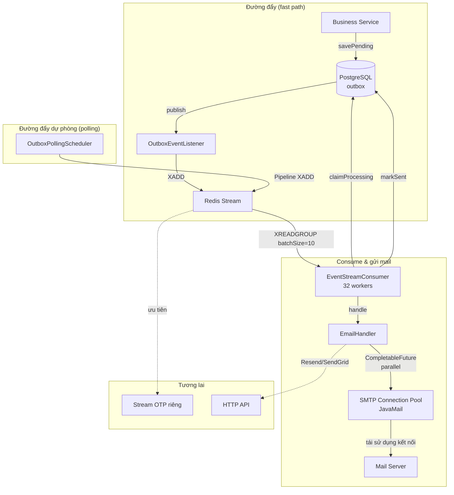

# Kế hoạch tối ưu hiệu suất gửi mail

**Dự án:** FINDJOB-BE  
**Ngày:** 2026-08-30  
**Trạng thái:** Lập kế hoạch

---

## 1. Mục tiêu

Tăng throughput gửi mail từ **~8–10 mail/giây** hiện tại lên **30–50 mail/giây** (trong giai đoạn đầu) và hướng tới **100+ mail/giây** sau khi triển khai các cải tiến sâu hơn, đảm bảo hệ thống có thể xử lý lượng lớn email (OTP, thông báo) mà không làm chậm API.

---

## 2. Phân tích bottleneck hiện tại

### 2.1 Luồng xử lý hiện tại

### 2.2 Điểm nghẽn chính

1. **JavaMailSender SMTP sync** – mỗi lần gửi mail cần:
   - Mở kết nối TCP → TLS handshake (~200–500ms)
   - AUTH (nếu cần) (~100–200ms)
   - Truyền dữ liệu (~200–1000ms tùy dung lượng)
   - Đóng kết nối
   - **Tổng:** 1–3 giây/mail khi ổn định, có thể >10s nếu server chậm.

2. **Số lượng worker cố định (8)** – throughput tối đa với 8 workers và 3s/mail là ~2.6 mail/giây (thực tế có thể đạt 8–10 do mail nhanh hơn).

3. **Không tận dụng connection pool** – mỗi lần gửi mở kết nối mới, không tái sử dụng.

4. **Polling push tuần tự** – `OutboxPollingScheduler` gọi `XADD` từng row một, không dùng pipeline.

---

## 3. Các giải pháp cải thiện

### 3.1 Nhóm "Nên làm ngay" (low-hanging fruit)

| # | Giải pháp | Độ khó | Hiệu quả dự kiến | Thời gian thực hiện |
|---|-----------|--------|------------------|----------------------|
| 1 | Tăng số workers 8 → 32 | Dễ | +100–200% | 5 phút |
| 2 | Bật SMTP connection pooling | Dễ | +50–70% | 15 phút |
| 3 | Tăng batchSize 1 → 10 | Dễ | +20–30% | 5 phút |
| 4 | Bật Thymeleaf cache | Dễ | +5–10% | 2 phút |

**Nguyên lý:**

- **Tăng workers** – SMTP là I/O-bound, tăng số luồng song song giúp tận dụng thời gian chờ network.
- **Connection pooling** – giữ kết nối SMTP sống, tái sử dụng cho nhiều mail → bỏ qua handshake và AUTH mỗi lần.
- **batchSize** – mỗi consumer nhận nhiều hơn 1 message/lần, giảm số lần gọi `XREADGROUP`.
- **Thymeleaf cache** – tránh parse template mỗi lần (Spring Boot mặc định cache nếu `cache: true`).

### 3.2 Nhóm "Nên làm sớm" (trung bình)

| # | Giải pháp | Độ khó | Hiệu quả dự kiến |
|---|-----------|--------|------------------|
| 5 | Redis Pipeline cho polling push | Trung bình | Giảm latency push từ O(n) → O(1) |
| 6 | Parallel per worker (CompletableFuture) | Trung bình | Tăng throughput 2–3x mỗi worker |

**Nguyên lý:**

- **Pipeline** – gửi nhiều lệnh `XADD` trong một round-trip, thay vì từng lệnh. Tiết kiệm thời gian mạng.
- **Parallel per worker** – mỗi worker thread có thể gửi 2–3 mail đồng thời bằng `CompletableFuture`, kết hợp với connection pool.

### 3.3 Nhóm "Mục tiêu dài hạn" (lớn, hiệu quả rất cao)

| # | Giải pháp | Độ khó | Hiệu quả dự kiến |
|---|-----------|--------|------------------|
| 7 | Chuyển sang Resend/SendGrid API (HTTP) | Lớn | +500–1000% (100–200ms/mail) |
| 8 | Phân luồng ưu tiên (OTP riêng) | Lớn | Cải thiện UX, OTP luôn nhanh |
| 9 | Horizontal scaling (nhiều instances) | Trung bình | Tăng tuyến tính theo số instance |

**Nguyên lý:**

- **Resend/SendGrid** – gọi API HTTP thay vì SMTP, bỏ qua handshake nặng, deliverability cao hơn, có built-in retry, monitoring.
- **Priority queue** – tách OTP vào stream riêng, consumer riêng, đảm bảo OTP được xử lý trước các email thông báo.
- **Horizontal scaling** – deploy nhiều instance, mỗi instance có consumer group riêng, `FOR UPDATE SKIP LOCKED` giúp chia việc.

---

## 4. Sơ đồ tổng quan kiến trúc sau tối ưu

---

## 5. Kế hoạch triển khai chi tiết

### Giai đoạn 1 – Tối ưu nhanh (ngay lập tức)

**Mục tiêu:** Tăng throughput lên 20–30 mail/giây mà không thay đổi logic lớn.

| Bước | File | Thay đổi |
|------|------|----------|
| 1.1 | `OutboxStreamConfig.java` | `int workers = 32;` |
| 1.2 | `OutboxStreamConfig.java` | `.batchSize(5)` hoặc `.batchSize(10)` |
| 1.3 | `application.yml` | Thêm `spring.mail.properties.mail.smtp.pool.enable=true` và các timeout hợp lý |
| 1.4 | `application.yml` | `spring.thymeleaf.cache: true` |

**Kiểm tra:** Gửi batch 100 mail, đo thời gian hoàn thành và số mail/giây.

### Giai đoạn 2 – Tối ưu trung bình (1–2 tuần)

**Mục tiêu:** Tăng throughput lên 40–50 mail/giây, giảm latency push.

| Bước | File | Thay đổi |
|------|------|----------|
| 2.1 | `OutboxPollingScheduler.java` | Dùng `executePipelined` để gửi nhiều XADD trong 1 round-trip |
| 2.2 | `EmailHandler.java` | Wrap `emailService.sendXxx` trong `CompletableFuture.supplyAsync` để song song hóa trong cùng worker |
| 2.3 | `application.yml` | Tăng `spring.mail.properties.mail.smtp.pool.maxtotal` lên 64 |

### Giai đoạn 3 – Chiến lược dài hạn (3–4 tuần)

**Mục tiêu:** Đạt 100+ mail/giây, sẵn sàng cho scale lớn.

| Bước | File | Thay đổi |
|------|------|----------|
| 3.1 | `EmailService.java` | Thay thế JavaMailSender bằng Resend/SendGrid client (có thể dùng feature flag để chuyển đổi dần) |
| 3.2 | `OutboxStreamConfig.java` | Tạo stream riêng `findjob:email-urgent` cho OTP, consumer riêng với priority cao |
| 3.3 | `deployment` | Tăng số instance, đảm bảo consumer group chia sẻ việc |

---

## 6. Rủi ro & giảm thiểu

| Rủi ro | Tác động | Giảm thiểu |
|--------|----------|------------|
| Tăng workers quá nhiều gây quá tải SMTP server | SMTP rate limit, blacklist | Tăng từ từ, theo dõi logs, đặt giới hạn rate ở application (ví dụ: gửi tối đa 50 mail/phút) |
| Connection pool không được giải phóng | Rò rỉ kết nối, hết port | Đặt `pool.maxtotal` hợp lý, cấu hình `pool.timeout` và `pool.evict` |
| Chuyển sang Resend/SendGrid cần thay đổi contract | Ảnh hưởng tất cả EmailService calls | Dùng feature flag, triển khai canary, giữ JavaMail làm fallback |
| Priority queue làm tăng độ phức tạp | Khó debug, nhiều stream | Thiết kế đơn giản: consumer riêng cho OTP, dùng cùng logic nhưng config khác |

---

## 7. Kết luận

Các giải pháp được chia làm 3 nhóm, phù hợp với lộ trình phát triển. Giai đoạn 1 có thể triển khai ngay với hiệu quả rõ rệt, giai đoạn 2 và 3 sẽ đưa hệ thống lên một tầm cao mới, sẵn sàng cho lượng mail lớn mà không ảnh hưởng đến UX.

Sau khi hoàn thành giai đoạn 1, chúng ta sẽ đo lường lại và quyết định có cần tiếp tục giai đoạn 2 hay không.