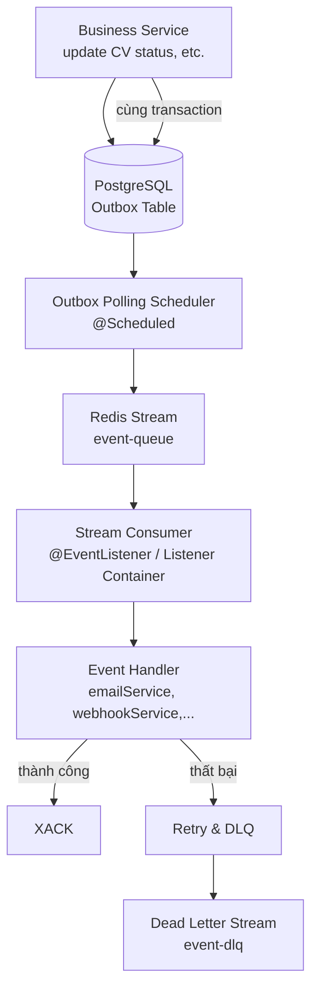
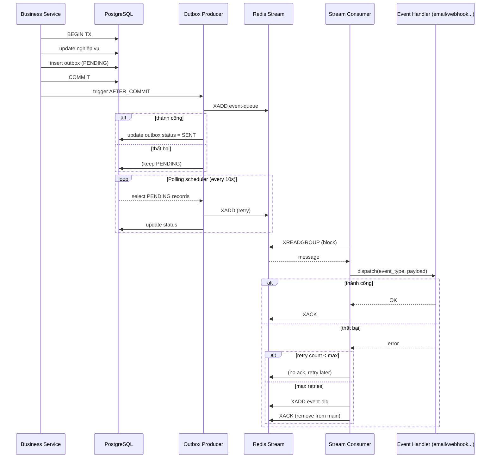

# Kế hoạch chuyển đổi module email sang Redis Stream + Outbox Pattern (Tổng quát)

**Ngày:** 2026-08-24  
**Dự án:** FINDJOB-BE  
**Tác giả:** AI Assistant

---

## 1. Mục tiêu

- Chuyển cơ chế gửi email từ `@Async` + `JavaMailSender` trực tiếp sang **Redis Streams** để đảm bảo độ tin cậy, khả năng retry, và giám sát.
- Đảm bảo **không mất sự kiện** (email, webhook, thông báo, …) khi có lỗi hệ thống (DB commit thành công nhưng gửi thất bại) bằng cách sử dụng **Transactional Outbox Pattern** tổng quát.
- Giảm tải cho luồng chính, tách biệt hoàn toàn việc xử lý sự kiện khỏi nghiệp vụ.
- Cho phép scale ngang (multiple consumers) và dễ dàng theo dõi backlog.
- **Thiết kế outbox tổng quát** để tái sử dụng cho nhiều loại sự kiện (email, webhook, notification, …).

---

## 2. Kiến trúc tổng quan



- **Outbox Table**: lưu các sự kiện (email, webhook, …) trong cùng transaction với nghiệp vụ.
- **Polling Scheduler**: định kỳ đọc các bản ghi `PENDING` và đẩy vào Redis Stream.
- **Redis Stream**: hàng đợi trung gian với cơ chế ack, lưu trữ tất cả sự kiện.
- **Stream Consumer**: lắng nghe, đọc `event_type` và điều hướng đến handler tương ứng.
- **DLQ**: nơi chứa các message thất bại sau nhiều lần retry.

---

## 3. Chi tiết các thành phần

### 3.1. Outbox Entity (Tổng quát)

**Bảng `outbox`** (PostgreSQL)

| Cột | Kiểu | Ghi chú |
|-----|------|---------|
| `id` | UUID | Primary key |
| `event_type` | VARCHAR(100) | Phân loại: `EMAIL_OTP`, `EMAIL_WELCOME`, `CV_STATUS_CHANGED`, `WEBHOOK_NOTIFY`, `PUSH_NOTIFICATION`, … |
| `aggregate_type` | VARCHAR(50) | Loại đối tượng nghiệp vụ (ví dụ: `USER`, `CV`, `COMPANY`, `APPLICATION`) |
| `aggregate_id` | UUID | ID của đối tượng liên quan (để truy vết) |
| `payload` | JSONB | Nội dung sự kiện (to, subject, template, params, …) |
| `status` | VARCHAR(20) | `PENDING`, `SENT`, `FAILED` |
| `retry_count` | INT | Số lần thử gửi (qua stream) |
| `max_retries` | INT | Ngưỡng retry (mặc định 5, có thể ghi đè theo event_type) |
| `created_at` | TIMESTAMP | Lúc tạo |
| `updated_at` | TIMESTAMP | Lần cuối cập nhật |
| `last_error` | TEXT | Lỗi gần nhất |

**Index:** `status`, `created_at` để polling hiệu quả.

**Package:** `com.example.boilerplate.common.outbox.entity`

---

### 3.2. Producer (Ghi outbox + gửi stream ngay)

- **Khi nghiệp vụ cần gửi sự kiện**, trong cùng transaction:
  - Lưu bản ghi `outbox` với `status = 'PENDING'`.
- **Sau khi commit** (dùng `@TransactionalEventListener(phase = AFTER_COMMIT)`):
  - Cố gắng đẩy message vào Redis Stream (`XADD event-queue * ...`).
  - Nếu thành công → cập nhật `status = 'SENT'` (hoặc xóa bản ghi).
  - Nếu thất bại → giữ nguyên `PENDING` và để polling xử lý.

**Luồng hybrid:** đa số sự kiện gửi ngay, chỉ fail mới cần polling.

**Package cho Producer:** `com.example.boilerplate.common.outbox.producer`

---

### 3.3. Polling Scheduler

- Chạy định kỳ (ví dụ mỗi 10 giây).
- Query: `SELECT * FROM outbox WHERE status = 'PENDING' AND retry_count < max_retries ORDER BY created_at LIMIT 100 FOR UPDATE SKIP LOCKED`.
- Với mỗi record:
  - Gửi vào Redis Stream (`XADD event-queue`).
  - Nếu thành công → cập nhật `status = 'SENT'`.
  - Nếu thất bại → tăng `retry_count`, cập nhật `last_error`. Nếu `retry_count >= max_retries`, đánh dấu `FAILED` và ghi log.

**Lưu ý:** Sử dụng `@Transactional` và `@Lock(LockModeType.PESSIMISTIC_WRITE)` để tránh duplicate xử lý.

**Package:** `com.example.boilerplate.common.outbox.scheduler`

---

### 3.4. Redis Stream Consumer & Event Dispatcher

- Sử dụng Spring Data Redis `StreamMessageListenerContainer`.
- Tạo consumer group: `event-consumer-group`.
- Xử lý message:
  - Parse payload, lấy `event_type`.
  - Dùng `ApplicationEventPublisher` hoặc `Map<String, EventHandler>` để điều hướng đến handler phù hợp.
  - Handler thực hiện công việc (gửi email, gọi webhook, …).
  - Nếu thành công → `XACK`.
  - Nếu thất bại → không ack, message pending và retry sau.
- **Retry**: Sau N lần thất bại (dùng `XCLAIM`), chuyển sang DLQ.

**Package:** `com.example.boilerplate.common.outbox.consumer`

---

### 3.5. Dead Letter Queue (DLQ)

- Stream riêng: `event-dlq`.
- Khi message thất bại quá số lần retry, consumer ghi vào DLQ, xóa khỏi stream chính (hoặc ack và log).
- Có thể có job riêng xử lý DLQ (gửi cảnh báo, retry thủ công).

**Package:** `com.example.boilerplate.common.outbox.dlq`

---

## 4. Luồng xử lý chi tiết (Sequence Diagram)



---

## 5. Cấu hình Redis Stream

- **Stream key:** `event-queue`
- **Consumer group:** `event-group`
- **Max length:** `~10000` (có thể điều chỉnh) để tránh tràn bộ nhớ.
- **Retry policy:** `XREADGROUP` với `BLOCK 2000 COUNT 10`.
- **Pending timeout:** dùng `XPENDING` và `XCLAIM` để xử lý message chết (nếu consumer crash).

---

## 6. Các vấn đề cần giải quyết

### 6.1. Consistency (DB + Stream)
- **Giải pháp:** Outbox pattern (lưu trong cùng transaction) + hybrid send.
- **Fallback:** Polling retry khi stream lỗi.

### 6.2. Idempotency (tránh xử lý trùng)
- **Nguyên nhân:** Consumer có thể nhận lại message nếu không ack kịp, hoặc polling gửi trùng.
- **Giải pháp:**
  - Sử dụng `outbox.id` làm message ID trong `XADD`.
  - Consumer kiểm tra trạng thái trong DB (`status = 'SENT'` thì bỏ qua).
  - Hoặc dùng Redis SETNX với TTL ngắn.

### 6.3. Duplicate message do polling + after_commit gửi cùng lúc
- **Giải pháp:** Khi gửi ngay sau commit, nếu thành công thì cập nhật `status = 'SENT'`. Khi polling, kiểm tra kỹ status và dùng optimistic lock để tránh cập nhật trùng.

### 6.4. Xử lý lỗi và retry
- **Retry:** Pending list của Redis Stream kết hợp `retry_count` trong outbox.
- **DLQ:** Chuyển sang stream dead-letter khi vượt ngưỡng.

### 6.5. Giám sát và cảnh báo
- **Metrics:** `XLEN`, `XPENDING`, thời gian xử lý.
- **Alert:** Khi `PENDING` trong DB > ngưỡng, hoặc `XLEN` > ngưỡng.

---

## 7. Kế hoạch triển khai từng bước

1. **Tạo bảng outbox** (flyway migration hoặc schema update).
2. **Tạo entity và repository** cho outbox.
3. **Tạo `OutboxService`**: lưu sự kiện, cập nhật trạng thái.
4. **Tích hợp vào các service nghiệp vụ** (CV, ứng tuyển, auth…) để ghi outbox.
5. **Cấu hình Redis Stream** và tạo `StreamProducer` (gửi message).
6. **Tạo `OutboxEventListener`** với `@TransactionalEventListener(phase = AFTER_COMMIT)` để gửi stream ngay.
7. **Tạo polling scheduler** (`@Scheduled`) xử lý `PENDING`.
8. **Tạo Stream Consumer + Event Dispatcher** (dùng `ApplicationEventPublisher` hoặc handler map).
9. **Triển khai các handler cụ thể** (EmailHandler, WebhookHandler, …).
10. **Triển khai DLQ** và xử lý retry.
11. **Thêm logging và monitoring**.
12. **Viết unit test và integration test**.
13. **Triển khai thử nghiệm** và quan sát.

---

## 8. Code snippets mẫu (kèm package)

### 8.1. Outbox Entity (JPA)

**Package:** `com.example.boilerplate.common.outbox.entity`

```java
package com.example.boilerplate.common.outbox.entity;

import jakarta.persistence.*;
import lombok.*;
import org.hibernate.annotations.CreationTimestamp;
import org.hibernate.annotations.UpdateTimestamp;

import java.time.LocalDateTime;
import java.util.UUID;

@Entity
@Table(name = "outbox",
       indexes = {
           @Index(name = "idx_outbox_status_created", columnList = "status, created_at")
       })
@Getter
@Setter
@NoArgsConstructor
@AllArgsConstructor
@Builder
public class Outbox {
    @Id
    private UUID id;

    @Column(name = "event_type", nullable = false, length = 100)
    private String eventType;

    @Column(name = "aggregate_type", length = 50)
    private String aggregateType;

    @Column(name = "aggregate_id")
    private UUID aggregateId;

    @Column(columnDefinition = "jsonb")
    private String payload; // JSON string

    @Enumerated(EnumType.STRING)
    @Column(nullable = false)
    private OutboxStatus status;

    @Column(name = "retry_count")
    private int retryCount;

    @Column(name = "max_retries")
    private int maxRetries = 5;

    @CreationTimestamp
    @Column(name = "created_at", updatable = false)
    private LocalDateTime createdAt;

    @UpdateTimestamp
    @Column(name = "updated_at")
    private LocalDateTime updatedAt;

    @Column(name = "last_error", columnDefinition = "text")
    private String lastError;

    // getters, setters
}

enum OutboxStatus {
    PENDING, SENT, FAILED
}
```

---

### 8.2. OutboxService

**Package:** `com.example.boilerplate.common.outbox.service`

```java
package com.example.boilerplate.common.outbox.service;

import com.example.boilerplate.common.outbox.entity.Outbox;
import com.example.boilerplate.common.outbox.entity.OutboxStatus;
import com.example.boilerplate.common.outbox.repository.OutboxRepository;
import com.fasterxml.jackson.databind.ObjectMapper;
import lombok.RequiredArgsConstructor;
import lombok.extern.slf4j.Slf4j;
import org.springframework.data.domain.PageRequest;
import org.springframework.stereotype.Service;
import org.springframework.transaction.annotation.Transactional;

import java.util.List;
import java.util.Map;
import java.util.UUID;

@Service
@RequiredArgsConstructor
@Slf4j
@Transactional
public class OutboxService {
    private final OutboxRepository repository;
    private final ObjectMapper objectMapper;

    public Outbox savePending(String eventType, String aggregateType, UUID aggregateId, Map<String, Object> payload) {
        try {
            String payloadJson = objectMapper.writeValueAsString(payload);
            Outbox outbox = Outbox.builder()
                .id(UUID.randomUUID())
                .eventType(eventType)
                .aggregateType(aggregateType)
                .aggregateId(aggregateId)
                .payload(payloadJson)
                .status(OutboxStatus.PENDING)
                .retryCount(0)
                .maxRetries(5)
                .build();
            return repository.save(outbox);
        } catch (Exception e) {
            log.error("Failed to serialize payload for event {}", eventType, e);
            throw new RuntimeException("Failed to save outbox", e);
        }
    }

    public void markAsSent(UUID id) {
        repository.updateStatus(id, OutboxStatus.SENT);
    }

    public void markAsFailed(UUID id, String error) {
        repository.updateStatusAndError(id, OutboxStatus.FAILED, error);
    }

    @Transactional(readOnly = true)
    public List<Outbox> findPending(int limit) {
        return repository.findByStatusOrderByCreatedAtAsc(OutboxStatus.PENDING, PageRequest.of(0, limit));
    }

    public void incrementRetry(UUID id, String error) {
        repository.incrementRetryAndSetError(id, error);
    }
}
```

---

### 8.3. OutboxRepository

**Package:** `com.example.boilerplate.common.outbox.repository`

```java
package com.example.boilerplate.common.outbox.repository;

import com.example.boilerplate.common.outbox.entity.Outbox;
import com.example.boilerplate.common.outbox.entity.OutboxStatus;
import org.springframework.data.domain.Pageable;
import org.springframework.data.jpa.repository.JpaRepository;
import org.springframework.data.jpa.repository.Modifying;
import org.springframework.data.jpa.repository.Query;
import org.springframework.data.repository.query.Param;

import java.util.List;
import java.util.UUID;

public interface OutboxRepository extends JpaRepository<Outbox, UUID> {
    List<Outbox> findByStatusOrderByCreatedAtAsc(OutboxStatus status, Pageable pageable);

    @Modifying
    @Query("UPDATE Outbox o SET o.status = :status WHERE o.id = :id")
    void updateStatus(@Param("id") UUID id, @Param("status") OutboxStatus status);

    @Modifying
    @Query("UPDATE Outbox o SET o.status = :status, o.lastError = :error WHERE o.id = :id")
    void updateStatusAndError(@Param("id") UUID id, @Param("status") OutboxStatus status, @Param("error") String error);

    @Modifying
    @Query("UPDATE Outbox o SET o.retryCount = o.retryCount + 1, o.lastError = :error WHERE o.id = :id")
    void incrementRetryAndSetError(@Param("id") UUID id, @Param("error") String error);
}
```

---

### 8.4. Stream Producer

**Package:** `com.example.boilerplate.common.outbox.producer`

```java
package com.example.boilerplate.common.outbox.producer;

import com.example.boilerplate.common.outbox.entity.Outbox;
import com.fasterxml.jackson.databind.ObjectMapper;
import lombok.RequiredArgsConstructor;
import lombok.extern.slf4j.Slf4j;
import org.springframework.data.redis.core.RedisTemplate;
import org.springframework.stereotype.Component;

import java.util.HashMap;
import java.util.Map;

@Component
@RequiredArgsConstructor
@Slf4j
public class EventStreamProducer {
    private final RedisTemplate<String, Object> redisTemplate;
    private final ObjectMapper objectMapper;
    private static final String STREAM_KEY = "event-queue";

    public String send(Outbox outbox) {
        try {
            Map<String, String> payload = new HashMap<>();
            payload.put("id", outbox.getId().toString());
            payload.put("eventType", outbox.getEventType());
            payload.put("aggregateType", outbox.getAggregateType());
            payload.put("aggregateId", outbox.getAggregateId() != null ? outbox.getAggregateId().toString() : null);
            payload.put("payload", outbox.getPayload()); // JSON string
            return redisTemplate.opsForStream().add(STREAM_KEY, payload);
        } catch (Exception e) {
            log.error("Failed to send outbox {} to stream", outbox.getId(), e);
            throw new RuntimeException("Failed to send to stream", e);
        }
    }
}
```

---

### 8.5. OutboxEventListener (gửi ngay sau commit)

**Package:** `com.example.boilerplate.common.outbox.event`

```java
package com.example.boilerplate.common.outbox.event;

import com.example.boilerplate.common.outbox.entity.Outbox;
import com.example.boilerplate.common.outbox.producer.EventStreamProducer;
import com.example.boilerplate.common.outbox.service.OutboxService;
import lombok.RequiredArgsConstructor;
import lombok.extern.slf4j.Slf4j;
import org.springframework.stereotype.Component;
import org.springframework.transaction.event.TransactionPhase;
import org.springframework.transaction.event.TransactionalEventListener;

@Component
@RequiredArgsConstructor
@Slf4j
public class OutboxEventListener {
    private final EventStreamProducer streamProducer;
    private final OutboxService outboxService;

    @TransactionalEventListener(phase = TransactionPhase.AFTER_COMMIT)
    public void handleOutbox(Outbox outbox) {
        if (outbox.getStatus() != com.example.boilerplate.common.outbox.entity.OutboxStatus.PENDING) {
            return;
        }
        try {
            streamProducer.send(outbox);
            outboxService.markAsSent(outbox.getId());
            log.info("Outbox {} sent to stream immediately", outbox.getId());
        } catch (Exception e) {
            log.error("Failed to send outbox {} immediately, will retry via polling", outbox.getId(), e);
            // keep PENDING, polling will handle
        }
    }
}
```

---

### 8.6. Polling Scheduler

**Package:** `com.example.boilerplate.common.outbox.scheduler`

```java
package com.example.boilerplate.common.outbox.scheduler;

import com.example.boilerplate.common.outbox.entity.Outbox;
import com.example.boilerplate.common.outbox.producer.EventStreamProducer;
import com.example.boilerplate.common.outbox.service.OutboxService;
import lombok.RequiredArgsConstructor;
import lombok.extern.slf4j.Slf4j;
import org.springframework.scheduling.annotation.Scheduled;
import org.springframework.stereotype.Component;
import org.springframework.transaction.annotation.Transactional;

import java.util.List;

@Component
@RequiredArgsConstructor
@Slf4j
public class OutboxPollingScheduler {
    private final OutboxService outboxService;
    private final EventStreamProducer streamProducer;
    private static final int BATCH_SIZE = 100;

    @Scheduled(fixedDelay = 10000) // 10 giây
    @Transactional
    public void pollPending() {
        List<Outbox> pending = outboxService.findPending(BATCH_SIZE);
        if (pending.isEmpty()) {
            return;
        }
        log.info("Polling {} pending outbox records", pending.size());

        for (Outbox outbox : pending) {
            try {
                streamProducer.send(outbox);
                outboxService.markAsSent(outbox.getId());
                log.info("Outbox {} sent successfully via polling", outbox.getId());
            } catch (Exception e) {
                log.error("Failed to send outbox {} via polling", outbox.getId(), e);
                outboxService.incrementRetry(outbox.getId(), e.getMessage());
                if (outbox.getRetryCount() + 1 >= outbox.getMaxRetries()) {
                    outboxService.markAsFailed(outbox.getId(), "Max retries exceeded: " + e.getMessage());
                    log.error("Outbox {} marked as FAILED after {} retries", outbox.getId(), outbox.getRetryCount());
                }
            }
        }
    }
}
```

---

### 8.7. Stream Consumer & Event Dispatcher

**Package:** `com.example.boilerplate.common.outbox.consumer`

```java
package com.example.boilerplate.common.outbox.consumer;

import com.example.boilerplate.common.outbox.handler.EventHandler;
import com.example.boilerplate.common.outbox.handler.EventHandlerRegistry;
import lombok.RequiredArgsConstructor;
import lombok.extern.slf4j.Slf4j;
import org.springframework.context.event.EventListener;
import org.springframework.data.redis.connection.stream.MapRecord;
import org.springframework.stereotype.Component;

import java.util.Map;

@Component
@RequiredArgsConstructor
@Slf4j
public class EventStreamConsumer {
    private final EventHandlerRegistry handlerRegistry;

    @EventListener(condition = "#event.headers['stream'] == 'event-queue'")
    public void handle(MapRecord<String, Object, Object> event) {
        Map<Object, Object> value = event.getValue();
        String id = (String) value.get("id");
        String eventType = (String) value.get("eventType");
        String payloadJson = (String) value.get("payload");

        log.info("Received event id={}, type={}", id, eventType);

        EventHandler handler = handlerRegistry.getHandler(eventType);
        if (handler == null) {
            log.error("No handler found for event type: {}", eventType);
            // No ack -> retry, but should be moved to DLQ eventually
            throw new IllegalArgumentException("No handler for event type: " + eventType);
        }

        try {
            handler.handle(payloadJson);
            // Acknowledge is handled by container if configured
        } catch (Exception e) {
            log.error("Failed to handle event id={}", id, e);
            throw e; // no ack, retry
        }
    }
}
```

---

### 8.8. Event Handler Interface & Registry

**Package:** `com.example.boilerplate.common.outbox.handler`

```java
package com.example.boilerplate.common.outbox.handler;

public interface EventHandler {
    void handle(String payloadJson) throws Exception;
}
```

```java
package com.example.boilerplate.common.outbox.handler;

import org.springframework.stereotype.Component;

import jakarta.annotation.PostConstruct;
import java.util.Map;
import java.util.concurrent.ConcurrentHashMap;

@Component
public class EventHandlerRegistry {
    private final Map<String, EventHandler> handlers = new ConcurrentHashMap<>();

    public void register(String eventType, EventHandler handler) {
        handlers.put(eventType, handler);
    }

    public EventHandler getHandler(String eventType) {
        return handlers.get(eventType);
    }
}
```

---

### 8.9. Email Handler (ví dụ handler cụ thể)

**Package:** `com.example.boilerplate.features.email.handler`

```java
package com.example.boilerplate.features.email.handler;

import com.example.boilerplate.common.outbox.handler.EventHandler;
import com.example.boilerplate.common.outbox.handler.EventHandlerRegistry;
import com.example.boilerplate.infrastructure.mail.EmailService;
import com.fasterxml.jackson.databind.ObjectMapper;
import lombok.RequiredArgsConstructor;
import lombok.extern.slf4j.Slf4j;
import org.springframework.stereotype.Component;

import jakarta.annotation.PostConstruct;
import java.util.Map;

@Component
@RequiredArgsConstructor
@Slf4j
public class EmailHandler implements EventHandler {
    private final EventHandlerRegistry registry;
    private final EmailService emailService;
    private final ObjectMapper objectMapper;

    @PostConstruct
    public void init() {
        registry.register("EMAIL_OTP", this);
        registry.register("EMAIL_WELCOME", this);
        registry.register("EMAIL_CV_STATUS", this);
    }

    @Override
    public void handle(String payloadJson) throws Exception {
        Map<String, Object> payload = objectMapper.readValue(payloadJson, Map.class);
        String to = (String) payload.get("to");
        String subject = (String) payload.get("subject");
        String body = (String) payload.get("body");
        // Có thể thêm template, params...
        emailService.sendHtmlEmail(to, subject, body);
        log.info("Email sent to {}", to);
    }
}
```

---

### 8.10. Webhook Handler (ví dụ khác)

**Package:** `com.example.boilerplate.features.webhook.handler`

```java
package com.example.boilerplate.features.webhook.handler;

import com.example.boilerplate.common.outbox.handler.EventHandler;
import com.example.boilerplate.common.outbox.handler.EventHandlerRegistry;
import com.fasterxml.jackson.databind.ObjectMapper;
import lombok.RequiredArgsConstructor;
import lombok.extern.slf4j.Slf4j;
import org.springframework.stereotype.Component;
import org.springframework.web.client.RestTemplate;

import jakarta.annotation.PostConstruct;
import java.util.Map;

@Component
@RequiredArgsConstructor
@Slf4j
public class WebhookHandler implements EventHandler {
    private final EventHandlerRegistry registry;
    private final RestTemplate restTemplate;
    private final ObjectMapper objectMapper;

    @PostConstruct
    public void init() {
        registry.register("WEBHOOK_NOTIFY", this);
    }

    @Override
    public void handle(String payloadJson) throws Exception {
        Map<String, Object> payload = objectMapper.readValue(payloadJson, Map.class);
        String url = (String) payload.get("url");
        Map<String, Object> data = (Map<String, Object>) payload.get("data");
        restTemplate.postForEntity(url, data, String.class);
        log.info("Webhook sent to {}", url);
    }
}
```

---

## 9. Cân nhắc hiệu năng và scale

- **Polling interval:** 5-10 giây, có thể điều chỉnh.
- **Batch size:** 100 mỗi lần poll.
- **Consumer scaling:** Mỗi instance backend có consumer riêng; Redis group đảm bảo phân phối.
- **Redis memory:** `MAXLEN ~ 10000` cho stream chính.
- **DB tải:** Outbox chỉ insert và update, có index tốt.

---

## 10. Rủi ro và biện pháp giảm thiểu

| Rủi ro | Biện pháp |
|--------|-----------|
| Redis unavailable | Outbox vẫn lưu trong DB, polling retry khi Redis hồi phục. |
| Consumer crash | Message pending trong stream, consumer khác xử lý. |
| Duplicate xử lý | Sử dụng idempotency key (outbox id) và kiểm tra trạng thái trong DB. |
| DB quá tải do polling | Index + `SKIP LOCKED` + batch limit. |
| Handler chậm / lỗi | Retry với backoff, DLQ để xử lý thủ công. |

---

## 11. Kết luận

Giải pháp kết hợp **Transactional Outbox tổng quát + Redis Stream + Polling** cung cấp độ tin cậy cao, khả năng phục hồi, và dễ dàng mở rộng cho nhiều loại sự kiện. Việc triển khai theo từng bước giúp giảm thiểu rủi ro và dễ dàng rollback.

**Bước tiếp theo:** Sau khi plan được duyệt, tiến hành triển khai từ bước 1 đến bước 13.
