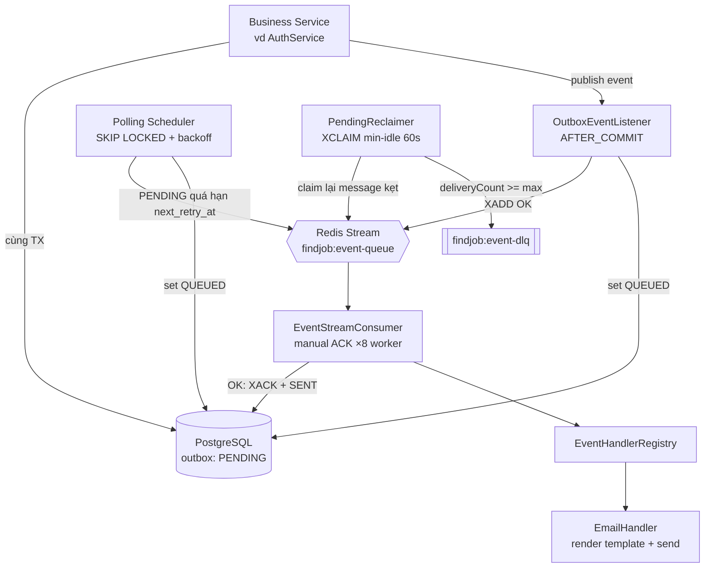
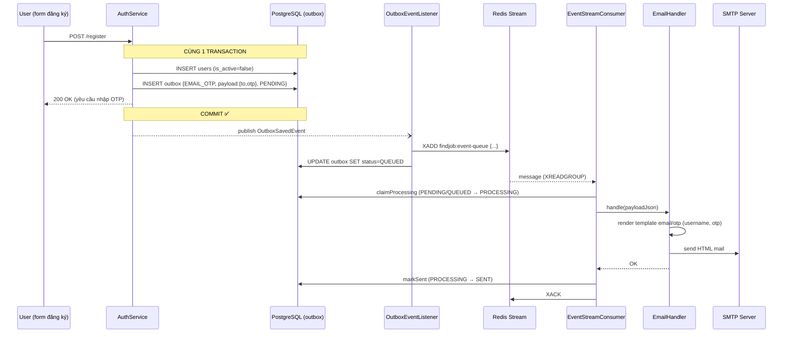

# Kế hoạch: Module email qua Redis Stream + Transactional Outbox (v2)

**Dự án:** FINDJOB-BE
**Trạng thái:** Giai đoạn 1 (xương sống) ĐÃ HOÀN TẤT. Còn lại Giai đoạn 2 (tích hợp nghiệp vụ) + Giai đoạn 3 (vận hành).

---

## 1. Mục tiêu & quyết định thiết kế

Mục tiêu: chuyển gửi mail từ gọi thẳng `@Async EmailService` sang hàng đợi **Redis Streams**
kèm **Transactional Outbox** để đảm bảo không mất sự kiện khi Redis/SMTP chết, có retry,
DLQ, và scale ngang consumer.

Các quyết định cốt lõi:

1. **DB là nguồn chân truth.** Row outbox ghi **cùng transaction** với nghiệp vụ — commit
   cùng sống, rollback cùng chết. Stream chỉ là băng chuyền, mất entry còn cứu được từ DB.
2. **AFTER_COMMIT mới được phép đẩy Redis.** Đẩy trước commit mà TX rollback là gửi OTP cho
   tài khoản chưa tồn tại.
3. **5 trạng thái** `PENDING → QUEUED → PROCESSING → SENT`, nhánh lỗi `FAILED`. `PROCESSING`
   là khóa atomic chống gửi trùng. `SENT` **chỉ consumer** được đặt, sau khi handler chạy OK.
4. **Hai đường đẩy vào stream** (fast path sau commit + polling dự phòng) chủ đích cho phép
   trùng nhau.
5. **Consumer manual-ACK** chuẩn Spring Data Redis (`receive(consumer, offset, listener)`),
   tự quyết lúc ack; consumer group tạo idempotent lúc start (BUSYGROUP = coi như xong).
6. **Chỉ giữ connection DB vài ms mỗi lần đụng DB** — không bọc call Redis trong transaction.
7. **Backoff + giới hạn số lần thử** phía push (polling) và phía consume (`deliveryCount`),
   vượt ngưỡng → DLQ + `FAILED`.
8. **Chấp nhận at-least-once delivery — handler bắt buộc idempotent.**

> [!important] Vì sao không theo đuổi exactly-once
> "Đúng 1 lần" đòi hỏi khoá hai hệ (DB + Redis + SMTP) trong một giao dịch — thực tế không hệ
> phân tán nào làm được rẻ. Ngược lại, "không mất" là yêu cầu cứng (OTP, welcome mail). Nên ta
> chọn **không-mất + chấp-nhận-trùng**, rồi xử lý trùng bằng idempotency ở handler — cách này
> rẻ và chắc chắn hơn nhiều.

---

## 2. Mô hình trạng thái

| Trạng thái | Ý nghĩa | Ai đặt |
|---|---|---|
| `PENDING` | Sự kiện **chỉ tồn tại trong DB**, chưa vào Redis. Đây là trạng thái sinh ra cùng lúc với nghiệp vụ. | Business service (insert) |
| `QUEUED` | Đã `XADD` vào Redis Stream, đang chờ consumer lấy. | Listener sau-commit hoặc polling scheduler, **sau khi XADD thành công** |
| `PROCESSING` | Consumer **đã giành quyền gửi mail** (atomic claim), đang trong lúc gửi. Khóa chống trùng: chỉ 1 luồng giành được. | Consumer, **TRƯỚC khi gửi mail** |
| `SENT` | Mail gửi thành công + đã `XACK`. Trạng thái kết thúc tốt đẹp — chỉ consumer được phép đặt. | Consumer |
| `FAILED` | Hết cứu cánh: hoặc đẩy lên Redis thất bại quá `max_retries`, hoặc consumer thử hoài không xong → xuống DLQ. | Polling scheduler / PendingReclaimer |

**Transition `PROCESSING`:**
- `PENDING/QUEUED → PROCESSING` — `claimProcessing()`, atomic, chống trùng
- `PROCESSING → SENT` — `markSent()`, sau khi gửi mail OK
- `PROCESSING → PENDING` — `revertToPending()`, khi gửi mail fail (để retry)

Mũi tên `QUEUED → PENDING` (qua janitor) là lưới an toàn: nếu entry trong Redis bị cắt mất
(trim/flush) nhưng row DB còn kẹt ở `QUEUED` quá 15 phút, hệ thống nghi ngờ và đẩy lại. Việc
đẩy lại có thể khiến mail gửi 2 lần — vô hại vì handler idempotent (xem mục 6).

---

## 3. Kiến trúc tổng quan

> [!tip] Tóm tắt bằng một câu: mỗi email cần gửi được lưu thành **1 row trong bảng outbox (PostgreSQL)** trước, rồi mới được đẩy sang **Redis Stream** để consumer gửi dần. Row là "nguồn sự thật" — Redis chỉ là hàng đợi tạm. Nếu Redis chết hay mất dữ liệu thì row trong DB vẫn còn, hệ thống tự đẩy lại được.



**📖 Giải thích sơ đồ — đi theo thứ tự đánh số**

1. **Business Service** (ví dụ `AuthService` khi đăng ký): vừa ghi bảng nghiệp vụ, vừa ghi 1
   dòng vào bảng `outbox` — **trong cùng một transaction**. Commit xong thì cả hai cùng tồn
   tại, rollback thì cả hai cùng biến mất. Đây là điểm mấu chốt đảm bảo "không mất": không có
   tình huống "nghiệp vụ xong mà quên ghi email cần gửi".
2. **OutboxEventListener** nghe sự kiện *sau khi commit*: lập tức thử `XADD` đưa sự kiện vào
   Redis Stream. Đây là đường nhanh — email vào hàng trong vài mili-giây.
3. Push thành công → đánh dấu row thành `QUEUED`.
4. Nếu bước 2 thất bại (Redis chết): row **giữ nguyên `PENDING`**.
5. **Polling Scheduler** mỗi 10 giây quét các row `PENDING` quá hạn `next_retry_at`, đẩy lại
   vào Stream. Đây là đường dự phòng — chậm hơn nhưng bù lại không bao giờ bỏ rơi sự kiện.
6. **EventStreamConsumer** đọc message từ Stream theo cơ chế consumer group, gọi handler
   tương ứng theo `eventType`. Cùng 1 instance `@Component` được **8 consumer** (`-w0`..`-w7`)
   dùng chung để xử lý đồng thời — phải thread-safe.
7. Handler gửi mail thật (SMTP). OK → `XACK` + row thành `SENT`.
8. **PendingReclaimer** mỗi 30 giây soi danh sách message "đã giao nhưng chưa ack" (pending
   entries): cái nào treo quá 60 giây thì nhận lại để xử lý; thử quá số lần → đẩy vào
   **DLQ** (`findjob:event-dlq`) và đánh dấu row `FAILED`.

Hai đường đẩy vào Stream (2 và 5) có thể đẩy **trùng nhau** một sự kiện — điều này là chủ
đích, consumer sẽ tự loại trùng (mục 5.8).

### 3b. Ví dụ đi qua toàn hệ thống: gửi mail OTP khi đăng ký



**📖 Giải thích:** người dùng chỉ cảm nhận bước đầu và cuối — submit form rồi mở mailbox.
Mọi bước giữa diễn ra nền, không chặn API. Nếu Redis chết tại bước `XADD`: response API vẫn
trả bình thường (outbox đã commit), mail đi muộn hơn qua polling — người dùng nhận OTP chậm
vài chục giây thay vì không nhận gì.

---

## 4. Schema — Flyway `V16__create_outbox_table.sql`

> [!note] Migration mới nhất hiện tại là V15 → file này bắt buộc tên `V16__...`.
> File đã tồn tại sẵn trong repo: `src/main/resources/db/migration/V16__create_outbox_table.sql`.

```sql
CREATE TABLE outbox (
    id            BIGSERIAL PRIMARY KEY,
    event_type    VARCHAR(100) NOT NULL,
    aggregate_type VARCHAR(50),
    aggregate_id  BIGINT,
    payload       JSONB NOT NULL,                 -- {to, templateName, variables{...}}
    status        VARCHAR(20) NOT NULL DEFAULT 'PENDING', -- PENDING|QUEUED|PROCESSING|SENT|FAILED
    retry_count   INT NOT NULL DEFAULT 0,
    max_retries   INT NOT NULL DEFAULT 5,
    next_retry_at TIMESTAMPTZ,
    last_error    TEXT,
    created_at    TIMESTAMPTZ NOT NULL DEFAULT now(),
    updated_at    TIMESTAMPTZ NOT NULL DEFAULT now()
);

-- Index nóng: tập PENDING luôn nhỏ
CREATE INDEX idx_outbox_pending ON outbox (next_retry_at, created_at) WHERE status = 'PENDING';
CREATE INDEX idx_outbox_status_queued ON outbox (created_at) WHERE status = 'QUEUED';
CREATE INDEX idx_outbox_status_sent_created ON outbox (status, created_at);
```

**📖 Giải thích schema — chia 4 nhóm cột:**

- **Định danh & truy vết:** `id` (`BIGSERIAL` = số tự tăng, map sang `Long`), `event_type`
  (quyết định handler nào xử lý — "loại thư"), `aggregate_type` (kiểu đối tượng nghiệp vụ
  — vd `USER`, `JOB`) + `aggregate_id` (ID của đối tượng — vd `42`). Hai cột này chỉ để
  debug/truy vết, logic xử lý không phụ thuộc vào chúng.
- **Hành lý:** `payload` (JSONB) gói mọi thứ handler cần (`to`, `templateName`, `variables`).
  Nguyên tắc *self-contained*: consumer KHÔNG quay lại bảng users/jobs để hỏi thêm — đề phòng
  dữ liệu gốc đã đổi làm payload stale.
- **Vòng đời & retry:** `status` điều phối máy trạng thái; `retry_count`/`max_retries` giới hạn
  số lần thử; `next_retry_at` là mốc "hẹn giờ thử lại" — nền tảng của backoff; `last_error`
  lưu vết lỗi cuối để soi log không phải đoán.
- **Mốc thời gian:** `updated_at` ngoài mục đích thường quy còn là dấu vết janitor dựa vào để
  biết row "kẹt QUEUED đã lâu chưa".

**📖 Hai cột `retry_count` + `max_retries` — bộ đếm và giới hạn:**

- `retry_count` = row này **đã đẩy vào Redis thất bại bao nhiêu lần**. Mỗi lần polling đẩy
  mà hỏng (Redis chết, mất kết nối...) thì +1. Row mới tạo thì bằng 0.
- `max_retries` = **giới hạn số lần thử**: fail đủ số lần này thì chuyển `FAILED` và thôi
  không thử nữa. Mặc định 5; vì là cột riêng từng row nên event nào quan trọng hơn có thể
  set số lớn hơn lúc tạo.

Ví dụ cụ thể: có 1 email OTP cần gửi mà Redis sập luôn, polling cứ thử lại theo giờ hẹn:

| Diễn biến | retry_count | next_retry_at (hẹn thử lại lúc) | status |
|---|---|---|---|
| Vừa ghi row | 0 | *(rỗng → được nhặt ngay)* | PENDING |
| Đẩy vào Redis hỏng lần 1 | 1 | sau 30 giây | PENDING |
| Hỏng lần 2 | 2 | sau 1 phút | PENDING |
| Hỏng lần 3 | 3 | sau 2 phút | PENDING |
| Hỏng lần 4 | 4 | sau 4 phút | PENDING |
| Hỏng lần 5 = đủ max_retries | 5 | *(không hẹn nữa)* | FAILED 💀 |

Giờ hẹn xa dần gấp đôi mỗi lần (30s → 1p → 2p...) gọi là *backoff* — tránh việc Redis đang
chết mà polling dội liên tục mỗi 10 giây. Câu SELECT lấy row cũng có điều kiện
`retry_count < max_retries`, nên row FAILED tự động bị bỏ qua mãi mãi.

Lưu ý ranh giới: hai cột này **chỉ đếm lỗi đẩy vào Redis** (đường polling). Riêng phía
consumer gửi mail thất bại thì không đụng vào đây — nó dùng `deliveryCount` (số lần Redis tự
giao lại message trong PEL) so với chính `max_retries` này để quyết định thử lại hay đưa xuống
DLQ (mục 5.8).

Ba index cuối là **partial index**: `idx_outbox_pending` chỉ đánh chỉ số các row `PENDING` —
vốn luôn rất ít (chỉ sự kiện chờ đẩy) → query polling mỗi 10 giây quét index nhỏ xíu, gần
như miễn phí.

### 4.1 Entity + Enum

Package `com.example.boilerplate.common.outbox.entity` — `@Entity Outbox` map 1-1 bảng trên
(`id` kiểu `Long` vì `BIGSERIAL`), enum `OutboxStatus { PENDING, QUEUED, PROCESSING, SENT, FAILED }`.

```java
// common/outbox/entity/Outbox.java
/**
 * 1 outbox = 1 event cần xử lí
 *
 * Row này được ghi CÙNG TRANSACTION với nghiệp vụ — ví dụ hàm register()
 * vừa lưu user vừa ghi row EMAIL_OTP. Commit thì cả hai cùng vào DB,
 * rollback thì cả hai cùng biến mất. Nhờ vậy không bao giờ có trường hợp
 * "tạo user xong mà quên gửi mail".
 *
 * 5 trạng thái của row:
 * PENDING    — mới ghi, chưa đưa vào Redis
 * QUEUED     — đã nằm trong Redis, chờ consumer gửi
 * PROCESSING — consumer đang giành quyền gửi mail (atomic claim)
 * SENT       — mail đã gửi thành công
 * FAILED     — thử quá nhiều lần vẫn hỏng, bỏ cuộc
 */
@Entity
@Table(name = "outbox")
@Getter @Setter @Builder
@NoArgsConstructor @AllArgsConstructor
public class Outbox {

    @Id
    @GeneratedValue(strategy = GenerationType.IDENTITY)
    private Long id;

    /**
     * Loại event - EMAIL_OTP, EMAIL_WELCOME, consumer sẽ dựa vào đây để chọn cách
     * xử lí
     */
    @Column(name = "event_type", nullable = false, length = 100)
    private String eventType;

    /**
     * Loại đối tượng nghiệp vụ liên quan đến event này - VD: USER, JOB, APPLICATION
     * Kết hợp với aggregateId để truy vết khi debug, KHÔNG dùng trong xử lí logic
     */
    @Column(name = "aggregate_type", length = 50)
    private String aggregateType;

    /**
     * ID của đối tượng nghiệp vụ - VD: 42 (tức là USER 42)
     * Chỉ để debug, ko dùng trong logic xử lí
     */
    @Column(name = "aggregate_id")
    private Long aggregateId;

    /**
     * Toàn bộ dữ liệu cần để gửi mail, đóng gói thành JSON:
     * {"to": "nam@gmail.com", "templateName": "email/otp", "variables": {...}}
     *
     * Consumer chỉ đọc payload này, KHÔNG quay lại bảng users lấy thêm —
     * vì giữa lúc ghi và lúc gửi có thể cách nhau lâu (Redis chết...),
     * dữ liệu users có thể đã đổi. Payload là "bản chụp" tại thời điểm ghi.
     *
     * @JdbcTypeCode: bắt buộc để Hibernate ghi chuỗi String vào cột jsonb
     * của PostgreSQL — thiếu là lỗi kiểu dữ liệu lúc INSERT.
     */
    @JdbcTypeCode(SqlTypes.JSON)
    @Column(columnDefinition = "jsonb", nullable = false)
    private String payload;

    /**
     * Trạng thái hiện tại của event
     */
    @Enumerated(EnumType.STRING)
    @Column(nullable = false, length = 20)
    private OutboxStatus status;

    /**
     * Đếm số lần đẩy event vào redis stream lỗi (redis chết, mất kết nối)
     *
     * Lưu ý: Không đếm lỗi xử lí event. Xử lí event lỗi là thuộc về redis -
     * redis tự đếm số lần giao lại message (deliveryCount) trong PEL và
     * PendingReclaimer dựa vào số đó:
     * - deliveryCount < maxRetries -> còn lượt -> XCLAIM claim lại -> xử lí lại
     * - deliveryCount >= maxRetries -> hết lượt -> chuyển qua DLQ + markFailed
     *
     * Field này chỉ dành cho lỗi ở phía đẩy.
     */
    @Column(name = "retry_count", nullable = false)
    @Builder.Default
    private int retryCount = 0;

    /**
     * Số lần thử tối đa = 5. Thử hỏng đủ 5 lần thì bỏ cuộc (FAILED)
     * Dùng cho 2 việc:
     * - Đẩy message vào redis hỏng -> row FAILED
     * - Gửi mail hỏng 5 lần (Redis giao lại 5 lần) -> chuyển vào DLQ
     */
    @Column(name = "max_retries", nullable = false)
    @Builder.Default
    private int maxRetries = 5;

    /**
     * Hẹn giờ thử lại: đẩy hỏng thì không đẩy lại ngay mà hẹn xa dần
     * (30 giây -> 1 phút -> 2 phút ...). Chưa đến giờ thì polling bỏ qua row.
     * NULL -> được thử đẩy lại vào stream ngay lập tức
     */
    @Column(name = "next_retry_at")
    private Instant nextRetryAt;

    /** Lỗi gần nhất - VD: "Redis Connection Timeout". Để debug */
    @Column(name = "last_error")
    private String lastError;

    @CreationTimestamp
    @Column(name = "created_at", updatable = false)
    private Instant createdAt;

    @UpdateTimestamp
    @Column(name = "updated_at")
    private Instant updatedAt;
}
```

```java
// common/outbox/entity/OutboxStatus.java
/**
 * Trạng thái của outbox event. Ràng buộc quyền chuyển trạng thái:
 *
 * PENDING  : initial state, do business service thiết lập lúc INSERT event vào db
 * QUEUED   : entry đã được XADD thành công vào Redis Stream. Do listener hoặc polling
 *            scheduler thiết lập, sau khi XADD trả về entry-id.
 * PROCESSING: trạng thái khi consumer dành được quyền xử lí event, event đang trong giai đoạn
 *             được xử lí.
 * SENT      : terminal state - handler đã thực thi thành công và đã ACK. Chỉ EventStreamConsumer
 *             mới được thiết lập trạng thái này. Đây là điều kiện cần cho idempotency check ở
 *             consumer (khi xử lí event bị duplicate -> kiểm tra db đã thấy trạng thái
 *             SENT -> bỏ qua và ACK).
 * FAILED    : terminal state - vượt max_retries ở giai đoạn push (registerPushFailure) hoặc
 *             consume path (reclaimer -> DLQ)
 *
 * Sơ đồ chuyển đổi:
 * PENDING -> PROCESSING    - claimProcessing(), atomic, chống trùng
 * PROCESSING -> SENT       - markSent(), sau khi gửi mail OK
 * PROCESSING -> PENDING    - revertToPending(), khi gửi mail fail (để retry)
 *
 * Không tồn tại quá trình chuyển trạng thái từ QUEUED -> PENDING từ consumer;
 * transition ngược QUEUED <- PENDING chỉ do janitor (requeueStaleQueued) thực hiện.
 */
public enum OutboxStatus {
    PENDING,
    QUEUED,
    PROCESSING,
    SENT,
    FAILED
}
```

### 4.2 Repository — các query then chốt

Package `com.example.boilerplate.common.outbox.repository`.

```java
// common/outbox/repository/OutboxRepository.java
@Repository
public interface OutboxRepository extends JpaRepository<Outbox,Long> {

    /**
     * Polling batch: SELECT các row PENDING để push vào stream
     * Chỉ lấy các event có status PENDING, số lần retry chưa đạt ngưỡng
     * và đã đến hạn retry
     */
    @Query(value = """
    SELECT * FROM outbox
    WHERE status = 'PENDING'
        AND retry_count < max_retries
        AND (next_retry_at IS NULL OR next_retry_at <= NOW())
    ORDER BY created_at
    LIMIT :limit
    FOR UPDATE SKIP LOCKED
    """, nativeQuery = true)
    List<Outbox> lockPendingBatch(@Param("limit") int limit);

    /**
     * Đổi status từ PENDING -> QUEUED. Chỉ đổi khi status đang là PENDING
     */
    @Modifying
    @Query(value = """
        UPDATE outbox SET status = 'QUEUED', next_retry_at = NULL, last_error = NULL
        WHERE id = :id AND status = 'PENDING'
    """, nativeQuery = true)
    int markQueued(@Param("id") Long id);

    /**
     * Event QUEUED quá N phút chưa được xử lí -> khả năng message đã bị mất trong redis
     * -> Đưa về PENDING để polling đẩy vào Stream lại.
     */
    @Modifying
    @Query(value = """
        UPDATE outbox SET status = 'PENDING', next_retry_at = NOW()
        WHERE status = 'QUEUED' and updated_at < NOW() - (:minutes * interval '1 minutes')
    """, nativeQuery = true)
    int requeueStaleQueued(@Param("minutes")int minutes);

    /**
     * Push vào Redis thất bại → đếm 1 lần hỏng (retry_count + 1), lưu lỗi,
     * hẹn giờ thử lại xa dần (30s → 1p → 2p → 4p...). Hỏng đủ max_retries
     * lần (mặc định 5) → chuyển FAILED, thôi thử.
     *
     * Chỉ đếm khi row còn PENDING: row đã QUEUED nghĩa là thằng khác đẩy
     * thành công rồi — không tính hỏng oan.
     */
    @Modifying
    @Query(value = """
        UPDATE outbox
        SET retry_count = retry_count + 1,
            last_error = :error,
            next_retry_at = CASE WHEN retry_count + 1 >= max_retries THEN NULL
                            ELSE now() + least(power(2, retry_count) * interval '30 seconds',
                                                interval '10 minutes') END,
            status = CASE WHEN retry_count + 1 >= max_retries THEN 'FAILED' ELSE status END
        WHERE id = :id AND status = 'PENDING'
    """, nativeQuery = true)
    int registerPushFailure(@Param("id") Long id, @Param("error") String error);

    /**
     * Claim quyền xử lí 1 event
     * Chỉ 1 luồng giành được quyền này:
     * - affected = 1; giành được quyền xử lí event
     * - affected = 0; luồng khác giành được quyền, bỏ qua
     */
    @Modifying
    @Query(value = """
        UPDATE Outbox o SET o.status = 'PROCESSING'
        WHERE o.id = :id AND o.status IN ('PENDING', 'QUEUED')
    """)
    int claimProcessing(@Param("id") Long id);

    /**
     * PROCESSING -> SENT, chỉ consumer được gọi sau khi event được xử lí thành công,
     * và chỉ luồng đã ở trạng thái PROCESSING mới được cập nhật qua SENT.
     */
    @Modifying
    @Query("""
        UPDATE Outbox o SET o.status = 'SENT', o.lastError = NULL
        WHERE o.id = :id AND o.status = 'PROCESSING'
    """)
    int markSent(@Param("id") Long id);

    /**
     * Đổi status từ PROCESSING về PENDING khi xử lí event thất bại
     */
    @Modifying
    @Query("""
        UPDATE Outbox o SET o.status = 'PENDING'
        WHERE o.id = :id AND o.status = 'PROCESSING'
    """)
    int revertToPending(@Param("id") Long id);

    /**
     * Ghi lỗi xử lí event vào last_error để tra cứu.
     */
    @Modifying
    @Query("""
    UPDATE Outbox o SET o.lastError = :error WHERE o.id = :id
    """)
    void noteProcessingError(@Param("id") Long id, @Param("error") String error);

    /**
     * Hết lượt thử (message đã vào DLQ) -> đánh status là FAILED + lưu lí do
     * WHERE status <> 'SENT': nếu consumer vừa gửi mail thành công đúng
     * lúc này thì thôi — SENT là kết quả cuối, không ghi đè.
     */
    @Modifying
    @Query("UPDATE Outbox o SET o.status = 'FAILED', o.lastError = :reason"
            + " WHERE o.id = :id AND o.status <> 'SENT'")
    int markFailed(@Param("id") Long id, @Param("reason") String reason);
}
```

**📖 Tóm tắt query — mỗi query chỉ là một câu UPDATE/SELECT đổi trạng thái:**

| Query | Ai gọi, khi nào | Transition |
|---|---|---|
| `lockPendingBatch` | Polling scheduler, mỗi 10 giây | SELECT PENDING |
| `markQueued` | Sau khi XADD thành công | PENDING → QUEUED |
| `registerPushFailure` | Đẩy Redis hỏng | PENDING (+ backoff / FAILED) |
| `requeueStaleQueued` | Janitor, đầu mỗi vòng polling | QUEUED → PENDING |
| `claimProcessing` | Consumer, trước khi gửi mail | PENDING/QUEUED → PROCESSING |
| `markSent` | Consumer, sau khi mail OK | PROCESSING → SENT ✅ |
| `revertToPending` | Consumer, gửi mail fail | PROCESSING → PENDING |
| `noteProcessingError` | Consumer, ghi lỗi | Chỉ ghi last_error |
| `markFailed` | Consumer (hết lượt) + Reclaimer, khi message vào DLQ | → FAILED |

---

## 5. Các thành phần chi tiết

**🗺️ Bản đồ file & package:**

| File | Package đầy đủ |
|---|---|
| `Outbox.java`, `OutboxStatus.java` | `com.example.boilerplate.common.outbox.entity` |
| `OutboxRepository.java` | `com.example.boilerplate.common.outbox.repository` |
| `OutboxSavedEvent.java`, `OutboxEventListener.java` | `com.example.boilerplate.common.outbox.event` |
| `EventStreamProducer.java` | `com.example.boilerplate.common.outbox.producer` |
| `OutboxService.java` | `com.example.boilerplate.common.outbox.service` |
| `OutboxPollingScheduler.java` | `com.example.boilerplate.common.outbox.scheduler` |
| `OutboxStreamConfig.java`, `OutboxStreamProperties.java` | `com.example.boilerplate.common.outbox.config` |
| `EventStreamConsumer.java` | `com.example.boilerplate.common.outbox.consumer` |
| `PendingReclaimer.java` | `com.example.boilerplate.common.outbox.reclaimer` |
| `EventHandler.java`, `EventHandlerRegistry.java`, `EmailHandler.java` | `com.example.boilerplate.common.outbox.handler` |

### 5.1 Ghi outbox + phát sự kiện — `OutboxService` + `OutboxSavedEvent`

```java
// common/outbox/event/OutboxSavedEvent.java
public record OutboxSavedEvent(
        Long outboxId,
        Outbox outbox
) {
}
```

```java
// Ví dụ gọi thật: features/auth/service/impl/AuthServiceImplement.java, trong hàm register()
// Business service dùng — BÊN TRONG transaction nghiệp vụ:
Outbox saved = outboxService.savePending("EMAIL_OTP", "USER", userId,
        Map.of("to", email, "templateName", "email/otp",
               "variables", Map.of("username", username, "otp", otp)));
eventPublisher.publishEvent(new OutboxSavedEvent(saved.getId(), saved));
```

> [!warning] Bẫy kinh điển của `@TransactionalEventListener`
> `publishEvent` phải diễn ra **trong một transaction đang mở**, nếu không listener
> AFTER_COMMIT **không bao giờ được gọi** (mặc định `fallbackExecution = false`) — mail im
> lặng không gửi, không lỗi.

`savePending` serialize payload → JSON, insert với `status=PENDING`, `retry_count=0`,
`max_retries=5`, `next_retry_at=NULL`. Lỗi serialize là bug lập trình → quăng luôn cho TX
nghiệp vụ rollback.

**OutboxService** (`@Service` — mỗi method tự khai báo `@Transactional`):

```java
// common/outbox/service/OutboxService.java
@Service
@RequiredArgsConstructor
@Slf4j
public class OutboxService {

    private final OutboxRepository outboxRepository;
    private final ObjectMapper objectMapper;

    /**
     * Ghi 1 event cần xử lí vào bảng outbox (trạng thái PENDING)
     */
    @Transactional
    public Outbox savePending(String eventType, String aggregateType,
                                   Long aggregateId, Map<String, Object> payload) {
        try {
            return outboxRepository.save(Outbox.builder()
                            .eventType(eventType)
                            .aggregateType(aggregateType)
                            .aggregateId(aggregateId)
                            .payload(objectMapper.writeValueAsString(payload))
                            .status(OutboxStatus.PENDING)
                            .retryCount(0)
                            .maxRetries(5)
                    .build());
        } catch (JsonProcessingException e) {
            throw new IllegalStateException("Serial payload failed: " + eventType, e);
        }
    }

    /**
     *  Đổi status PENDING -> QUEUED. Gọi ngay sau khi đẩy event vào Redis thành công
     * (listener sau commit hoặc polling mỗi 10 giây).
     *
     * @return false = thằng khác đã chuyển QUEUED trước rồi (2 đường cùng
     *         đẩy 1 event) — bình thường, bỏ qua.
     *
     * Cần @Transactional riêng: method được gọi từ listener AFTER_COMMIT,
     * lúc đó TX cũ đã đóng - thiếu annotation thì @Modifying UPDATE lỗi
     * TransactionRequiredException.
     */
    @Transactional
    public boolean markQueued(Long id) {
        return outboxRepository.markQueued(id) > 0;
    }

    /**
     * Claim quyền gửi mail - ATOMIC, chống trùng.
     * PENDING/QUEUED → PROCESSING. Chỉ 1 luồng (trong 8 worker + reclaimer) giành được:
     *   affected = 1 → giành được → gửi mail
     *   affected = 0 → thua (luồng khác đang gửi) → bỏ qua
     */
    @Transactional
    public boolean claimProcessing(Long id) {
        return outboxRepository.claimProcessing(id) > 0;
    }

    /**
     * PROCESSING → SENT. CHỈ consumer được gọi — sau khi mail gửi THẬT thành công.
     *
     * Thứ tự bắt buộc: markSent() TRƯỚC, XACK Redis SAU.
     * Nếu app crash giữa 2 bước → Redis giao lại message → consumer thấy
     * row đã SENT → chỉ ACK, không gửi mail lần nữa. Đảo ngược thứ tự
     * (ACK trước) mà crash = mail mất trắng, không ai giao lại nữa.
     *
     * @Transactional riêng: consumer gọi từ thread riêng, cần TX cho @Modifying.
     */
    @Transactional
    public boolean markSent(Long id) {
        return outboxRepository.markSent(id) > 0;
    }

    /**
     * Gửi mail thất bại → revert PROCESSING → PENDING để retry.
     * Chỉ revert nếu vẫn còn PROCESSING (chưa bị luồng khác đụng).
     *
     * @Transactional riêng: consumer gọi từ thread riêng, cần TX cho @Modifying.
     */
    @Transactional
    public void revertToPending(Long id) {
        outboxRepository.revertToPending(id);
    }

    /**
     * Ghi nội dung lỗi gần nhất của consumer vào cột last_error để debug.
     * Không tăng retry - phía redis đã có deliveryCount tự tăng mỗi lần
     * giao lại message.
     *
     * @Transactional riêng: consumer gọi từ thread riêng, cần TX cho @Modifying.
     */
    @Transactional
    public void noteProcessingError(Long id, String error) {
        outboxRepository.noteProcessingError(id, error);
    }

    /**
     * → FAILED. Consumer (hết lượt: deliveryCount >= maxRetries) hoặc reclaimer
     * gọi sau khi message đã bị chuyển vào DLQ — thử đủ lượt vẫn hỏng.
     *
     * Guard WHERE status <> 'SENT': consumer vừa gửi mail thành công đúng lúc
     * thằng kia quyết định đưa message xuống DLQ → SENT luôn thắng, không
     * ghi đè kết quả thành công bằng thất bại.
     *
     * @Transactional riêng: consumer/reclaimer gọi từ thread riêng, cần TX cho @Modifying.
     */
    @Transactional
    public void markFailed(Long id, String reason) {
        outboxRepository.markFailed(id, reason);
    }

    /**
     * Ghi nhận 1 lần ĐẨY VÀO REDIS hỏng - polling scheduler gọi khi push lỗi.
     * Chi tiết nằm trong 1 câu UPDATE ở repository: retry_count + 1,
     * lưu lỗi, hẹn giờ thử lại xa dần (30s → 1p → 2p → 4p).
     * Hỏng đủ 5 lần → row FAILED, thôi thử.
     *
     * @Transactional riêng: polling scheduler gọi từ thread scheduling-1,
     * không có transaction context sẵn — cần TX cho @Modifying UPDATE query.
     */
    @Transactional
    public void registerPushFailure(Long id, String error) {
        outboxRepository.registerPushFailure(id, error);
    }

    /**
     * Lấy tối đa limit row PENDING (mail cũ trước) đem đi đẩy vào Redis.
     * Polling scheduler gọi mỗi 10 giây.
     */
    @Transactional
    public List<Outbox> lockPendingBatch(int limit) {
        return outboxRepository.lockPendingBatch(limit);
    }

    /**
     * Chuyển row QUEUED bị kẹt quá N phút về PENDING.
     * Phải có transaction vì là @Modifying @Query (UPDATE).
     */
    @Transactional
    public int requeueStaleQueued(int minutes) {
        return outboxRepository.requeueStaleQueued(minutes);
    }
}
```

> [!note] Tại sao không đặt `@Transactional` cấp class — mỗi method tự khai báo
> Class KHÔNG khai báo `@Transactional` ở cấp class. Các method `markQueued`, `markSent`,
> `claimProcessing`, `revertToPending`, `noteProcessingError`, `markFailed`, `registerPushFailure`,
> `requeueStaleQueued` đều tự khai báo `@Transactional` riêng vì chúng được gọi từ **thread không có
> transaction context sẵn** (listener `@Async` trên Virtual Thread, consumer trên pool executor,
> scheduler trên `scheduling-*`) — nếu không, `@Modifying` UPDATE query sẽ chạy không transaction
> và lỗi `TransactionRequiredException`.

### 5.2 Janitor — cứu row kẹt `QUEUED`

Chạy đầu mỗi vòng polling (xem 5.5): gọi `outboxService.requeueStaleQueued(staleQueuedMinutes)`
với mặc định 15 phút. Xử lý các case: Redis bị `FLUSHALL`, entry bị MAXLEN trim khi ứ đọng,
consumer group bị xoá nhầm… Row quay về `PENDING` → polling đẩy lại. Có thể trùng — chấp
nhận, xem mục 6.

### 5.3 Đường đẩy vào Stream — `EventStreamProducer`

```java
// common/outbox/producer/EventStreamProducer.java
@Component
@RequiredArgsConstructor
public class EventStreamProducer {

    private final StringRedisTemplate stringRedisTemplate;
    private final OutboxStreamProperties outboxStreamProperties;

    /**
     * Đẩy 1 event vào stream, thành công -> true.
     * Redis chết / mất kết ối -> ném exception cho caller bắt
     */
    public boolean push(Outbox outbox) {
        Map<String, String> fields = new HashMap<>();
        fields.put("outboxId", outbox.getId().toString());
        fields.put("eventType", outbox.getEventType());

        if (outbox.getAggregateType() != null) {
            fields.put("aggregateType", outbox.getAggregateType());
        }

        if (outbox.getAggregateId() != null) {
            fields.put("aggregateId", outbox.getAggregateId().toString());
        }

        fields.put("payload", outbox.getPayload());

        // MAXLEN = 50000: stream chỉ giữ tối đa 50k message, cũ hơn thì redis tự
        // cắt để không làm phình bộ nhớ. nếu message nào bị bắt mất trong khi chưa
        // được xử lí thì polling scheduler sẽ quét event và thêm vào stream lại
        return stringRedisTemplate.opsForStream().add(
                StreamRecords.string(fields).withStreamKey(outboxStreamProperties.streamKey()),
                RedisStreamCommands.XAddOptions.maxlen(outboxStreamProperties.maxlen())
                        .approximateTrimming(true)) != null;
    }
}
```

> [!warning] MAXLEN là cơ chế phòng thủ, không phải bảo chứng
> Trim xấp xỉ (`~`) có thể cắt entry **chưa ai consume** nếu ứ đọng quá 50k. Khi đó row DB
> vẫn ở `QUEUED` → janitor phát hiện và đẩy lại. DB là nơi lưu chân truth, Stream chỉ là băng
> chuyền. Lưu ý API: `MAXLEN` là tham số của lệnh `XADD` (`XAddOptions.maxlen(...)`), không phải
> thuộc tính của record — `StreamRecords` không có `withMaxlen()`.

### 5.4 Sau-commit push — `OutboxEventListener`

```java
// common/outbox/event/OutboxEventListener.java
@Slf4j
@Component
@RequiredArgsConstructor
public class OutboxEventListener {

    private final EventStreamProducer eventStreamProducer;
    private final OutboxService outboxService;

    @Async("emailTaskExecutor")
    @TransactionalEventListener(phase = TransactionPhase.AFTER_COMMIT)
    public void onSaved(OutboxSavedEvent event) {
        try {
            if (eventStreamProducer.push(event.outbox())) {
                markQueuedWithRetry(event.outboxId());
            }
        } catch (Exception e) {
            // redis lỗi -> không ném exp, giữ status pending
            log.warn("Push event vào stream sau commit thất bại, polling sẽ xử lí: {}", event.outboxId());
        }
    }

    /**
     * Đánh dấu QUEUED cho row, thử tối đa 3 lần (cách nhau 200ms -> 400ms -> 600ms)
     *
     * Tại sao phải retry: lúc này XADD đã push event thành công - event chắc chắn đã nằm
     * trong redis stream. Lỗi db lúc này chỉ là tạm thời (timeout, pool đầy).
     * Thử 3 lần vẫn hỏng thì bỏ: row giữ PENDING, polling scheduler sẽ đẩy lại
     * (chấp nhận trùng event trong stream, consumer sẽ tự loại)
     */
    private void markQueuedWithRetry(Long id) {
        for (int attempt = 1; attempt <= 3; attempt++) {
            try {
                // markQueued trả về true nếu đổi PENDING → QUEUED thành công;
                // trả false nghĩa là người khác đã đổi trạng thái trước rồi - thôi can thiệp nữa
                if (outboxService.markQueued(id)) {
                    log.info("Outbox {} queued ngay sau commit", id);
                }
                return;
            } catch (Exception ex) {
                log.warn("Mark QUEUED fail (lần {}/3) outbox {}: {}", attempt, id, ex.getMessage());
                try {                          // backoff ngắn, không làm chậm request đáng kể
                    Thread.sleep(attempt * 200L);
                } catch (InterruptedException ie) {
                    Thread.currentThread().interrupt();   // khôi phục cờ interrupt rồi thoát
                    break;
                }
            }
        }
        log.error("Không mark QUEUED được outbox {} — polling sẽ đẩy lại (chấp nhận trùng)", id);
    }
}
```

> [!note] Vì sao `@Async("emailTaskExecutor")` + `AFTER_COMMIT` là bắt buộc
> `@TransactionalEventListener(AFTER_COMMIT)` mặc định chạy **đồng bộ** trên thread request — lúc
> đó transaction vừa commit nhưng synchronization vẫn còn active. Gọi `outboxService.markQueued()`
> (cần mở TX mới) từ đó sẽ bị Spring "join" vào synchronization đã hoàn tất → không mở được TX →
> `@Modifying` UPDATE query chạy không transaction → `TransactionRequiredException`. Chạy trên
> Virtual Thread riêng (`emailTaskExecutor`) sẽ thoát khỏi synchronization đó → `markQueued` mở TX
> mới bình thường.

**📖 Giải thích ba kịch bản:**

1. **Êm đẹp:** XADD OK → mark QUEUED, tổng công vài ms.
2. **Redis chết:** catch im lặng, row ở lại PENDING. Polling xử lý sau.
3. **XADD OK nhưng DB fail:** retry nhanh 3 lần; vẫn hỏng thì chấp nhận polling đẩy lại gây TRÙNG (consumer tự loại).

Nguyên tắc xuyên suốt: listener **không bao giờ ném exception lên request của user**.

### 5.5 Polling scheduler — `OutboxPollingScheduler`

```java
// common/outbox/scheduler/OutboxPollingScheduler.java
@Slf4j
@Component
@RequiredArgsConstructor
public class OutboxPollingScheduler {

    private final OutboxService outboxService;
    private final OutboxStreamProperties outboxStreamProperties;
    private final EventStreamProducer eventStreamProducer;

    /**
     * Chạy nền mỗi 10 giây.
     *
     * Luồng xử lí:
     * - Chuyển các event có trạng thái QUEUED không được xử lí trong 15p về
     * trạng thái PENDING để thử đẩy lại
     * - Batch Fetch: lấy tối đa 100 event có status PENDING
     * - Push từng event vào Stream, nếu thành công thì đánh dấu là QUEUED;
     * thất bại -> registerFailure
     */
    @Scheduled(fixedDelayString = "${app.outbox.poll-interval-ms:10000}")
    public void pollOutbox() {
        // Chuyển các event có trạng thái QUEUED nhưng ko được xử lí trong 15p
        // về PENDING
        outboxService.requeueStaleQueued(outboxStreamProperties.staleQueuedMinutes());

        // Batch Fetch - Lấy ra các event có status PENDING
        List<Outbox> batch = outboxService.lockPendingBatch(outboxStreamProperties.batchSize());
        if (!batch.isEmpty()) {
            log.info("[POLLING] Fetched {} PENDING outbox(es) to push", batch.size());
        }

        // Lặp qua từng event trong batch, đẩy vào stream
        for(Outbox outbox : batch) {
            try {
                // Push thành công -> đổi status từ pending sang queued
                if (eventStreamProducer.push(outbox)) {
                    outboxService.markQueued(outbox.getId());
                    log.info("[POLLING] Pushed outbox={} eventType={} → QUEUED", outbox.getId(), outbox.getEventType());
                }
            } catch (Exception ex) {
                // Push thất bại -> ghi nhận lỗi + retry_count++ + backoff hẹn giờ retry xa dần)
                // nếu retry_count đạt max_retries -> chuyển FAILED (không thử nữa)
                outboxService.registerPushFailure(outbox.getId(), ex.getMessage());
                log.warn("[POLLING] Push FAILED outbox={}: {}", outbox.getId(), ex.getMessage());
            }
        }
    }
}
```

### 5.6 Config Redis — `OutboxStreamConfig`

Đây là **`@Configuration`** — định nghĩa 1 `@Bean` (container) + 1 `@EventListener`:
(1) `@EventListener(ApplicationReadyEvent.class)` kiểm tra stream tồn tại, tạo consumer group,
xóa dummy entry, rồi start container.
(2) `@Bean StreamMessageListenerContainer` lắng nghe stream với 8 consumers đồng thời.

**Cấu hình container:**
- `batchSize(1)`: map thẳng vào `COUNT 1` của `XREADGROUP` — mỗi consumer nhận 1 message/lần,
  8 consumers chia đều backlog, xử lý đồng thời.
- `executor(ThreadPoolTaskExecutor)`: corePoolSize=8, maxPoolSize=8, queueCapacity=0
  (SynchronousQueue — 8 consumer = 8 task poll sống mãi trên 1 thread, không task nào chờ
  trong queue), CallerRunsPolicy phòng hờ: nếu sau này pool nhận task ngắn hạn mà queue đầy
  thì caller tự chạy task thay vì reject — không mất task.
- `pollTimeout(2s)`: `XREADGROUP BLOCK 2000` — idle thì ngủ, có tin dậy trong ≤2s.

**Consumer registration — 8 workers đồng thời:**
- Container đăng ký 8 consumer trong cùng group, mỗi consumer có tên riêng:
  `CONSUMER_NAME + "-w0"` .. `CONSUMER_NAME + "-w7"`.
- PEL là duy nhất của GROUP (không phải mỗi consumer 1 cái) — mỗi entry trong
  PEL ghi tên consumer đang giữ message. Redis phân phối message round-robin
  giữa 8 consumer.
- So với phương án "1 consumer + executor xử lý đồng thời": đăng ký 8 consumer
  cho 8 vòng poll (XREADGROUP) chạy đồng thời trên 8 thread của containerExecutor —
  cả khâu lấy message lẫn xử lý đều đồng thời, poll không thành nút cổ chai 1 message/lần.

**CONSUMER_NAME** — tên instance consumer duy nhất:
- Được tạo từ `hostname + timestamp base36`, đảm bảo không trùng giữa các instance.
- Dùng để đăng ký consumer trong group và để PendingReclaimer claim lại message.

**Full code — toàn bộ file `OutboxStreamConfig.java`:**

```java
// common/outbox/config/OutboxStreamConfig.java
package com.example.boilerplate.common.outbox.config;

import com.example.boilerplate.common.outbox.consumer.EventStreamConsumer;
import io.lettuce.core.RedisBusyException;
import lombok.RequiredArgsConstructor;
import lombok.extern.slf4j.Slf4j;
import org.springframework.boot.context.event.ApplicationReadyEvent;
import org.springframework.context.ApplicationContext;
import org.springframework.context.annotation.Bean;
import org.springframework.context.annotation.Configuration;
import org.springframework.context.event.EventListener;
import org.springframework.data.redis.RedisSystemException;
import org.springframework.data.redis.connection.RedisConnectionFactory;
import org.springframework.data.redis.connection.stream.Consumer;
import org.springframework.data.redis.connection.stream.MapRecord;
import org.springframework.data.redis.connection.stream.ReadOffset;
import org.springframework.data.redis.connection.stream.RecordId;
import org.springframework.data.redis.connection.stream.StreamOffset;
import org.springframework.data.redis.connection.stream.StreamRecords;
import org.springframework.data.redis.core.StringRedisTemplate;
import org.springframework.data.redis.stream.StreamMessageListenerContainer;
import org.springframework.scheduling.concurrent.ThreadPoolTaskExecutor;

import java.net.InetAddress;
import java.time.Duration;
import java.util.Map;
import java.util.concurrent.ThreadPoolExecutor;

@Slf4j
@Configuration
@RequiredArgsConstructor
public class OutboxStreamConfig {

    /**
     * Tên consumer của instance hiện tại: hostname + timestamp base36,
     * đảm bảo duy nhất giữa các instance. Dùng để đăng kí consumer trong group và
     * để PendingReclaimer claim lại message.
     */
    public static final String CONSUMER_NAME = buildConsumerName();
    private final StringRedisTemplate redisTemplate;
    private final ApplicationContext applicationContext;
    private final OutboxStreamProperties outboxStreamProperties;


    private static String buildConsumerName() {
        String host;
        try {
            host = InetAddress.getLocalHost().getHostName();
        } catch (Exception e) {
            host = "unknown";
        }

        return host + ":" + Long.toString(System.currentTimeMillis(), 36);
    }

    /**
     * Tạo container lắng nghe stream với chế độ manual ACK.
     * Sử dụng nhiều consumer trong cùng group để xử lí đồng thời,
     * mỗi consumer có tên riêng, Redis phân phối message round-robin
     *
     * @Bean(destroyMethod = "stop") đảm bảo container stop khi app shutdown
     */
    @Bean(destroyMethod = "stop")
    StreamMessageListenerContainer<String, MapRecord<String, String, String>> container(
            RedisConnectionFactory redisConnectionFactory,
            EventStreamConsumer consumer,
            OutboxStreamProperties outboxStreamProperties) {
        // Số lượng worker consumer chạy đồng thời (hardcode 8, không tự suy từ số core)
        int workers = 8;

        ThreadPoolTaskExecutor containerExecutor = new ThreadPoolTaskExecutor();
        containerExecutor.setCorePoolSize(workers);
        containerExecutor.setMaxPoolSize(workers);
        // 8 consumer = 8 task poll, mỗi task sống mãi trên 1 thread -> không có task
        // nào chờ trong queue. Để 0 cho đúng thực tế (queueCapacity=0 → SynchronousQueue);
        // queue chỉ có ý nghĩa nếu sau này có task ngắn hạn được nộp vào pool này.
        containerExecutor.setQueueCapacity(0);

        // Phòng hờ: nếu sau này pool này nhận task ngắn hạn, queue đầy thì caller
        // tự chạy task thay vì reject (không mất task). Với 8 task poll hiện tại
        // thì handler này không bao giờ kích hoạt.
        containerExecutor.setRejectedExecutionHandler(new ThreadPoolExecutor.CallerRunsPolicy());
        containerExecutor.initialize();

        var options = StreamMessageListenerContainer.StreamMessageListenerContainerOptions.builder()
                .pollTimeout(Duration.ofMillis(outboxStreamProperties.pollTimeoutMs()))
                .batchSize(1) // COUNT = 1 cho XREADGROUP -> mỗi consumer nhận 1 message/ 1 lần
                .executor(containerExecutor)   // phân phối 8 thread cho 8 consumer chạy đồng thời
                .errorHandler(t -> log.error("Stream poll error", t))
                .build();

        // Tạo container
        var container = StreamMessageListenerContainer.create(redisConnectionFactory, options);

        // Đăng kí nhiều consumer với tên khác nhau trong cùng 1 group.
        // Lưu ý: PEL là của GROUP — 1 PEL duy nhất cho cả group, không phải
        // mỗi consumer 1 cái. Mỗi entry trong PEL chỉ ghi tên consumer đang
        // giữ message. Tên consumer khác nhau để Redis chia message
        // round-robin giữa các consumer trong group.
        for (int i = 0; i < workers; i++) {
            String workerName = CONSUMER_NAME + "-w" + i;
            // Mỗi lần receive() đăng kí 1 consumer trong group → tạo 1 task poll,
            // chiếm 1 thread cố định (8 consumer = 8 thread). Tên consumer khác nhau
            // để Redis chia message round-robin giữa các consumer trong group.
            // ReadOffset.lastConsumed(): đọc tiếp từ message chưa xử lí gần nhất của
            // consumer này — không đọc lại message cũ đã XACK.
            container.receive(
                    Consumer.from(outboxStreamProperties.consumerGroup(), workerName),
                    StreamOffset.create(outboxStreamProperties.streamKey(), ReadOffset.lastConsumed()),
                    consumer
            );
        }

        // KHÔNG start() ở đây — chờ onAppReady() tạo group xong mới start
        return container;
    }

    /**
     * Chạy SAU KHI app ready (ApplicationReadyEvent).
     *
     * Thứ tự thực thi:
     * 1. Đảm bảo stream key tồn tại (XINFO STREAM, nếu chưa có thì XADD dummy)
     * 2. Tạo consumer group (nếu đã có thì BUSYGROUP → bỏ qua)
     * 2b. Xóa dummy entry nếu vừa tạo (consumer đọc phải thì crash)
     * 3. Start container (bắt đầu poll XREADGROUP)
     *
     * Nếu stream bị xóa (Redis restart, eviction, user xóa tay) giữa
     * lần trước và bây giờ, XREADGROUP sẽ fail NOGROUP.
     * Vì vậy phải kiểm tra stream key tồn tại TRƯỚC khi tạo group.
     */
    @EventListener(ApplicationReadyEvent.class)
    public void onAppReady() {
        String streamKey = outboxStreamProperties.streamKey();
        String consumerGroup = outboxStreamProperties.consumerGroup();

        // 1. Đảm bảo stream key tồn tại
        //    Nếu stream chưa có → tạo bằng XADD dummy entry, lưu ID để xóa sau
        //    Nếu stream đã có → bỏ qua (XINFO thành công)
        RecordId dummyId = null;
        try {
            redisTemplate.opsForStream().info(streamKey);
        } catch (RedisSystemException e) {
            dummyId = redisTemplate.opsForStream().add(
                    StreamRecords.string(Map.of("_", "_")).withStreamKey(streamKey));
            log.info("Stream '{}' created (was missing)", streamKey);
        }

        // 2. Tạo consumer group (nếu đã có thì BUSYGROUP → bỏ qua)
        try {
            redisTemplate.opsForStream().createGroup(
                    streamKey, ReadOffset.from("0"), consumerGroup);
            log.info("Consumer group '{}' created on stream '{}'",
                    consumerGroup, streamKey);
        } catch (RedisSystemException ex) {
            // BUSYGROUP bị wrap trong RedisSystemException → check root cause
            if (ex.getCause() instanceof RedisBusyException) {
                log.info("Consumer group '{}' already exists", consumerGroup);
            } else {
                throw ex;
            }
        }

        // 2b. Xóa dummy entry nếu vừa tạo (consumer đọc phải thì crash)
        if (dummyId != null) {
            redisTemplate.opsForStream().delete(streamKey, dummyId);
        }

        // 3. Start container SAU KHI group đã tồn tại
        StreamMessageListenerContainer<?, ?> container =
                applicationContext.getBean(StreamMessageListenerContainer.class);
        container.start();
        log.info("Outbox stream container started");
    }
}
```

> [!important] Vì sao bắt buộc theo đúng thứ tự này
> - **Stream phải tồn tại trước khi tạo group:** `XGROUP CREATE` yêu cầu stream đã có.
> - **Group phải tồn tại trước khi start container:** `XREADGROUP` sẽ fail `NOGROUP` nếu
>   group chưa có.
> - **Dummy entry phải được xóa:** nếu để lại, consumer nhận entry `_=_`, `outboxId` = null →
>   `Long.parseLong(null)` crash `NumberFormatException`. Lưu `RecordId` từ XADD để XDEL
>   đúng entry.### 5.7 Consumer — `EventStreamConsumer`

```java
// common/outbox/consumer/EventStreamConsumer.java
/**
 * Consumer chính: nhận message từ Redis Stream (container giao tới),
 * gọi handler xử lí event, rồi tự quyết định ACK
 *
 * Luồng xử lí 1 event:
 * 1. Claim quyền xử lí event
 * 2. Nếu claim fail -> ACK và bỏ qua
 * 3. Kiểm tra deliveryCount >= maxRetries -> hết lượt, chuyển DLQ + markFailed + ACK
 * 4. Gọi handler theo eventType để xử lí event
 * 5. Thành công -> markSent() rồi mới ACK
 * 6. Thất bại -> revertToPending, ko ACK, để message ở lại PEL
 * cho PendingReclaimer xử lí sau (retry hoặc DLQ)
 */
@Slf4j
@Component
@RequiredArgsConstructor
public class EventStreamConsumer implements StreamListener<String, MapRecord<String, String, String>> {

    private final OutboxService outboxService;
    private final StringRedisTemplate stringRedisTemplate;
    private final OutboxStreamProperties outboxStreamProperties;
    private final OutboxRepository outboxRepository;
    private final EventHandlerRegistry eventHandlerRegistry;

    /**
     * StreamMessageListenerContainer gọi method này mỗi khi có message mới.
     * Với 8 consumer, method này được gọi đồng thời (cũng có lúc song song)
     * từ nhiều thread - instance @Component này được dùng chung, nên phải
     * thread-safe:
     * - Không giữ state mutable
     * - Mỗi message xử lí độc lập, không chia sẻ biến giữa các lần gọi
     * @param mapRecord Message từ Redis Stream, chứa các field:
     *                  outboxId, eventType, payload, aggregateType, aggregateId
     */
    @Override
    public void onMessage(MapRecord<String, String, String> mapRecord) {
        long outboxId = Long.parseLong(mapRecord.getValue().get("outboxId"));

        /**
         * Giành quyền xử lí event bằng cách đổi status từ PENDING/QUEUED -> PROCESSING
         * Chỉ 1 luồng giành được:
         * - affected = 1 -> giành được -> xử lí event;
         * - affected = 0 -> thua (do luồng khác đang xử lí, hoặc đã SENT) -> bỏ qua, chỉ ACK
         */
        if (!outboxService.claimProcessing(outboxId)) {
            log.debug("[OUTBOX] Skip outbox={} (already processing or SENT) → ACK", outboxId);
            acknowledge(mapRecord);
            return;
        }

        try {
            // Kiểm tra deliveryCount: nếu message đã bị giao lại quá maxRetries
            // lần mà chưa XACK → hết lượt thử, chuyển DLQ luôn, không cố xử lý nữa.
            // Tránh lãng phí 1 lần gửi mail nữa khi biết trước sẽ fail.
            long deliveryCount = getDeliveryCount(mapRecord);
            int maxRetries = outboxRepository.findById(outboxId)
                    .map(Outbox::getMaxRetries).orElse(5);

            if (deliveryCount >= maxRetries) {
                log.warn("[OUTBOX] outbox={} deliveryCount({}) >= maxRetries({}) → DLQ",
                        outboxId, deliveryCount, maxRetries);
                sendToDlq(mapRecord);
                outboxService.markFailed(outboxId,
                        "Exceeded max deliveries (" + deliveryCount + ")");
                acknowledge(mapRecord);
                return;
            }

            // dispatch theo eventType -> EmailHandler/DoSomeThingHandler
            String eventType = mapRecord.getValue().get("eventType");
            log.info("[OUTBOX] Processing outbox={} eventType={}", outboxId, eventType);

            eventHandlerRegistry.getByEventType(eventType)
                    .handle(mapRecord.getValue().get("payload"));

            // Cập nhật status của event thành SENT nếu xử lí thành công
            outboxService.markSent(outboxId);
            // Sau đó ACK Redis cho event này
            acknowledge(mapRecord);
            log.info("[OUTBOX] SUCCESS outbox={} eventType={} → SENT + ACK", outboxId, eventType);
        } catch (Exception e) {
            // Xử lí event thất bại -> revert PROCESSING về PENDING để reclaimer retry.
            // Không ACK — message nằm lại PEL chờ reclaimer claim (min-idle reclaimIdleMs).
            log.error("Handle fail out={} - revert to PENDING, chờ reclaimer", outboxId, e);
            outboxService.revertToPending(outboxId);
            outboxService.noteProcessingError(outboxId, e.getMessage());
        }
    }

    /**
     * Lấy deliveryCount từ PEL — số lần Redis đã giao message này cho consumer
     * mà chưa nhận XACK. Dùng XPENDING tra theo message ID.
     */
    private long getDeliveryCount(MapRecord<String, String, String> mapRecord) {

        var pending = stringRedisTemplate.opsForStream().pending(
                outboxStreamProperties.streamKey(),
                outboxStreamProperties.consumerGroup(),
                Range.just(mapRecord.getId().getValue()), // start = end = ID message đang check
                1);                             // count: range chỉ 1 ID nên tối đa 1 message khớp, để 1 là đủ

        // Nếu có pending thì lấy ra DeliveryCount của message pending đó
        if (pending != null && !pending.isEmpty()) {
            return pending.get(0).getTotalDeliveryCount();
        }

        return 0;
    }

    /**
     * Chuyển message sang DLQ (dead-letter stream) để debug/requeue thủ công.
     * Giới hạn 10000 entry trong DLQ bằng MAXLEN ~.
     */
    private void sendToDlq(MapRecord<String, String, String> mapRecord) {
        stringRedisTemplate.opsForStream().add(
                StreamRecords.string(mapRecord.getValue())
                        .withStreamKey(outboxStreamProperties.dlqStreamKey()),
                RedisStreamCommands.XAddOptions.maxlen(10000)
                        .approximateTrimming(true));
    }

    private void acknowledge(MapRecord<String, String, String> mapRecord) {
        stringRedisTemplate.opsForStream().acknowledge(outboxStreamProperties.streamKey(),
                outboxStreamProperties.consumerGroup(), mapRecord.getId());
    }
}
```

**📖 Bốn lối rẽ trong `onMessage`:**

- **Lối vui:** `claimProcessing()` giành được → check deliveryCount < maxRetries → dispatch handler → gửi SMTP → `markSent` → `acknowledge`. Thứ tự **bắt buộc**: markSent TRƯỚC, XACK SAU.
- **Lối hết lượt:** `claimProcessing()` giành được → `deliveryCount >= maxRetries` → chuyển DLQ + `markFailed` + ACK → bỏ qua, không cố xử lý.
- **Lối trùng:** `claimProcessing()` trả false → chỉ ACK rồi đi.
- **Lối lỗi:** handler ném exception → `revertToPending()` → không ACK → message ở lại PEL → reclaimer 60s sau nhặt.

### 5.8 PendingReclaimer — mỗi 30 giây

Khi consumer nhận message mà chưa ack, message nằm trong **PEL** (Pending Entries List). Nếu
consumer crash, message **không tự quay lại** — phải có ai "nhặt lại":

1. `XPENDING` — liệt kê message chưa ack mà **im lặng quá 60 giây**.
2. Với mỗi entry, xem `deliveryCount`:
   - `< max_retries` → `XCLAIM` → chuyển message sang consumer này, xử lý lại.
   - `>= max_retries` → XADD sang DLQ + XACK + `markFailed` trong DB.

```java
// common/outbox/reclaimer/PendingReclaimer.java
/**
 * Định kỳ quét PEL (Pending Entries List) của consumer group trên Redis Stream.
 *
 * Khi một message đã được deliver (giao) cho consumer nhưng chưa được XACK,
 * nó nằm trong PEL. Nếu consumer không XACK (do crash hoặc handler throw exception),
 * message sẽ không tự động được deliver lại. Class này có nhiệm vụ:
 * 1. Đọc danh sách các message trong PEL.
 * 2. Lọc những message có thời gian idle vượt quá ngưỡng (reclaimIdleMs).
 * 3. Dùng lệnh XCLAIM để chuyển quyền sở hữu message sang consumer hiện tại.
 * 4. Đọc payload để biết outboxId và số lần deliver (deliveryCount).
 * 5. Nếu deliveryCount < maxRetries, gọi lại EventStreamConsumer để xử lý.
 * 6. Nếu deliveryCount >= maxRetries, chuyển message sang DLQ (dead-letter stream),
 *    XACK khỏi PEL, và cập nhật status của outbox row thành FAILED.
 */
@Component
@RequiredArgsConstructor
@Slf4j
public class PendingReclaimer {

    private static final String CONSUMER_NAME = OutboxStreamConfig.CONSUMER_NAME;
    private final StringRedisTemplate stringRedisTemplate;
    private final OutboxStreamProperties outboxStreamProperties;
    private final OutboxRepository outboxRepository;
    private final EventStreamConsumer eventStreamConsumer;
    private final OutboxService outboxService;

    // Chạy nền mỗi 30 giây
    @Scheduled(fixedDelayString = "${app.outbox.reclaim-interval-ms:30000}")
    public void reclaim() {
        var ops = stringRedisTemplate.opsForStream();
        String streamKey = outboxStreamProperties.streamKey();
        String consumerGroup = outboxStreamProperties.consumerGroup();

        // Lấy tối đa 50 message đang nằm trong PEL (không giới hạn khoảng ID).
        // Spring API không hỗ trợ lọc theo idle trực tiếp — lấy toàn bộ rồi lọc
        // ở vòng lặp bên dưới theo reclaimIdleMs (mặc định 60 giây).
        PendingMessages pendings;
        try {
            pendings = ops.pending(streamKey, consumerGroup, Range.unbounded(), 50);
        } catch (RedisSystemException ex) {
            // NOGROUP: consumer group chưa được tạo (app vừa start, onAppReady chưa chạy).
            // Đây là race lúc startup — bỏ qua, lần chạy sau (30s) group đã có.
            if (ex.getCause() instanceof io.lettuce.core.RedisCommandExecutionException
                    && ex.getCause().getMessage() != null
                    && ex.getCause().getMessage().contains("NOGROUP")) {
                log.debug("Consumer group chưa tồn tại, bỏ qua lượt reclaim này");
                return;
            }
            throw ex;
        }

        if (pendings == null) {
            return;
        }

        for (PendingMessage pendingMessage : pendings) {
            // Bỏ qua nếu message vừa mới được deliver (idle < reclaimIdleMs)
            if (pendingMessage.getElapsedTimeSinceLastDelivery().toMillis() < outboxStreamProperties.reclaimIdleMs()) {
                continue;
            }

            // deliveryCount là số lần Redis đã chuyển message này
            long deliveryCount = pendingMessage.getTotalDeliveryCount();

            // XCLAIM: chuyển quyền sở hữu message này về lại consumer hiện tại
            // cần claim trước để đọc payload
            List<MapRecord<String, Object, Object>> reclaimed = ops.claim(
                    streamKey, consumerGroup, CONSUMER_NAME,
                    Duration.ofMillis(outboxStreamProperties.reclaimIdleMs()), pendingMessage.getId());

            if (reclaimed.isEmpty()) {
                continue;
            }

            MapRecord<String, Object, Object> raw = reclaimed.getFirst();

            // Ép kiểu từ <String, Object, Object> sang <String, String, String>
            // Vì thực tế các giá trị đều là chuỗi (do dùng StringRedisTemplate)
            // giữ nguyên ID của entry để XACK có thể xác nhận đúng entry
            MapRecord<String, String, String> mapRecord = raw
                    .mapEntries(entry -> Map.entry(
                            String.valueOf(entry.getKey()),
                            String.valueOf(entry.getValue())))
                    .withId(raw.getId());

            long outboxId = Long.parseLong(mapRecord.getValue().get("outboxId"));

            // lấy maxRetries từ event. Mặc định là 5 nếu row ko tồn tại
            int maxRetries = outboxRepository.findById(outboxId)
                    .map(Outbox::getMaxRetries).orElse(5);

            if (deliveryCount < maxRetries) {
                // Còn lượt thử: gọi lại consumer để xử lí
                eventStreamConsumer.onMessage(mapRecord);
                log.info("Reclaimed outbox {} (delivery #{})", outboxId, deliveryCount);
            } else {
                // Vượt quá số lần thử tối đa
                // 1. Ghi nguyên bản message này vào DLQ Stream (giới hạn 10000 messsage)
                // 2. Xác nhận XACK cho message này khỏi PEL của group
                // 3. Cập nhật status của outbox row thành FAILED
                ops.add(StreamRecords.string(mapRecord.getValue())
                        .withStreamKey(outboxStreamProperties.dlqStreamKey()),
                        RedisStreamCommands.XAddOptions.maxlen(10000).approximateTrimming(true)
                );
                ops.acknowledge(streamKey, consumerGroup, pendingMessage.getId());
                outboxService.markFailed(outboxId, "Exceeded max deliveries (" + deliveryCount + ")");
                log.error("Outbox {} → DLQ sau {} lần giao", outboxId, deliveryCount);
            }
        }
    }
}
```

**📖 Điểm dễ sai:**

- **Tin claim không tự chạy:** container dùng `XREADGROUP >` chỉ nhận tin *chưa ai giao* — tin
  vừa claim nằm trong PEL → PHẢI tự gọi `onMessage()`.
- **Kiểu trả về của `ops.claim()` là `<String, Object, Object>`:** phải convert sang
  `<String, String, String>` bằng `mapEntries()` + `withId()`.

### 5.9 Handler registry + EmailHandler

Registry: map `eventType → EventHandler`, đăng ký bằng constructor injection.

```java
// common/outbox/handler/EventHandler.java
/**
 * Hợp đồng cho các handler xử lí payload của outbox event
 *
 * EventStreamConsumer dựa vào eventType để tìm kiếm handler phù hợp
 * trong EventHandlerRegistry, sau đó gọi handle() để thực thi logic
 */
public interface EventHandler {

    /**
     * Các event type mà handler này nhận.
     * EventHandlerRegistry sẽ dùng kết quả của method này để xây dựng
     * routing table (eventType -> handler) vào lúc khởi tạo bean
     *
     * @return tập eventType (ví dụ: {"EMAIL_OTP", "EMAIL_WELCOME"})
     */
    Set<String> supportedTypes();

    /**
     * Xử lí payload JSON của event
     */
    void handle(String payloadJson) throws Exception;
}
```

```java
// common/outbox/handler/EventHandlerRegistry.java
/**
 * Registry ánh xạ eventType -> EventHandler
 *
 * Được xây dựng tự động từ tất cả các bean EventHandler trong Spring Context.
 * Mỗi handler khai báo tập eventType mình xử lí qua supportedTypes().
 *
 * Consumer dùng registry này để dispatch payload tới handler đúng loại.
 * Nếu không tìm thấy handler cho eventType -> throw Exception -> consumer
 * không ACK -> entry sẽ bị reclaimer đưa vào DLQ (không bị mất message)
 */
@Component
public class EventHandlerRegistry {

    private final Map<String, EventHandler> byEventType = new ConcurrentHashMap<>();

    /**
     * Constructor injection: Spring cung cấp tất cả bean EventHandler.
     * Registry tự đăng kí từng handler với các eventType nó hỗ trợ.
     */
    public EventHandlerRegistry(List<EventHandler> allHandlers) {
        allHandlers.forEach(h -> h.supportedTypes()
                .forEach(type -> byEventType.put(type, h)));
    }

    /**
     * Lấy handler theo eventType.
     *
     * @throws IllegalStateException nếu không tìm thấy handler — đây là lỗi
     *         cấu hình, cần được surface để entry vào DLQ thay vì bị bỏ qua.
     */
    public EventHandler getByEventType(String eventType) {
        EventHandler eventHandler = byEventType.get(eventType);
        if (eventHandler == null) {
            throw new IllegalStateException("No handler for event type " + eventType);
        }
        return eventHandler;
    }
}
```

```java
// common/outbox/handler/EmailHandler.java
/**
 * Xử lý sự kiện email từ outbox.
 *
 * Payload JSON được mong đợi có dạng:
 * {
 *   "to": "nguoi@example.com",
 *   "templateName": "email/otp",
 *   "variables": { "username": "...", "otp": "..." }
 * }
 *
 * Dựa vào templateName, chọn method tương ứng của EmailService.
 * Các method EmailService được gọi đồng bộ – vì consumer chạy trên thread nền,
 * không ảnh hưởng đến response của API.
 */
@Component
@RequiredArgsConstructor
@Slf4j
public class EmailHandler implements EventHandler {

    /**
     * Các loại event mà handler này hỗ trợ.
     * Đăng ký vào EventHandlerRegistry để consumer biết route.
     */
    private static final Set<String> TYPES = Set.of(
            "EMAIL_OTP",
            "EMAIL_WELCOME",
            "EMAIL_APPLICATION_ACCEPTED",
            "EMAIL_APPLICATION_REJECTED",
            "EMAIL_GENERIC"
    );

    private final ObjectMapper objectMapper;
    private final EmailService emailService;

    @Override
    public Set<String> supportedTypes() {
        return TYPES;
    }

    @Override
    public void handle(String payloadJson) throws Exception {
        // Parse payload
        var root = objectMapper.readTree(payloadJson);
        String to = root.path("to").asText();
        String templateName = root.path("templateName").asText();
        var variables = root.path("variables");
        log.info("[EMAIL] Sending to={} template={}", to, templateName);

        // Dispatch theo templateName
        switch (templateName) {
            case "email/otp":
                emailService.sendOtpEmail(
                        to,
                        variables.path("username").asText(),
                        variables.path("otp").asText()
                );
                break;

            case "email/welcome":
                emailService.sendWelcomeEmail(
                        to,
                        variables.path("username").asText()
                );
                break;

            case "email/application-accepted":
                emailService.sendApplicationAcceptedEmail(
                        to,
                        variables.path("fullName").asText(),
                        variables.path("jobTitle").asText(),
                        variables.path("companyName").asText()
                );
                break;

            case "email/application-rejected":
                emailService.sendApplicationRejectedEmail(
                        to,
                        variables.path("fullName").asText(),
                        variables.path("jobTitle").asText(),
                        variables.path("companyName").asText(),
                        variables.path("rejectedReason").asText()
                );
                break;

            default:
                // EMAIL_GENERIC – không có template định sẵn, lấy subject và html content từ payload
                emailService.sendHtmlEmail(
                        to,
                        root.path("subject").asText(),
                        root.path("htmlContent").asText()
                );
                break;
        }
    }
}
```

**Dispatch theo `templateName`:**

| eventType | Method `EmailService` |
|---|---|
| `EMAIL_OTP` | `sendOtpEmail(to, username, otp)` |
| `EMAIL_WELCOME` | `sendWelcomeEmail(to, username)` |
| `EMAIL_APPLICATION_ACCEPTED` | `sendApplicationAcceptedEmail(to, fullName, jobTitle, companyName)` |
| `EMAIL_APPLICATION_REJECTED` | `sendApplicationRejectedEmail(to, fullName, jobTitle, companyName, rejectedReason)` |
| `EMAIL_GENERIC` | `sendHtmlEmail(to, subject, htmlContent)` |

> [!warning] `@Async` trong EmailService — KHÔNG CÓ
> `@Async` đã được gỡ khỏi các method template. Consumer gửi mail **sync** — exception lan truyền
> → không ACK → retry/DLQ hoạt động đúng. JavaMailSender dùng `synchronized` → không được dùng
> Virtual Thread (sẽ bị pinning). SMTP timeout bắt buộc cấu hình trong `application.yml`
> (JavaMail mặc định chờ vô hạn — 1 connection treo sẽ treo vĩnh viễn thread consumer).

---

## 6. Phân tích failure mode — vì sao thiết kế này "không mất"

| # | Sự cố | Hậu quả | Vì sao an toàn |
|---|---|---|---|
| 1 | App crash sau commit, trước listener | Row `PENDING` | Polling ≤10s đẩy lại |
| 2 | Redis chết lúc push | Giữ `PENDING` | Polling đẩy khi Redis sống lại |
| 3 | XADD OK nhưng `markQueued` fail | Stream có event, row `PENDING` | Polling đẩy lại → trùng → consumer dedupe bằng `SENT` |
| 4 | Đảo thứ tự: mark QUEUED trước push | Row QUEUED mà stream trống | Janitor 15 phút đưa về PENDING |
| 5 | 2 instance consume bản copy gần đồng thời | Có thể gửi đôi | Cửa sổ hẹp; atomic claim giảm thiểu |
| 6 | Consumer crash sau gửi mail, trước markSent/ACK | Redelivery | Lần giao lại thấy SENT → chỉ ACK |
| 7 | Redis flush / MAXLEN trim | Row kẹt QUEUED | Janitor 15 phút救 |
| 8 | SMTP chết dai dẳng | Retry mãi? | Consumer check `deliveryCount >= maxRetries` → chuyển DLQ + `markFailed` trước khi cố xử lý |
| 8b | Consumer và reclaimer cùng thấy `deliveryCount >= maxRetries` | DLQ có bản copy thừa | `markFailed` guard `WHERE status <> 'SENT'` → row DB không bị ghi đè; DLQ thừa vô hại, debug thấy row đã SENT thì bỏ qua |
| 9 | Stream chưa tồn tại (Redis restart) | Container không poll được | `onAppReady()` tạo stream bằng dummy XADD → tạo group → Xóa dummy → start |
| 10 | Dummy entry bị consumer đọc | NumberFormatException | `onAppReady()` lưu RecordId, tạo group xong → XDEL dummy |

---

## 7. Cấu hình — `application.yml` + `OutboxStreamProperties`

```yaml
app:
  outbox:
    stream-key: ${OUTBOX_STREAM_KEY:findjob:event-queue}
    dlq-stream-key: ${OUTBOX_DLQ_KEY:findjob:event-dlq}
    consumer-group: ${OUTBOX_GROUP:findjob-workers}
    poll-interval-ms: ${OUTBOX_POLL_MS:10000}
    batch-size: ${OUTBOX_BATCH:100}
    maxlen: ${OUTBOX_MAXLEN:50000}
    stale-queued-minutes: ${OUTBOX_STALE_QUEUED_MIN:15}
    reclaim-interval-ms: ${OUTBOX_RECLAIM_MS:30000}
    reclaim-idle-ms: ${OUTBOX_RECLAIM_IDLE_MS:60000}
    poll-timeout-ms: ${OUTBOX_POLL_TIMEOUT_MS:2000}
```

```java
// common/outbox/config/OutboxStreamProperties.java
/**
 * Configuration properties cho outbox module (prefix: app.outbox).
 * Tất cả giá trị đều có thể override qua biến môi trường hoặc command line.
 *
 * Các giá trị mặc định được định nghĩa trong application.yml.
 */
@ConfigurationProperties(prefix = "app.outbox")
public record OutboxStreamProperties(
        /**
         * Tên Redis Stream chính — nơi producer XADD entry vào.
         * Mặc định: findjob:event-queue
         */
        String streamKey,

        /**
         * Tên Redis Stream DLQ (Dead Letter Queue) — các entry đã được thử gửi mail
         * vượt quá số lần cho phép (maxRetries) sẽ được move vào đây để debug và xử lý thủ công.
         * Số lần thử là deliveryCount do Redis quản lý, không phải retry_count trong DB.
         * Mặc định: findjob:event-dlq
         */
        String dlqStreamKey,

        /**
         * Tên consumer group — tất cả instance trong cùng group chia sẻ việc
         * consume entry (mỗi entry chỉ 1 consumer nhận).
         * Mặc định: findjob-workers
         */
        String consumerGroup,

        /**
         * Chu kỳ polling scheduler (đường fallback) — đơn vị ms.
         * Mặc định: 10000 (10 giây)
         * Lưu ý: @Scheduled dùng placeholder trực tiếp, field này chỉ để document.
         */
        long pollIntervalMs,

        /**
         * Thời gian BLOCK của XREADGROUP khi stream trống — container chờ tối đa
         * bao lâu trước khi poll lại.
         * Mặc định: 2000 (2 giây)
         */
        long pollTimeoutMs,

        /**
         * Số lượng row PENDING tối đa được lấy mỗi vòng polling.
         * Mặc định: 100
         */
        int batchSize,

        /**
         * Giới hạn số entry tối đa trong stream chính (MAXLEN ~).
         * Trim xấp xỉ để giữ RAM Redis có giới hạn.
         * Mặc định: 50000
         */
        long maxlen,

        /**
         * Ngưỡng (phút) để janitor phát hiện row QUEUED bị kẹt.
         * Row QUEUED có updated_at cũ hơn giá trị này sẽ được đưa về PENDING.
         * Mặc định: 15 phút
         */
        int staleQueuedMinutes,

        /**
         * Chu kỳ quét PEL (Pending Entries List) của PendingReclaimer — đơn vị ms.
         * Mặc định: 30000 (30 giây)
         * Lưu ý: @Scheduled dùng placeholder trực tiếp, field này chỉ để document.
         */
        long reclaimIntervalMs,

        /**
         * Thời gian idle tối thiểu (ms) để reclaimer claim một entry từ PEL.
         * Dưới ngưỡng này, entry được coi là đang được consumer xử lý hợp lệ.
         * Đồng thời là khoảng thời gian tối thiểu giữa các lần retry phía consume.
         * Mặc định: 60000 (60 giây)
         */
        long reclaimIdleMs
) {}
```

**Bắt buộc bổ sung khi consumer gửi mail sync:**

1. **SMTP timeout** (JavaMail mặc định chờ vô hạn):
   ```yaml
   spring:
     mail:
       properties:
         mail:
           smtp:
             connectiontimeout: 5000
             timeout: 10000
             writetimeout: 10000
   ```
2. **Scheduling pool size** (`@Scheduled` mặc định 1 thread — 2 scheduler sẽ chặn nhau):
   ```yaml
   spring:
     task:
       scheduling:
         pool:
           size: 4
   ```

---

## 8. Kế hoạch triển khai từng bước

Giai đoạn 1 — xương sống: ✅ ĐÃ HOÀN TẤT

1. [x] Flyway `V16__create_outbox_table.sql`
2. [x] Entity `Outbox` + enum `OutboxStatus` + `OutboxRepository`
3. [x] `OutboxService`: tất cả method (savePending, markQueued, claimProcessing, markSent,
       revertToPending, noteProcessingError, markFailed, registerPushFailure, lockPendingBatch, requeueStaleQueued)
4. [x] `EventStreamProducer` + `OutboxSavedEvent` + `OutboxEventListener`
5. [x] `OutboxPollingScheduler` + janitor
6. [x] `OutboxStreamConfig`: container + onAppReady (stream check + dummy cleanup)
7. [x] `EventHandlerRegistry` + `EventStreamConsumer`
8. [x] `EmailHandler` map 5 eventType
9. [x] `PendingReclaimer` + DLQ (maxlen 10000)
10. [x] `application.yml` + `OutboxStreamProperties` + SMTP timeout + scheduling pool

Giai đoạn 2 — tích hợp nghiệp vụ:

11. [ ] `AuthService.register`: thay gọi trực tiếp EmailService bằng outbox
12. [ ] `ApplicationService`: duyệt/từ chối hồ sơ → EMAIL_APPLICATION_ACCEPTED/REJECTED
13. [ ] Dọn chỗ cũ: bỏ `@Async` khỏi EmailService, xóa các call site cũ

Giai đoạn 3 — vận hành:

14. [ ] Metrics/log: XLEN, PENDING count, PEL size
15. [ ] Tool xem DLQ + script requeue tay
16. [ ] Guard chống trùng (atomic claim hoặc SETNX) nếu cần

---

## 9. Kế hoạch test

**Unit test:**

- `savePending` serialize lỗi → exception (TX rollback)
- Listener: push fail → giữ PENDING; push OK + mark fail 3 lần → log error, không quăng
- Listener `@Async`: markQueued mở TX mới thành công trên thread riêng
- Consumer: `claimProcessing()` trả false → skip + ACK; handler lỗi → `revertToPending()`
- `registerPushFailure`: đúng nhánh backoff vs FAILED

**Integration test (Testcontainers: PostgreSQL + Redis):**

- Luồng vui: register → PENDING → XADD → claim → gửi → SENT + XACK
- Redis chết lúc push → response 200; Redis sống lại → polling đẩy ≤10s
- Nhồi 2 bản copy cùng outboxId → `claimProcessing()` atomic → mail đúng 1 lần
- Consumer crash giả lập → XCLAIM nhặt lại sau 60s
- `deliveryCount` ≥ max → DLQ + FAILED
- Publish event ngoài TX → listener không chạy
- 8 consumer đồng thời: 8+ email cùng lúc, không bỏ sót, không duplicate
- Startup sạch: restart khi Redis có data → không NumberFormatError, không NOGROUP

---

## 10. Rủi ro & giảm thiểu

| Rủi ro | Giảm thiểu |
|--------|-----------|
| Redis unavailable kéo dài | Polling retry + backoff; alert khi PENDING tăng bất thường |
| Mail gửi đôi | at-least-once + `claimProcessing()` atomic claim |
| Trim cắt entry chưa consume | Janitor QUEUED → PENDING sau 15 phút |
| Polling giành row | `FOR UPDATE SKIP LOCKED`, TX ngắn |
| Connection DB bị giữ lâu | Không bọc call Redis trong transaction |
| Quên publish event trong TX | Integration test bắt buộc |
| Startup stream missing | `onAppReady()` tạo stream + group + xóa dummy |

---

## 11. Kết luận

Kiến trúc **Outbox 5 trạng thái + dual-path push + manual-ACK 8 consumers đồng thời +
reclaimer + janitor** đạt mục tiêu "không mất" với chi phí thấp. `batchSize(1)` đảm bảo phân
phối công bằng, `claimProcessing()` atomic chống trùng, dummy entry cleanup đảm bảo startup
sạch. Toàn bộ thành phần test độc lập, rollout 3 giai đoạn không downtime.

---

## Phụ lục A — Bảng thuật ngữ

| Thuật ngữ | Nghĩa |
|---|---|
| **Transactional Outbox** | Ghi "việc cần làm" vào DB **cùng transaction** với nghiệp vụ — commit cùng sống, rollback cùng chết |
| **Redis Stream** | Băng chuyền message; mỗi entry có ID tự tăng |
| **XADD / XREADGROUP / XPENDING / XCLAIM / XACK** | Đưa việc / nhận mới theo nhóm / liệt kê chưa ký / claim lại message kẹt theo ID / ký nhận xong |
| **Consumer group** | Tổ nhân viên đọc chung bảng tin; mỗi message đúng 1 người nhận |
| **PEL** | Pending Entries List — sổ "đã giao nhưng chưa ký nhận" |
| **Manual ACK** | Làm xong mới ký nhận — chết giữa chừng = mất việc nếu auto-ACK |
| **DLQ** | Dead Letter Queue — sọt "hoá đơn chết", chờ xử lý thủ công |
| **Idempotent** | Làm 10 lần cũng như 1 lần — bắt buộc vì at-least-once |
| **At-least-once** | Ít nhất 1 lần (có thể thừa) — chấp nhận + dedupe ở consumer |
| **Backoff** | Retry càng lúc càng xa (30s → 1p → 2p…) |
| **Fast path / Polling** | Đường nhanh sau commit + đường chậm dự phòng — fail đường nào thì đường kia lót |
| **Janitor / Reclaimer** | Janitor rà DB row kẹt QUEUED, reclaimer rà Redis PEL kẹt — mỗi ông một khu |
| **batchSize(1)** | COUNT 1 cho XREADGROUP — mỗi consumer nhận 1 message/lần, phân phối công bằng |
