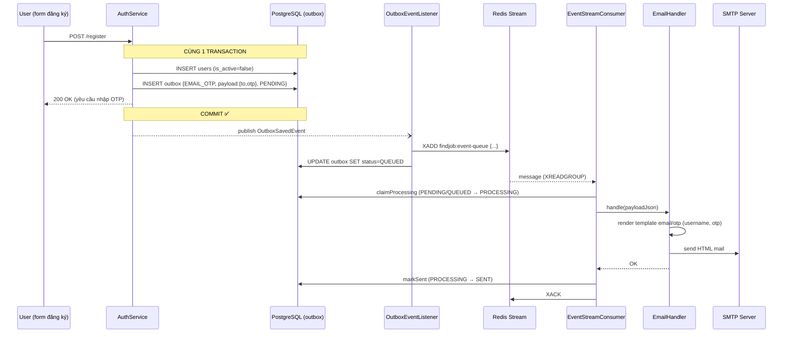

# Kế hoạch: Module email qua Redis Stream + Transactional Outbox (v2)

**Dự án:** FINDJOB-BE
**Trạng thái:** Giai đoạn 1 (xương sống) ĐÃ HOÀN TẤT. Còn lại Giai đoạn 2 (tích hợp nghiệp vụ) + Giai đoạn 3 (vận hành).

---

## 1. Mục tiêu & quyết định thiết kế

Mục tiêu: chuyển gửi mail từ gọi thẳng `@Async EmailService` sang hàng đợi **Redis Streams**
kèm **Transactional Outbox** để đảm bảo không mất sự kiện khi Redis/SMTP chết, có retry,
DLQ, và scale ngang consumer.

Các quyết định cốt lõi:

1. **DB là nguồn chân truth.** Row outbox ghi **cùng transaction** với nghiệp vụ — commit
   cùng sống, rollback cùng chết. Stream chỉ là băng chuyền, mất entry còn cứu được từ DB.
2. **AFTER_COMMIT mới được phép đẩy Redis.** Đẩy trước commit mà TX rollback là gửi OTP cho
   tài khoản chưa tồn tại.
3. **5 trạng thái** `PENDING → QUEUED → PROCESSING → SENT`, nhánh lỗi `FAILED`. `PROCESSING`
   là khóa atomic chống gửi trùng. `SENT` **chỉ consumer** được đặt, sau khi handler chạy OK.
4. **Hai đường đẩy vào stream** (fast path sau commit + polling dự phòng) chủ đích cho phép
   trùng nhau.
5. **Consumer manual-ACK** chuẩn Spring Data Redis (`receive(consumer, offset, listener)`),
   tự quyết lúc ack; consumer group tạo idempotent lúc start (BUSYGROUP = coi như xong).
6. **Chỉ giữ connection DB vài ms mỗi lần đụng DB** — không bọc call Redis trong transaction.
7. **Backoff + giới hạn số lần thử** phía push (polling) và phía consume (`deliveryCount`),
   vượt ngưỡng → DLQ + `FAILED`.
8. **Chấp nhận at-least-once delivery — handler bắt buộc idempotent.**

> [!important] Vì sao không theo đuổi exactly-once
> "Đúng 1 lần" đòi hỏi khoá hai hệ (DB + Redis + SMTP) trong một giao dịch — thực tế không hệ
> phân tán nào làm được rẻ. Ngược lại, "không mất" là yêu cầu cứng (OTP, welcome mail). Nên ta
> chọn **không-mất + chấp-nhận-trùng**, rồi xử lý trùng bằng idempotency ở handler — cách này
> rẻ và chắc chắn hơn nhiều.

---

## 2. Mô hình trạng thái

| Trạng thái | Ý nghĩa | Ai đặt |
|---|---|---|
| `PENDING` | Sự kiện **chỉ tồn tại trong DB**, chưa vào Redis. Đây là trạng thái sinh ra cùng lúc với nghiệp vụ. | Business service (insert) |
| `QUEUED` | Đã `XADD` vào Redis Stream, đang chờ consumer lấy. | Listener sau-commit hoặc polling scheduler, **sau khi XADD thành công** |
| `PROCESSING` | Consumer **đã giành quyền gửi mail** (atomic claim), đang trong lúc gửi. Khóa chống trùng: chỉ 1 luồng giành được. | Consumer, **TRƯỚC khi gửi mail** |
| `SENT` | Mail gửi thành công + đã `XACK`. Trạng thái kết thúc tốt đẹp — chỉ consumer được phép đặt. | Consumer |
| `FAILED` | Hết cứu cánh: hoặc đẩy lên Redis thất bại quá `max_retries`, hoặc consumer thử hoài không xong → xuống DLQ. | Polling scheduler / PendingReclaimer |

**Transition `PROCESSING`:**
- `PENDING/QUEUED → PROCESSING` — `claimProcessing()`, atomic, chống trùng
- `PROCESSING → SENT` — `markSent()`, sau khi gửi mail OK
- `PROCESSING → PENDING` — `revertToPending()`, khi gửi mail fail (để retry)

Mũi tên `QUEUED → PENDING` (qua janitor) là lưới an toàn: nếu entry trong Redis bị cắt mất
(trim/flush) nhưng row DB còn kẹt ở `QUEUED` quá 15 phút, hệ thống nghi ngờ và đẩy lại. Việc
đẩy lại có thể khiến mail gửi 2 lần — vô hại vì handler idempotent (xem mục 6).

---

## 3. Kiến trúc tổng quan

> [!tip] Tóm tắt bằng một câu: mỗi email cần gửi được lưu thành **1 row trong bảng outbox (PostgreSQL)** trước, rồi mới được đẩy sang **Redis Stream** để consumer gửi dần. Row là "nguồn sự thật" — Redis chỉ là hàng đợi tạm. Nếu Redis chết hay mất dữ liệu thì row trong DB vẫn còn, hệ thống tự đẩy lại được.


**📖 Giải thích sơ đồ — đi theo thứ tự đánh số**

1. **Business Service** (ví dụ `AuthService` khi đăng ký): vừa ghi bảng nghiệp vụ, vừa ghi 1
   dòng vào bảng `outbox` — **trong cùng một transaction**. Commit xong thì cả hai cùng tồn
   tại, rollback thì cả hai cùng biến mất. Đây là điểm mấu chốt đảm bảo "không mất": không có
   tình huống "nghiệp vụ xong mà quên ghi email cần gửi".
2. **OutboxEventListener** nghe sự kiện *sau khi commit*: lập tức thử `XADD` đưa sự kiện vào
   Redis Stream. Đây là đường nhanh — email vào hàng trong vài mili-giây.
3. Push thành công → đánh dấu row thành `QUEUED`.
4. Nếu bước 2 thất bại (Redis chết): row **giữ nguyên `PENDING`**.
5. **Polling Scheduler** mỗi 10 giây quét các row `PENDING` quá hạn `next_retry_at`, đẩy lại
   vào Stream. Đây là đường dự phòng — chậm hơn nhưng bù lại không bao giờ bỏ rơi sự kiện.
6. **EventStreamConsumer** đọc message từ Stream theo cơ chế consumer group, gọi handler
   tương ứng theo `eventType`. Cùng 1 instance `@Component` được **8 consumer** (`-w0`..`-w7`)
   dùng chung để xử lý song song — phải thread-safe.
7. Handler gửi mail thật (SMTP). OK → `XACK` + row thành `SENT`.
8. **PendingReclaimer** mỗi 30 giây soi danh sách message "đã giao nhưng chưa ack" (pending
   entries): cái nào treo quá 60 giây thì nhận lại để xử lý; thử quá số lần → đẩy vào
   **DLQ** (`findjob:event-dlq`) và đánh dấu row `FAILED`.

Hai đường đẩy vào Stream (2 và 5) có thể đẩy **trùng nhau** một sự kiện — điều này là chủ
đích, consumer sẽ tự loại trùng (mục 5.8).

### 3b. Ví dụ đi qua toàn hệ thống: gửi mail OTP khi đăng ký



**📖 Giải thích:** người dùng chỉ cảm nhận bước đầu và cuối — submit form rồi mở mailbox.
Mọi bước giữa diễn ra nền, không chặn API. Nếu Redis chết tại bước `XADD`: response API vẫn
trả bình thường (outbox đã commit), mail đi muộn hơn qua polling — người dùng nhận OTP chậm
vài chục giây thay vì không nhận gì.

---

## 4. Schema — Flyway `V16__create_outbox_table.sql`

> [!note] Migration mới nhất hiện tại là V15 → file này bắt buộc tên `V16__...`.
> File đã tồn tại sẵn trong repo: `src/main/resources/db/migration/V16__create_outbox_table.sql`.

```sql
CREATE TABLE outbox (
    id            BIGSERIAL PRIMARY KEY,
    event_type    VARCHAR(100) NOT NULL,
    aggregate_type VARCHAR(50),
    aggregate_id  BIGINT,
    payload       JSONB NOT NULL,                 -- {to, templateName, variables{...}}
    status        VARCHAR(20) NOT NULL DEFAULT 'PENDING', -- PENDING|QUEUED|PROCESSING|SENT|FAILED
    retry_count   INT NOT NULL DEFAULT 0,
    max_retries   INT NOT NULL DEFAULT 5,
    next_retry_at TIMESTAMPTZ,
    last_error    TEXT,
    created_at    TIMESTAMPTZ NOT NULL DEFAULT now(),
    updated_at    TIMESTAMPTZ NOT NULL DEFAULT now()
);

-- Index nóng: tập PENDING luôn nhỏ
CREATE INDEX idx_outbox_pending ON outbox (next_retry_at, created_at) WHERE status = 'PENDING';
CREATE INDEX idx_outbox_status_queued ON outbox (created_at) WHERE status = 'QUEUED';
CREATE INDEX idx_outbox_status_sent_created ON outbox (status, created_at);
```

**📖 Giải thích schema — chia 4 nhóm cột:**

- **Định danh & truy vết:** `id` (`BIGSERIAL` = số tự tăng, map sang `Long`), `event_type`
  (quyết định handler nào xử lý — "loại thư"), `aggregate_type`/`aggregate_id` (sự kiện này
  thuộc đối tượng nghiệp vụ nào, vd `USER` #42 — chỉ để debug/truy vết, logic không phụ thuộc).
- **Hành lý:** `payload` (JSONB) gói mọi thứ handler cần (`to`, `templateName`, `variables`).
  Nguyên tắc *self-contained*: consumer KHÔNG quay lại bảng users/jobs để hỏi thêm — đề phòng
  dữ liệu gốc đã đổi làm payload stale.
- **Vòng đời & retry:** `status` điều phối máy trạng thái; `retry_count`/`max_retries` giới hạn
  số lần thử; `next_retry_at` là mốc "hẹn giờ thử lại" — nền tảng của backoff; `last_error`
  lưu vết lỗi cuối để soi log không phải đoán.
- **Mốc thời gian:** `updated_at` ngoài mục đích thường quy còn là dấu vết janitor dựa vào để
  biết row "kẹt QUEUED đã lâu chưa".

**📖 Hai cột `retry_count` + `max_retries` — bộ đếm và giới hạn:**

- `retry_count` = row này **đã đẩy vào Redis thất bại bao nhiêu lần**. Mỗi lần polling đẩy
  mà hỏng (Redis chết, mất kết nối...) thì +1. Row mới tạo thì bằng 0.
- `max_retries` = **giới hạn số lần thử**: fail đủ số lần này thì chuyển `FAILED` và thôi
  không thử nữa. Mặc định 5; vì là cột riêng từng row nên event nào quan trọng hơn có thể
  set số lớn hơn lúc tạo.

Ví dụ cụ thể: có 1 email OTP cần gửi mà Redis sập luôn, polling cứ thử lại theo giờ hẹn:

| Diễn biến | retry_count | next_retry_at (hẹn thử lại lúc) | status |
|---|---|---|---|
| Vừa ghi row | 0 | *(rỗng → được nhặt ngay)* | PENDING |
| Đẩy vào Redis hỏng lần 1 | 1 | sau 30 giây | PENDING |
| Hỏng lần 2 | 2 | sau 1 phút | PENDING |
| Hỏng lần 3 | 3 | sau 2 phút | PENDING |
| Hỏng lần 4 | 4 | sau 4 phút | PENDING |
| Hỏng lần 5 = đủ max_retries | 5 | *(không hẹn nữa)* | FAILED 💀 |

Giờ hẹn xa dần gấp đôi mỗi lần (30s → 1p → 2p...) gọi là *backoff* — tránh việc Redis đang
chết mà polling dội liên tục mỗi 10 giây. Câu SELECT lấy row cũng có điều kiện
`retry_count < max_retries`, nên row FAILED tự động bị bỏ qua mãi mãi.

Lưu ý ranh giới: hai cột này **chỉ đếm lỗi đẩy vào Redis** (đường polling). Riêng phía
consumer gửi mail thất bại thì không đụng vào đây — nó dùng `deliveryCount` (số lần Redis tự
giao lại message trong PEL) so với chính `max_retries` này để quyết định thử lại hay đưa xuống
DLQ (mục 5.8).

Ba index cuối là **partial index**: `idx_outbox_pending` chỉ đánh chỉ số các row `PENDING` —
vốn luôn rất ít (chỉ sự kiện chờ đẩy) → query polling mỗi 10 giây quét index nhỏ xíu, gần
như miễn phí.

### 4.1 Entity + Enum

Package `com.example.boilerplate.common.outbox.entity` — `@Entity Outbox` map 1-1 bảng trên
(`id` kiểu `Long` vì `BIGSERIAL`), enum `OutboxStatus { PENDING, QUEUED, PROCESSING, SENT, FAILED }`.

```java
// common/outbox/entity/Outbox.java
/**
 * Mỗi row = 1 email cần gửi.
 *
 * Row này được ghi CÙNG TRANSACTION với nghiệp vụ — ví dụ hàm register()
 * vừa lưu user vừa ghi row EMAIL_OTP. Commit thì cả hai cùng vào DB,
 * rollback thì cả hai cùng biến mất. Nhờ vậy không bao giờ có trường hợp
 * "tạo user xong mà quên gửi mail".
 *
 * 5 trạng thái của row:
 * PENDING    — mới ghi, chưa đưa vào Redis
 * QUEUED     — đã nằm trong Redis, chờ consumer gửi
 * PROCESSING — consumer đang giành quyền gửi mail (atomic claim)
 * SENT       — mail đã gửi thành công
 * FAILED     — thử quá nhiều lần vẫn hỏng, bỏ cuộc
 */
@Entity
@Table(name = "outbox")
@Getter @Setter @Builder
@NoArgsConstructor @AllArgsConstructor
public class Outbox {

    @Id
    @GeneratedValue(strategy = GenerationType.IDENTITY)
    private Long id;

    /** Loại email — vd EMAIL_OTP, EMAIL_WELCOME. Consumer dựa vào đây chọn cách gửi. */
    @Column(name = "event_type", nullable = false, length = 100)
    private String eventType;

    /** Sự kiện này thuộc về ai — vd USER #42. Chỉ để tra cứu khi debug. */
    @Column(name = "aggregate_type", length = 50)
    private String aggregateType;

    @Column(name = "aggregate_id")
    private Long aggregateId;

    /**
     * Toàn bộ dữ liệu cần để gửi mail, đóng gói thành JSON:
     * {"to": "nam@gmail.com", "templateName": "email/otp", "variables": {...}}
     *
     * Consumer chỉ đọc payload này, KHÔNG quay lại bảng users lấy thêm —
     * vì giữa lúc ghi và lúc gửi có thể cách nhau lâu (Redis chết...),
     * dữ liệu users có thể đã đổi. Payload là "bản chụp" tại thời điểm ghi.
     *
     * @JdbcTypeCode: bắt buộc để Hibernate ghi chuỗi String vào cột jsonb
     * của PostgreSQL — thiếu là lỗi kiểu dữ liệu lúc INSERT.
     */
    @JdbcTypeCode(SqlTypes.JSON)
    @Column(columnDefinition = "jsonb", nullable = false)
    private String payload;

    /** Trạng thái hiện tại của row — xem 5 giá trị ở đầu class. */
    @Enumerated(EnumType.STRING)
    @Column(nullable = false, length = 20)
    private OutboxStatus status;

    /**
     * Đếm số lần ĐƯA VÀO REDIS hỏng (Redis chết, mất kết nối...).
     *
     * Lưu ý: KHÔNG đếm lỗi gửi mail. Gửi mail hỏng là chuyện của Redis —
     * Redis tự đếm số lần giao lại message (deliveryCount) và PendingReclaimer
     * dựa vào số đó. Field này chỉ dành cho lỗi phía đẩy.
     */
    @Column(name = "retry_count", nullable = false)
    @Builder.Default
    private int retryCount = 0;

    /**
     * Số lần thử tối đa = 5. Thử hỏng đủ 5 lần thì bỏ cuộc (FAILED).
     * Dùng cho cả 2 việc:
     * - Đẩy vào Redis hỏng 5 lần → row FAILED
     * - Gửi mail hỏng 5 lần (Redis giao lại 5 lần) → chuyển vào DLQ
     */
    @Column(name = "max_retries", nullable = false)
    @Builder.Default
    private int maxRetries = 5;

    /**
     * Hẹn giờ thử lại: đẩy hỏng thì không thử ngay mà hẹn xa dần
     * (30 giây → 1 phút → 2 phút...). Chưa đến giờ thì polling bỏ qua row.
     * NULL = được thử ngay lập tức.
     */
    @Column(name = "next_retry_at")
    private Instant nextRetryAt;

    /** Lỗi gần nhất — vd "Redis connection timeout". Để soi khi debug. */
    @Column(name = "last_error")
    private String lastError;

    @CreationTimestamp
    @Column(name = "created_at", updatable = false)
    private Instant createdAt;

    /**
     * Hibernate tự cập nhật mỗi lần row đổi. Dùng để phát hiện row QUEUED
     * "kẹt" — hơn 15 phút không nhúc nhích thì nghi bản trong Redis đã mất,
     * đưa về PENDING đẩy lại - sẽ có khả năng gửi trùng event nên phải kiểm
     * tra status của outbox event.
     */
    @UpdateTimestamp
    @Column(name = "updated_at")
    private Instant updatedAt;
}
```

```java
// common/outbox/entity/OutboxStatus.java
/**
 * State machine của outbox event. Ràng buộc quyền chuyển trạng thái:
 *
 * PENDING : initial state. Do business service set lúc INSERT (trong TX nghiệp vụ).
 * QUEUED  : entry đã XADD thành công vào Redis Stream. Do listener (fast path)
 *           hoặc polling scheduler set, sau khi XADD trả về entry-id.
 * PROCESSING: consumer đã giành quyền gửi mail (atomic claim), đang trong lúc gửi.
 *           Khóa chống trùng: chỉ 1 luồng giành được.
 * SENT    : terminal state — handler đã thực thi thành công và đã XACK.
 *           CHỈ EventStreamConsumer được set. Đây là điều kiện cần cho
 *           idempotency check ở consumer (bản duplicate thấy SENT → skip + ACK).
 * FAILED  : terminal state — vượt max_retries ở push path (registerPushFailure)
 *           hoặc consume path (reclaimer → DLQ).
 *
 * Transition PROCESSING:
 *   PENDING → PROCESSING — claimProcessing(), atomic, chống trùng
 *   PROCESSING → SENT    — markSent(), sau khi gửi mail OK
 *   PROCESSING → PENDING — revertToPending(), khi gửi mail fail (để retry)
 *
 * Chú ý: không tồn tại transition QUEUED → PENDING từ consumer;
 * transition ngược PENDING ← QUEUED chỉ do janitor (requeueStaleQueued) thực hiện.
 */
public enum OutboxStatus { PENDING, QUEUED, PROCESSING, SENT, FAILED }
```

### 4.2 Repository — các query then chốt

Package `com.example.boilerplate.common.outbox.repository`.

```java
// common/outbox/repository/OutboxRepository.java
/**
 * Các mutation trạng thái outbox. Mỗi method là một transition của state machine,
 * đều guard bằng điều kiện WHERE trên status hiện tại để đảm bảo idempotent
 * khi có nhiều writer cạnh tranh (listener vs scheduler vs consumer).
 */
@Repository
public interface OutboxRepository extends JpaRepository<Outbox, Long> {

    /**
     * Polling batch: SELECT các row PENDING để push vào stream.
     *
     * Điều kiện eligibility:
     * - retry_count < max_retries : loại row đã exceed ngưỡng push-failure
     * - next_retry_at IS NULL OR <= now() : chưa đến backoff deadline thì skip
     *
     * FOR UPDATE SKIP LOCKED: row-level lock, các transaction khác gặp row
     * đang lock sẽ bỏ qua thay vì block → multi-instance poll không overlap batch
     * và không serialize nhau. Lock tồn tại trong phạm vi TX của lời gọi này.
     */
    @Query(value = """
        SELECT * FROM outbox
        WHERE status = 'PENDING'
          AND retry_count < max_retries
          AND (next_retry_at IS NULL OR next_retry_at <= now())
        ORDER BY created_at
        LIMIT :limit
        FOR UPDATE SKIP LOCKED
    """, nativeQuery = true)
    List<Outbox> lockPendingBatch(@Param("limit") int limit);

    /**
     * Transition PENDING → QUEUED. Guard status='PENDING': nếu row đã được
     * chuyển bởi writer khác (race giữa fast path và polling), affected rows = 0
     * → caller hiểu là không cần thao tác thêm. Idempotent.
     */
    @Modifying
    @Query(value = """
        UPDATE outbox SET status = 'QUEUED', next_retry_at = NULL, last_error = NULL
        WHERE id = :id AND status = 'PENDING'
    """, nativeQuery = true)
    int markQueued(@Param("id") Long id);

    /**
     * Janitor: khôi phục row QUEUED stale về PENDING.
     * Áp dụng cho các case mất entry phía Redis: FLUSHALL, MAXLEN trim cắt entry
     * chưa consume, consumer group bị xóa. Điều kiện updated_at < now() - N minutes
     * để tránh requeue row đang trong quá trình consume hợp lệ.
     * Side effect: có thể push duplicate vào stream — chấp nhận trong at-least-once.
     */
    @Modifying
    @Query(value = """
        UPDATE outbox SET status = 'PENDING', next_retry_at = now()
        WHERE status = 'QUEUED' AND updated_at < now() - (:minutes * interval '1 minute')
    """, nativeQuery = true)
    int requeueStaleQueued(@Param("minutes") int minutes);

    /**
     * Ghi nhận 1 lần ĐẨY VÀO REDIS THẤT BẠI — polling scheduler gọi khi push lỗi.
     *
     * Một câu UPDATE làm 3 việc:
     * 1. retry_count + 1
     * 2. Lưu lỗi vào last_error (vd "Redis connection timeout")
     * 3. Hẹn giờ thử lại — mỗi lần hỏng hẹn xa GẤP ĐÔI lần trước:
     *
     *      hỏng lần 1 → thử lại sau 30 giây
     *      hỏng lần 2 → sau 1 phút
     *      hỏng lần 3 → sau 2 phút
     *      hỏng lần 4 → sau 4 phút
     *      hỏng lần 5 → FAILED, thôi thử (mặc định max_retries = 5)
     *
     *    Hẹn xa dần để không đánh liên tục vào Redis đang chết — polling chạy
     *    mỗi 10 giây, không hẹn giờ thì cứ 10s lại dội 1 lần.
     *    (Trần tối đa 10 phút/lần — chỉ có tác dụng khi max_retries đặt > 5.)
     *
     * Lưu ý SQL: CASE so sánh "retry_count + 1" với max_retries, trong đó
     * retry_count là giá trị CŨ (PostgreSQL đọc giá trị trước khi UPDATE),
     * nên "+1" chính là số lần hỏng MỚI. Ví dụ: đang 4, max 5 → 4+1=5 ≥ 5 → FAILED.
     *
     * WHERE status = 'PENDING': row đã thành QUEUED (instance khác đẩy thành
     * công rồi) thì câu lệnh không đụng vào — tránh đếm hỏng oan cho row đã xong.
     */
    @Modifying
    @Query(value = """
        UPDATE outbox
        SET retry_count = retry_count + 1,
            last_error = :error,
            next_retry_at = CASE WHEN retry_count + 1 >= max_retries THEN NULL
                                 ELSE now() + least(power(2, retry_count) * interval '30 seconds',
                                                    interval '10 minutes') END,
            status = CASE WHEN retry_count + 1 >= max_retries THEN 'FAILED' ELSE status END
        WHERE id = :id AND status = 'PENDING'
    """, nativeQuery = true)
    int registerPushFailure(@Param("id") Long id, @Param("error") String error);

    /**
     * Claim quyền gửi mail — ATOMIC, chống trùng.
     * Chỉ 1 luồng (trong 8 worker + reclaimer) giành được:
     *   affected = 1 → giành được → gửi mail
     *   affected = 0 → thua (luồng khác đang gửi) → bỏ qua
     */
    @Modifying
    @Query("UPDATE Outbox o SET o.status = 'PROCESSING'"
            + " WHERE o.id = :id AND o.status IN ('PENDING', 'QUEUED')")
    int claimProcessing(@Param("id") Long id);

    /**
     * PROCESSING → SENT — CHỈ consumer được gọi, sau khi mail gửi THẬT SỰ thành công.
     *
     * WHERE status = 'PROCESSING': chỉ luồng đã claim mới được đặt SENT.
     */
    @Modifying
    @Query("UPDATE Outbox o SET o.status = 'SENT', o.lastError = NULL"
            + " WHERE o.id = :id AND o.status = 'PROCESSING'")
    int markSent(@Param("id") Long id);

    /**
     * Gửi mail thất bại → revert PROCESSING → PENDING để retry.
     * Chỉ revert nếu vẫn còn PROCESSING (chưa bị luồng khác đụng).
     */
    @Modifying
    @Query("UPDATE Outbox o SET o.status = 'PENDING'"
            + " WHERE o.id = :id AND o.status = 'PROCESSING'")
    int revertToPending(@Param("id") Long id);

    /**
     * Chỉ ghi lỗi gửi mail gần nhất vào last_error — vd "SMTP timeout".
     * KHÔNG tăng retry_count: số lần gửi lại do Redis đếm (deliveryCount),
     * PendingReclaimer dựa vào số đó. DB đếm thêm là đếm kép.
     */
    @Modifying
    @Query("UPDATE Outbox o SET o.lastError = :error WHERE o.id = :id")
    void noteProcessingError(@Param("id") Long id, @Param("error") String error);

    /**
     * → FAILED — reclaimer gọi sau khi message đã bị chuyển vào DLQ
     * (thử gửi đủ max_retries lần vẫn hỏng).
     *
     * WHERE status <> 'SENT': trong trường hợp consumer vừa gửi thành công
     * đúng lúc reclaimer quyết định đưa xuống DLQ, SENT luôn thắng —
     * không ghi đè kết quả thành công bằng thất bại.
     */
    @Modifying
    @Query("UPDATE Outbox o SET o.status = 'FAILED', o.lastError = :reason"
            + " WHERE o.id = :id AND o.status <> 'SENT'")
    int markFailed(@Param("id") Long id, @Param("reason") String reason);
}
```

**📖 Tóm tắt query — mỗi query chỉ là một câu UPDATE/SELECT đổi trạng thái:**

| Query | Ai gọi, khi nào | Transition |
|---|---|---|
| `lockPendingBatch` | Polling scheduler, mỗi 10 giây | SELECT PENDING |
| `markQueued` | Sau khi XADD thành công | PENDING → QUEUED |
| `registerPushFailure` | Đẩy Redis hỏng | PENDING (+ backoff / FAILED) |
| `requeueStaleQueued` | Janitor, đầu mỗi vòng polling | QUEUED → PENDING |
| `claimProcessing` | Consumer, trước khi gửi mail | PENDING/QUEUED → PROCESSING |
| `markSent` | Consumer, sau khi mail OK | PROCESSING → SENT ✅ |
| `revertToPending` | Consumer, gửi mail fail | PROCESSING → PENDING |
| `noteProcessingError` | Consumer, ghi lỗi | Chỉ ghi last_error |
| `markFailed` | Reclaimer, message vào DLQ | → FAILED |

---

## 5. Các thành phần chi tiết

**🗺️ Bản đồ file & package:**

| File | Package đầy đủ |
|---|---|
| `Outbox.java`, `OutboxStatus.java` | `com.example.boilerplate.common.outbox.entity` |
| `OutboxRepository.java` | `com.example.boilerplate.common.outbox.repository` |
| `OutboxSavedEvent.java`, `OutboxEventListener.java` | `com.example.boilerplate.common.outbox.event` |
| `EventStreamProducer.java` | `com.example.boilerplate.common.outbox.producer` |
| `OutboxService.java` | `com.example.boilerplate.common.outbox.service` |
| `OutboxPollingScheduler.java` | `com.example.boilerplate.common.outbox.scheduler` |
| `OutboxStreamConfig.java`, `OutboxStreamProperties.java` | `com.example.boilerplate.common.outbox.config` |
| `EventStreamConsumer.java` | `com.example.boilerplate.common.outbox.consumer` |
| `PendingReclaimer.java` | `com.example.boilerplate.common.outbox.reclaimer` |
| `EventHandler.java`, `EventHandlerRegistry.java`, `EmailHandler.java` | `com.example.boilerplate.common.outbox.handler` |

### 5.1 Ghi outbox + phát sự kiện — `OutboxService` + `OutboxSavedEvent`

```java
// common/outbox/event/OutboxSavedEvent.java
public record OutboxSavedEvent(Long outboxId, Outbox outbox) {}
```

```java
// Ví dụ gọi thật: features/auth/service/impl/AuthServiceImplement.java, trong hàm register()
// Business service dùng — BÊN TRONG transaction nghiệp vụ:
Outbox saved = outboxService.savePending("EMAIL_OTP", "USER", userId,
        Map.of("to", email, "templateName", "email/otp",
               "variables", Map.of("username", username, "otp", otp)));
eventPublisher.publishEvent(new OutboxSavedEvent(saved.getId(), saved));
```

> [!warning] Bẫy kinh điển của `@TransactionalEventListener`
> `publishEvent` phải diễn ra **trong một transaction đang mở**, nếu không listener
> AFTER_COMMIT **không bao giờ được gọi** (mặc định `fallbackExecution = false`) — mail im
> lặng không gửi, không lỗi.

`savePending` serialize payload → JSON, insert với `status=PENDING`, `retry_count=0`,
`max_retries=5`, `next_retry_at=NULL`. Lỗi serialize là bug lập trình → quăng luôn cho TX
nghiệp vụ rollback.

**OutboxService** (`@Service @Transactional`):

```java
// common/outbox/service/OutboxService.java
@Service
@RequiredArgsConstructor
@Slf4j
@Transactional
public class OutboxService {

    private final OutboxRepository outboxRepository;
    private final ObjectMapper objectMapper;

    /**
     * Ghi 1 email cần gửi vào bảng outbox (trạng thái PENDING).
     *
     * Phải gọi BÊN TRONG transaction của nghiệp vụ — vd trong hàm register(),
     * cùng lúc với việc lưu user. Nhờ vậy user và row email cùng commit
     * hoặc cùng rollback.
     *
     * Sau khi gọi hàm này, caller phải publishEvent(OutboxSavedEvent)
     * để listener đẩy event vào Redis sau khi commit.
     *
     * Ví dụ:
     *   outboxService.savePending("EMAIL_OTP", "USER", user.getId(),
     *       Map.of("to", email, "templateName", "email/otp",
     *              "variables", Map.of("username", username, "otp", otp)));
     *
     * Biến Map thành JSON mà lỗi → ném exception cho transaction nghiệp vụ
     * rollback. Đây là bug lập trình (payload chứa kiểu không serialize được),
     * nuốt lỗi đồng nghĩa mất email vĩnh viễn.
     */
    public Outbox savePending(String eventType, String aggregateType,
                              Long aggregateId, Map<String, Object> payload) {
        try {
            return outboxRepository.save(Outbox.builder()
                            .eventType(eventType)
                            .aggregateType(aggregateType)
                            .aggregateId(aggregateId)
                            .payload(objectMapper.writeValueAsString(payload))
                            .status(OutboxStatus.PENDING)
                            .retryCount(0)
                            .maxRetries(5)
                    .build()
            );
        } catch (JsonProcessingException e) {
            throw new IllegalStateException("Serialize payload failed: " + eventType, e);
        }
    }

    /**
     * PENDING → QUEUED. Gọi ngay sau khi đẩy event vào Redis thành công.
     * Có 2 nơi gọi: listener (ngay sau commit) và polling scheduler (mỗi 10 giây).
     *
     * @return false = row đã được thằng khác chuyển QUEUED trước rồi
     *         (hai đường cùng đẩy 1 event) — bình thường, không cần làm gì thêm
     *
     * @Transactional riêng (không dựa vào class-level): method này được gọi từ
     * @TransactionalEventListener(AFTER_COMMIT) — lúc đó transaction của request
     * đã commit & đóng, class-level @Transactional không mở TX mới được.
     * Nếu thiếu annotation này, @Modifying UPDATE query chạy không có transaction
     * → TransactionRequiredException "Executing an update/delete query".
     */
    @Transactional
    public boolean markQueued(Long id) {
        return outboxRepository.markQueued(id) > 0;
    }

    /**
     * Claim quyền gửi mail — ATOMIC, chống trùng.
     * PENDING/QUEUED → PROCESSING. Chỉ 1 luồng (trong 8 worker + reclaimer) giành được:
     *   affected = 1 → giành được → gửi mail
     *   affected = 0 → thua (luồng khác đang gửi) → bỏ qua
     *
     * @Transactional riêng: consumer gọi từ thread riêng, cần TX cho @Modifying.
     */
    @Transactional
    public boolean claimProcessing(Long id) {
        return outboxRepository.claimProcessing(id) > 0;
    }

    /**
     * PROCESSING → SENT. CHỈ consumer được gọi — sau khi mail gửi THẬT thành công.
     *
     * Thứ tự bắt buộc: markSent() TRƯỚC, XACK Redis SAU.
     * Nếu app crash giữa 2 bước → Redis giao lại message → consumer thấy
     * row đã SENT → chỉ ACK, không gửi mail lần nữa. Đảo ngược thứ tự
     * (ACK trước) mà crash = mail mất trắng, không ai giao lại nữa.
     *
     * @Transactional riêng: consumer gọi từ thread riêng, cần TX cho @Modifying.
     */
    @Transactional
    public boolean markSent(Long id) {
        return outboxRepository.markSent(id) > 0;
    }

    /**
     * Gửi mail thất bại → revert PROCESSING → PENDING để retry.
     * Chỉ revert nếu vẫn còn PROCESSING (chưa bị luồng khác đụng).
     *
     * @Transactional riêng: consumer gọi từ thread riêng, cần TX cho @Modifying.
     */
    @Transactional
    public void revertToPending(Long id) {
        outboxRepository.revertToPending(id);
    }

    /**
     * Ghi nội dung lỗi gần nhất của consumer vào cột last_error để debug.
     * Không tăng retry - phía redis đã có deliveryCount tự tăng mỗi lần
     * giao lại message.
     *
     * @Transactional riêng: consumer gọi từ thread riêng, cần TX cho @Modifying.
     */
    @Transactional
    public void noteProcessingError(Long id, String error) {
        outboxRepository.noteProcessingError(id, error);
    }

    /**
     * Ghi nhận 1 lần ĐẨY VÀO REDIS hỏng — polling scheduler gọi khi push lỗi.
     * Chi tiết nằm trong 1 câu UPDATE ở repository: retry_count + 1,
     * lưu lỗi, hẹn giờ thử lại xa dần (30s → 1p → 2p → 4p).
     * Hỏng đủ 5 lần → row FAILED, thôi thử.
     *
     * @Transactional riêng: polling scheduler gọi từ thread scheduling-1,
     * không có transaction context sẵn — cần TX cho @Modifying UPDATE query.
     */
    @Transactional
    public void registerPushFailure(Long id, String error) {
        outboxRepository.registerPushFailure(id, error);
    }

    /**
     * Lấy tối đa `limit` row PENDING (mail cũ trước) đem đi đẩy vào Redis.
     * Polling scheduler gọi mỗi 10 giây.
     *
     * Transaction chỉ sống trong hàm này: SELECT xong là nhả lock và
     * connection ngay — vòng for đẩy Redis của scheduler chạy bên ngoài,
     * không giữ DB connection trong lúc chờ Redis.
     */
    @Transactional
    public List<Outbox> lockPendingBatch(int limit) {
        return outboxRepository.lockPendingBatch(limit);
    }

    /**
     * Janitor: chuyển row QUEUED bị kẹt quá N phút về PENDING.
     * Phải có transaction vì là @Modifying @Query (UPDATE).
     */
    @Transactional
    public int requeueStaleQueued(int minutes) {
        return outboxRepository.requeueStaleQueued(minutes);
    }
}
```

> [!note] Tại sao các method cần `@Transactional` riêng (dù class đã có)
> Các method `markQueued`, `markSent`, `claimProcessing`, `revertToPending`, `noteProcessingError`,
> `registerPushFailure`, `requeueStaleQueued` được gọi từ **thread không có transaction context
> sẵn** (listener `@Async` trên Virtual Thread, consumer trên pool executor, scheduler trên
> `scheduling-*`). Class-level `@Transactional` không đủ tin cậy trong các ngữ cảnh này — phải
> khai báo `@Transactional` riêng trên từng method để đảm bảo `@Modifying` UPDATE query luôn
> chạy trong transaction.

### 5.2 Janitor — cứu row kẹt `QUEUED`

Chạy đầu mỗi vòng polling (xem 5.5): gọi `outboxService.requeueStaleQueued(staleQueuedMinutes)`
với mặc định 15 phút. Xử lý các case: Redis bị `FLUSHALL`, entry bị MAXLEN trim khi ứ đọng,
consumer group bị xoá nhầm… Row quay về `PENDING` → polling đẩy lại. Có thể trùng — chấp
nhận, xem mục 6.

### 5.3 Đường đẩy vào Stream — `EventStreamProducer`

```java
// common/outbox/producer/EventStreamProducer.java
/**
 * Nơi duy nhất đẩy event vào Redis Stream (lệnh XADD).
 *
 * Có 2 thằng gọi class này:
 * - OutboxEventListener — đẩy ngay sau khi transaction commit (đường nhanh)
 * - OutboxPollingScheduler — quét mỗi 10 giây, nhặt row PENDING còn bỏ sót (đường dự phòng)
 *
 * 2 đường cùng đẩy 1 event → stream có 2 bản — vô hại: consumer check
 * status == SENT trước khi gửi, bản trùng tới sau sẽ bị bỏ qua.
 */
@Component
@RequiredArgsConstructor
public class EventStreamProducer {

    private final StringRedisTemplate stringRedisTemplate;
    private final OutboxStreamProperties outboxStreamProperties;

    /**
     * Đẩy 1 event vào stream. Thành công → true.
     * Redis chết / mất kết nối → ném exception cho caller bắt.
     *
     * Vì sao không tự bắt lỗi ở đây: mỗi caller xử lí lỗi một kiểu —
     * listener nuốt lỗi (row giữ PENDING, chờ polling), scheduler thì
     * tăng retry_count.
     */
    public boolean push(Outbox outbox) {
        Map<String, String> fields = new HashMap<>();
        fields.put("outboxId", outbox.getId().toString());
        fields.put("eventType", outbox.getEventType());

        if (outbox.getAggregateType() != null) {
            fields.put("aggregateType", outbox.getAggregateType());
        }

        if (outbox.getAggregateId() != null) {
            fields.put("aggregateId", outbox.getAggregateId().toString());
        }

        fields.put("payload", outbox.getPayload());

        // MAXLEN ~ 50000: stream chỉ giữ tối đa ~50k entry, cũ hơn thì Redis tự cắt
        // để RAM không phình to. Dấu "~" là trim xấp xỉ — có thể cắt nhầm entry
        // chưa ai đọc. Nếu bị cắt, row DB vẫn còn QUEUED → janitor sau 15 phút
        // đưa về PENDING đẩy lại (DB mới là nguồn chân truth, stream chỉ là băng chuyền).
        //
        // Lưu ý API: MAXLEN là tham số của LỆNH XADD (XAddOptions),
        // không phải thuộc tính của record — StreamRecords không có withMaxlen().
        return stringRedisTemplate.opsForStream().add(
                StreamRecords.string(fields).withStreamKey(outboxStreamProperties.streamKey()),
                RedisStreamCommands.XAddOptions.maxlen(outboxStreamProperties.maxlen())
                        .approximateTrimming(true)) != null;
    }
}
```

> [!warning] MAXLEN là cơ chế phòng thủ, không phải bảo chứng
> Trim xấp xỉ (`~`) có thể cắt entry **chưa ai consume** nếu ứ đọng quá 50k. Khi đó row DB
> vẫn ở `QUEUED` → janitor phát hiện và đẩy lại. DB là nơi lưu chân truth, Stream chỉ là băng
> chuyền. Lưu ý: `withMaxlen(...)` gắn trực tiếp lên `StreamRecords` là API **không tồn tại** —
> phải dùng `XAddOptions.maxlen(...)`.

### 5.4 Sau-commit push — `OutboxEventListener`

```java
// common/outbox/event/OutboxEventListener.java
/**
 * Đẩy event vào redis ngay sau khi transaction commit.
 *
 * Business service (ví dụ: register) ghi row outbox xong thì phát
 * 1 event OutboxSavedEvent. Class này nghe sự kiện đó - nhưng ko chạy ngay,
 * nó đợi transaction COMMIT thành công rồi mới chạy (AFTER_COMMIT)
 *
 * Vì sao phải đợi commit xong mới chạy -> nếu đẩy event mail ra lên stream
 * trước, trong trường hợp transaction rollback -> consumer gửi otp cho tài
 * khoản chưa bao giờ tồn tại
 *
 * Nếu redis chết luúc đẩy -> bắt lỗi, im lặng, giữ nguyên status là pending
 * -> OutboxPollingScheduler sẽ thử đẩy lại sau.
 */
@Slf4j
@Component
@RequiredArgsConstructor
public class OutboxEventListener {

    private final EventStreamProducer eventStreamProducer;
    private final OutboxService outboxService;

    /**
     * Đẩy event vào Redis (XADD), thành công thì đánh dấu row thành queued
     *
     * Thứ tự: đẩy vào stream trước, sau đó đánh dấu thành queued sau.
     * Nếu crash giữa 2 bước -> event đã nằm trong redis nhưng row vẫn pending
     * -> polling scheduler sẽ đẩy lại lần nữa -> redis có 2 bản trùng -> consumer
     * check status == SENT và bỏ qua bản trùng.
     *
     * Bắt mọi exception, nhưng ko ném exp do transaction ở tầng nghiệp vụ đã kết thúc
     * , ném lỗi lúc này sẽ ko đuợc rollback.
     *
     * @Async("emailTaskExecutor"): chạy trên Virtual Thread riêng, KHÔNG nằm trong
     * transaction synchronization của request thread. Vì sao bắt buộc:
     * @TransactionalEventListener(AFTER_COMMIT) mặc định chạy đồng bộ trên thread
     * của request — lúc đó transaction vừa commit nhưng synchronization vẫn còn
     * active. Gọi outboxService.markQueued() (cần mở TX mới) từ đó sẽ bị Spring
     * "join" vào synchronization đã hoàn tất → không mở được TX → @Modifying
     * UPDATE query chạy không có transaction → TransactionRequiredException
     * "Executing an update/delete query". Chạy trên thread riêng sẽ thoát khỏi
     * synchronization đó → markQueued mở TX mới bình thường.
     */
    @Async("emailTaskExecutor")
    @TransactionalEventListener(phase = TransactionPhase.AFTER_COMMIT)
    public void onSaved(OutboxSavedEvent event) {
        try {
            if (eventStreamProducer.push(event.outbox())) {
                markQueuedWithRetry(event.outboxId());
            }
        } catch (Exception e) {
            // Redis lỗi -> không ném exp, giữ status pending
            log.warn("Push event vào stream sau commit thất bại, polling sẽ xử lí: {}", event.outboxId());
        }
    }

    /**
     * Đánh dấu QUEUED cho row, thử tối đa 3 lần (cách nhau 200ms -> 400ms -> 600ms)
     *
     * Tại sao phải retry: lúc này XADD đã thành công - event chắc chắn đã nằm
     * trong redis stream. Lỗi db lúc này chỉ là tạm thời (timeout, pool đầy).
     * Thử 3 lần vẫn hỏng thì bỏ: row giữ PENDING, polling scheduler sẽ đẩy lại
     * (chấp nhận trùng event trong stream, consumer sẽ tự loại)
     */
    private void markQueuedWithRetry(Long id) {
        for (int attempt = 1; attempt <= 3; attempt++) {
            try {
                // markQueued trả về true nếu đổi PENDING → QUEUED thành công;
                // trả false nghĩa là người khác đã đổi trạng thái trước rồi — thôi can thiệp nữa
                if (outboxService.markQueued(id)) {
                    log.info("Outbox {} queued ngay sau commit", id);
                }
                return;
            } catch (Exception ex) {
                log.warn("Mark QUEUED fail (lần {}/3) outbox {}: {}", attempt, id, ex.getMessage());
                try {                          // backoff ngắn, không làm chậm request đáng kể
                    Thread.sleep(attempt * 200L);
                } catch (InterruptedException ie) {
                    Thread.currentThread().interrupt();   // khôi phục cờ interrupt rồi thoát
                    break;
                }
            }
        }
        log.error("Không mark QUEUED được outbox {} — polling sẽ đẩy lại (chấp nhận trùng)", id);
    }
}
```

**📖 Giải thích ba kịch bản:**

1. **Êm đẹp:** XADD OK → mark QUEUED, tổng công vài ms.
2. **Redis chết:** catch im lặng, row ở lại PENDING. Polling xử lý sau.
3. **XADD OK nhưng DB fail:** retry nhanh 3 lần; vẫn hỏng thì chấp nhận polling đẩy lại gây TRÙNG (consumer tự loại).

Nguyên tắc xuyên suốt: listener **không bao giờ ném exception lên request của user**.

### 5.5 Polling scheduler — `OutboxPollingScheduler`

```java
// common/outbox/scheduler/OutboxPollingScheduler.java
/**
 * Fallback publisher - chạy nền mỗi 10 giây để đẩy nhưng event PENDING
 * còn sót ở database vào Redis Stream
 *
 * Hỗ trợ cho OutboxEventListener khi:
 * - Redis chết tại thời đểm commit -> giữ event PENDING
 * - App crash ngay sau khi commit trước khi listener kịp chạy
 * - markQueued thất bại (lỗi DB) -> event vẫn PENDING
 *
 * Vì OutboxEventListener + OutboxPollingScheduler có thể đẩy duplicate vào stream
 * (dual‑path publish), consumer sẽ dedupe bằng check status == SENT trước khi xử lý
 * – đây là at‑least‑once.
 *
 * fixedDelay: đợt trước kết thúc mới tính chu kỳ kế tiếp → không overlap giữa các lần
 * chạy trên cùng một instance.
 */
@Slf4j
@Component
@RequiredArgsConstructor
public class OutboxPollingScheduler {

    private final OutboxStreamProperties outboxStreamProperties;
    private final OutboxService outboxService;
    private final EventStreamProducer eventStreamProducer;

    /**
     * Chạy nền mỗi 10 giây.
     *
     * Luồng xử lí:
     * 1. Janitor: chuyển các sự kiện QUEUED bị kẹt (không được xử lí trong hơn 15p),
     * thì đưa về trạng thái PENDING để thử đẩy lại
     * 2. Batch Fetch: lấy tối đa 100 row PENDING (có FOR UPDATE SKIP LOCKED)
     * 3. Push từng row: XADD vào Stream, thành công -> Mark QUEUED;
     * thất bại -> registerPushFailure.
     */
    @Scheduled(fixedDelayString = "${app.outbox.poll-interval-ms:10000}")
    public void pollOutbox() {
        // Cứu row QUEUED bị kẹt (Redis FLUSHALL, MAXLEN trim, consumer group bị xóa…)
        // đưa về PENDING để chu kỳ này hoặc chu kỳ sau đẩy lại.
        // Gọi qua service vì requeueStaleQueued là @Modifying @Query cần transaction.
        outboxService.requeueStaleQueued(outboxStreamProperties.staleQueuedMinutes());

        // Batch fetch – TX chỉ sống trong câu SELECT này (vài ms).
        //    FOR UPDATE SKIP LOCKED: lock row vừa lấy, instance khác bỏ qua row đang bị lock
        //    → 2 instance chạy song song tự chia batch, không giành việc của nhau.
        //    Lock được release ngay khi method này return – KHÔNG giữ connection trong vòng for.
        List<Outbox> batch = outboxService.lockPendingBatch(outboxStreamProperties.batchSize());
        if (!batch.isEmpty()) {
            log.info("[POLLING] Fetched {} PENDING outbox(es) to push", batch.size());
        }

        // Lặp qua từng event outbox trong batch, sau đó đẩy vào stream
        // -> Nếu thành công: đánh dấu các event trong db thành QUEUED
        // -> Nếu thất bại:
        for(Outbox outbox : batch) {
            try {
                // Nêu push thành công vào stream, đổi status event từ pending
                // sang queued
                if (eventStreamProducer.push(outbox)) {
                    outboxService.markQueued(outbox.getId());
                    log.info("[POLLING] Pushed outbox={} eventType={} → QUEUED", outbox.getId(), outbox.getEventType());
                }
            } catch (Exception ex) {
                // push thất bại → ghi nhận lỗi + retry_count++ + backoff (hẹn giờ xa dần)
                // nếu retry_count đạt max_retries → chuyển FAILED (không thử nữa)
                outboxService.registerPushFailure(outbox.getId(), ex.getMessage());
                log.warn("[POLLING] Push FAILED outbox={}: {}", outbox.getId(), ex.getMessage());
            }
        }
    }
}
```

### 5.6 Config Redis — `OutboxStreamConfig`

Đây là **`@Configuration`** — định nghĩa 1 `@Bean` (container) + 1 `@EventListener`:
(1) `@EventListener(ApplicationReadyEvent.class)` kiểm tra stream tồn tại, tạo consumer group,
xóa dummy entry, rồi start container.
(2) `@Bean StreamMessageListenerContainer` lắng nghe stream với 8 consumers song song.

**Cấu hình container:**
- `batchSize(1)`: map thẳng vào `COUNT 1` của `XREADGROUP` — mỗi consumer nhận 1 message/lần,
  8 consumers chia đều backlog, xử lý song song thật.
- `executor(ThreadPoolTaskExecutor)`: corePoolSize=8, maxPoolSize=8, queueCapacity=100,
  CallerRunsPolicy. Dùng fixed pool (KHÔNG Virtual Thread) vì consumer gọi Java Mail
  (dùng synchronized → Virtual Thread bị pinning, mất lợi ích). CallerRunsPolicy đảm bảo
  nếu queue đầy (100 task) thì thread gọi sẽ chạy task thay vì reject — không mất message.
- `pollTimeout(2s)`: `XREADGROUP BLOCK 2000` — idle thì ngủ, có tin dậy trong ≤2s.

**Consumer registration — 8 workers song song:**
- Container đăng ký 8 consumer trong cùng group, mỗi consumer có tên riêng:
  `CONSUMER_NAME + "-w0"` .. `CONSUMER_NAME + "-w7"`.
- Mỗi consumer có PEL riêng, Redis phân phối message round-robin giữa 8 consumer.
- Cách này tăng throughput hơn dùng executor đơn vì container poll song song.

**CONSUMER_NAME** — tên instance consumer duy nhất:
- Được tạo từ `hostname + timestamp base36`, đảm bảo không trùng giữa các instance.
- Dùng để đăng ký consumer trong group và để PendingReclaimer claim lại message.

**Container bean — full code:**

```java
// common/outbox/config/OutboxStreamConfig.java
@Bean(destroyMethod = "stop")
StreamMessageListenerContainer<String, MapRecord<String, String, String>> container(
    RedisConnectionFactory redisConnectionFactory,
    EventStreamConsumer consumer
) {
    // Số lượng consumer song song — nên bằng số core hoặc 8 để tối ưu
    int workers = 8;

    // Executor pool: mỗi consumer chạy trên thread riêng → xử lý song song thật.
    // Dùng fixed thread pool (KHÔNG Virtual Thread) vì consumer gọi Java Mail
    // (dùng synchronized → Virtual Thread bị pinning, mất lợi ích).
    ThreadPoolTaskExecutor containerExecutor = new ThreadPoolTaskExecutor();
    containerExecutor.setCorePoolSize(workers);
    containerExecutor.setMaxPoolSize(workers);
    containerExecutor.setQueueCapacity(100); // hàng đợi giới hạn kích thước tối đa 100
    containerExecutor.setRejectedExecutionHandler(new ThreadPoolExecutor.CallerRunsPolicy());
    containerExecutor.initialize();

    var options = StreamMessageListenerContainer.StreamMessageListenerContainerOptions.builder()
            .pollTimeout(Duration.ofMillis(properties.pollTimeoutMs()))
            .batchSize(1)                    // COUNT=1 cho XREADGROUP → mỗi consumer nhận 1 message/lần
            .executor(containerExecutor)      // 8 threads cho 8 consumers → song song thật
            .errorHandler(t -> log.error("Stream poll error", t))
            .build();

    var container = StreamMessageListenerContainer.create(redisConnectionFactory, options);

    // Đăng ký nhiều consumer với tên khác nhau trong cùng group.
    // Mỗi consumer có PEL riêng, Redis chia message cho các consumer.
    // Cách này tăng throughput hơn dùng executor vì container poll song song.
    for (int i = 0; i < workers; i++) {
        String workerName = CONSUMER_NAME + "-w" + i;
        container.receive(
                Consumer.from(properties.consumerGroup(), workerName),
                StreamOffset.create(properties.streamKey(), ReadOffset.lastConsumed()),
                consumer
        );
    }

    // KHÔNG start() ở đây — chờ onAppReady() tạo group xong mới start
    return container;
}
```

**Startup sequence (`onAppReady()`):**

```java
@EventListener(ApplicationReadyEvent.class)
public void onAppReady() {
    String streamKey = properties.streamKey();
    String consumerGroup = properties.consumerGroup();

    // 1. Đảm bảo stream key tồn tại
    //    Nếu stream chưa có → tạo bằng XADD dummy entry, lưu ID để xóa sau
    //    Nếu stream đã có → bỏ qua (XINFO thành công)
    RecordId dummyId = null;
    try {
        redisTemplate.opsForStream().info(streamKey);
    } catch (RedisSystemException e) {
        dummyId = redisTemplate.opsForStream().add(
                StreamRecords.string(Map.of("_", "_")).withStreamKey(streamKey));
        log.info("Stream '{}' created (was missing)", streamKey);
    }

    // 2. Tạo consumer group (nếu đã có thì BUSYGROUP → bỏ qua)
    try {
        redisTemplate.opsForStream().createGroup(
                streamKey, ReadOffset.from("0"), consumerGroup);
        log.info("Consumer group '{}' created on stream '{}'",
                consumerGroup, streamKey);
    } catch (RedisSystemException ex) {
        // BUSYGROUP bị wrap trong RedisSystemException → check root cause
        if (ex.getCause() instanceof RedisBusyException) {
            log.info("Consumer group '{}' already exists", consumerGroup);
        } else {
            throw ex;
        }
    }

    // 2b. Xóa dummy entry nếu vừa tạo (consumer đọc phải thì crash)
    if (dummyId != null) {
        redisTemplate.opsForStream().delete(streamKey, dummyId);
    }

    // 3. Start container SAU KHI group đã tồn tại
    StreamMessageListenerContainer<?, ?> container =
            applicationContext.getBean(StreamMessageListenerContainer.class);
    container.start();
    log.info("Outbox stream container started");
}
```

> [!important] Vì sao bắt buộc theo đúng thứ tự này
> - **Stream phải tồn tại trước khi tạo group:** `XGROUP CREATE` yêu cầu stream đã có.
> - **Group phải tồn tại trước khi start container:** `XREADGROUP` sẽ fail `NOGROUP` nếu
>   group chưa có.
> - **Dummy entry phải được xóa:** nếu để lại, consumer nhận entry `_=_`, `outboxId` = null →
>   `Long.parseLong(null)` crash `NumberFormatException`. Lưu `RecordId` từ XADD để XDEL
>   đúng entry.### 5.7 Consumer — `EventStreamConsumer`

```java
// common/outbox/consumer/EventStreamConsumer.java
/**
 * Consumer chính: nhận message từ Redis Stream (container giao tới),
 * gọi handler gửi mail thật, rồi tự quyết định ACK
 *
 * Luồng xử lí 1 message:
 * 1. Lấy ra outbox trong DB theo outboxId,
 * 2. Nếu outbox đó đã có status SENT -> ACK và bỏ qua (chống gửi mail trùng)
 * 3. Gọi handler theo eventType để gửi mail
 * 4. Thành công -> markSent() rồi mới ACK
 * 5. Thất bại -> ko ACK, chỉ ghi last_error, để message ở lại PEL
 * cho PendingReclaimer xử lí sau (retry hoặc DLQ)
 */
@Slf4j
@Component
@RequiredArgsConstructor
public class EventStreamConsumer implements StreamListener<String, MapRecord<String, String, String>> {


    private final OutboxRepository outboxRepository;
    private final StringRedisTemplate stringRedisTemplate;
    private final OutboxStreamProperties outboxStreamProperties;
    private final EventHandlerRegistry eventHandlerRegistry;
    private final OutboxService outboxService;

    /**
     * StreamMessageListenerContainer gọi method này mỗi khi có message mới.
     * Với 8 consumer (mục 5.6) method này được gọi SONG SONG từ nhiều thread —
     * instance @Component này được dùng chung, nên phải thread-safe:
     * - Không giữ state mutable (chỉ inject dependencies)
     * - Mỗi message xử lý độc lập, không chia sẻ biến giữa các lần gọi
     *
     * @param mapRecord Message từ Redis Stream, chứa các field:
     *                  outboxId, eventType, payload, aggregateType, aggregateId
     */
    @Override
    public void onMessage(MapRecord<String, String, String> mapRecord) {
        long outboxId = Long.parseLong(mapRecord.getValue().get("outboxId"));

        /**
         * Giành quyền gửi mail — ATOMIC, chống trùng.
         * PENDING/QUEUED → PROCESSING. Chỉ 1 luồng giành được:
         *   affected = 1 → giành được → gửi mail
         *   affected = 0 → thua (luồng khác đang gửi, hoặc đã SENT) → bỏ qua, chỉ ACK
         */
        if (!outboxService.claimProcessing(outboxId)) {
            log.debug("[OUTBOX] Skip outbox={} (already processing or SENT) → ACK", outboxId);
            acknowledge(mapRecord);
            return;
        }

        try {
            // dispatch theo eventType -> EmailHandler/WebhookHandler
            String eventType = mapRecord.getValue().get("eventType");
            log.info("[OUTBOX] Processing outbox={} eventType={}", outboxId, eventType);

            eventHandlerRegistry.getByEventType(eventType)
                            .handle(mapRecord.getValue().get("payload"));

            // Cập nhật status của event thành SENT nếu xử lí thành công
            outboxService.markSent(outboxId);
            // Sau đó ACK Redis cho event này
            acknowledge(mapRecord);
            log.info("[OUTBOX] SUCCESS outbox={} eventType={} → SENT + ACK", outboxId, eventType);
        } catch (Exception e) {
            // Gửi mail thất bại → revert PROCESSING về PENDING để reclaimer retry.
            // Không ACK — message nằm lại PEL chờ reclaimer claim (min-idle reclaimIdleMs).
            log.error("Handle fail out={} - revert to PENDING, chờ reclaimer", outboxId, e);
            outboxService.revertToPending(outboxId);
            outboxService.noteProcessingError(outboxId, e.getMessage());
            // Lưu ý: không rethrow exception ở đây.
            // Rethrow sẽ làm container log lỗi lặp và nếu PendingReclaimer gọi onMessage()
            // trực tiếp, exception sẽ thoát khỏi vòng lặp reclaim(), khiến các entry còn lại bị bỏ sót.
        }
    }

    private void acknowledge(MapRecord<String, String, String> mapRecord) {
        stringRedisTemplate.opsForStream().acknowledge(outboxStreamProperties.streamKey(),
                outboxStreamProperties.consumerGroup(), mapRecord.getId());
    }
}
```

**📖 Ba lối rẽ trong `onMessage`:**

- **Lối vui:** `claimProcessing()` giành được → dispatch handler → gửi SMTP → `markSent` → `acknowledge`. Thứ tự **bắt buộc**: markSent TRƯỚC, XACK SAU.
- **Lối trùng:** `claimProcessing()` trả false → chỉ ACK rồi đi.
- **Lối lỗi:** handler ném exception → `revertToPending()` → không ACK → message ở lại PEL → reclaimer 60s sau nhặt.

### 5.8 PendingReclaimer — mỗi 30 giây

Khi consumer nhận message mà chưa ack, message nằm trong **PEL** (Pending Entries List). Nếu
consumer crash, message **không tự quay lại** — phải có ai "nhặt lại":

1. `XPENDING` — liệt kê message chưa ack mà **im lặng quá 60 giây**.
2. Với mỗi entry, xem `deliveryCount`:
   - `< max_retries` → `XAUTOCLAIM` → chuyển message sang consumer này, xử lý lại.
   - `>= max_retries` → XADD sang DLQ + XACK + `markFailed` trong DB.

```java
// common/outbox/reclaimer/PendingReclaimer.java
/**
 * Định kỳ quét PEL (Pending Entries List) của consumer group trên Redis Stream.
 *
 * Khi một message đã được deliver (giao) cho consumer nhưng chưa được XACK,
 * nó nằm trong PEL. Nếu consumer không XACK (do crash hoặc handler throw exception),
 * message sẽ không tự động được deliver lại. Class này có nhiệm vụ:
 * 1. Đọc danh sách các message trong PEL.
 * 2. Lọc những message có thời gian idle vượt quá ngưỡng (reclaimIdleMs).
 * 3. Dùng lệnh XCLAIM để chuyển quyền sở hữu message sang consumer hiện tại.
 * 4. Đọc payload để biết outboxId và số lần deliver (deliveryCount).
 * 5. Nếu deliveryCount < maxRetries, gọi lại EventStreamConsumer để xử lý.
 * 6. Nếu deliveryCount >= maxRetries, chuyển message sang DLQ (dead-letter stream),
 *    XACK khỏi PEL, và cập nhật status của outbox row thành FAILED.
 */
@Component
@RequiredArgsConstructor
@Slf4j
public class PendingReclaimer {

    private static final String CONSUMER_NAME = OutboxStreamConfig.CONSUMER_NAME;
    private final StringRedisTemplate stringRedisTemplate;
    private final OutboxStreamProperties outboxStreamProperties;
    private final EventStreamConsumer eventStreamConsumer;
    private final OutboxRepository outboxRepository;

    /**
     * Chạy mỗi 30 giây (cấu hình qua app.outbox.reclaim-interval-ms).
     * Sử dụng fixedDelay: lần chạy tiếp theo bắt đầu sau khi lần trước kết thúc.
     */
    @Scheduled(fixedDelayString = "${app.outbox.reclaim-interval-ms:30000}")
    public void reclaim(){

        var ops = stringRedisTemplate.opsForStream();
        String streamKey = outboxStreamProperties.streamKey();
        String consumerGroup = outboxStreamProperties.consumerGroup();

        // Lấy tối đa 50 message đang trong PEL (không giới hạn khoảng ID).
        // Spring API không hỗ trợ lọc theo idle trực tiếp, nên phải lấy toàn bộ và lọc sau.
        PendingMessages pendings;
        try {
            pendings = ops.pending(streamKey, consumerGroup, Range.unbounded(), 50);
        } catch (RedisSystemException ex) {
            // NOGROUP: consumer group chưa được tạo (app vừa start, onAppReady chưa chạy).
            // Đây là race lúc startup — bỏ qua, lần chạy sau (30s) group đã có.
            if (ex.getCause() instanceof io.lettuce.core.RedisCommandExecutionException
                    && ex.getCause().getMessage() != null
                    && ex.getCause().getMessage().contains("NOGROUP")) {
                log.debug("Consumer group chưa tồn tại, bỏ qua lượt reclaim này");
                return;
            }
            throw ex;
        }

        if (pendings == null) {
            return;
        }

        for (PendingMessage pendingMessage : pendings) {
            // Bỏ qua nếu message vừa mới được deliver (idle < reclaimIdleMs).
            // Khoảng thời gian này cho phép consumer hiện tại có cơ hội xử lý.
            if (pendingMessage.getElapsedTimeSinceLastDelivery().toMillis() < outboxStreamProperties.reclaimIdleMs()) {
                continue;
            }

            // deliveryCount là số lần Redis đã deliver message này (tăng mỗi lần).
            long deliveryCount = pendingMessage.getTotalDeliveryCount();

            // XCLAIM: chuyển quyền sở hữu message về consumer hiện tại.
            // Cần claim trước để đọc được payload (PEL chỉ chứa metadata, không chứa nội dung).
            List<MapRecord<String, Object, Object>> reclaimed = ops.claim(
                    streamKey, consumerGroup, CONSUMER_NAME,
                    Duration.ofMillis(outboxStreamProperties.reclaimIdleMs()), pendingMessage.getId());

            if (reclaimed.isEmpty()) {
                continue;
            }

            MapRecord<String, Object, Object> raw = reclaimed.getFirst();

            // Ép kiểu từ <String, Object, Object> sang <String, String, String>
            // vì trên thực tế các giá trị đều là chuỗi (do dùng StringRedisTemplate).
            // Giữ nguyên ID của entry để XACK có thể xác nhận đúng entry.
            MapRecord<String, String, String> mapRecord = raw
                    .mapEntries(entry -> Map.entry(
                            String.valueOf(entry.getKey()),
                            String.valueOf(entry.getValue())))
                    .withId(raw.getId());

            long outboxId = Long.parseLong(mapRecord.getValue().get("outboxId"));
            // Lấy maxRetries từ outbox row. Mặc định 5 nếu row không tồn tại (phòng trường hợp bị xóa tay).
            int maxRetries = outboxRepository.findById(outboxId)
                    .map(Outbox::getMaxRetries).orElse(5);

            if (deliveryCount < maxRetries) {
                // Còn lượt thử: gọi lại consumer để xử lý.
                // Lưu ý: container (StreamMessageListenerContainer) không tự động nhận
                // message đã được claim, vì nó chỉ đọc message mới (XREADGROUP >).
                // Vì vậy phải gọi onMessage trực tiếp.
                eventStreamConsumer.onMessage(mapRecord);
                log.info("Reclaimed outbox {} (delivery #{})", outboxId, deliveryCount);
            } else {
                // Đã vượt quá số lần thử tối đa:
                // 1. Ghi nguyên bản message vào DLQ stream (để debug và requeue thủ công),
                // nhưng giới hạn 10000 message
                // 2. Xác nhận (XACK) message khỏi PEL của group.
                // 3. Cập nhật status của outbox row thành FAILED.
                ops.add(StreamRecords.string(mapRecord.getValue())
                                .withStreamKey(outboxStreamProperties.dlqStreamKey()),
                        RedisStreamCommands.XAddOptions.maxlen(10000).approximateTrimming(true));
                ops.acknowledge(streamKey, consumerGroup, pendingMessage.getId());
                outboxRepository.markFailed(outboxId,
                        "Exceeded max deliveries (" + deliveryCount + ")");
                log.error("Outbox {} → DLQ sau {} lần giao", outboxId, deliveryCount);
            }
        }
    }
}
```

**📖 Điểm dễ sai:**

- **Tin claim không tự chạy:** container dùng `XREADGROUP >` chỉ nhận tin *chưa ai giao* — tin
  vừa claim nằm trong PEL → PHẢI tự gọi `onMessage()`.
- **Kiểu trả về của `ops.claim()` là `<String, Object, Object>`:** phải convert sang
  `<String, String, String>` bằng `mapEntries()` + `withId()`.

### 5.9 Handler registry + EmailHandler

Registry: map `eventType → EventHandler`, đăng ký bằng constructor injection.

```java
// common/outbox/handler/EventHandler.java
/**
 * Hợp đồng cho các handler xử lý payload của outbox event.
 *
 * EventStreamConsumer dựa vào eventType để lookup handler trong EventHandlerRegistry,
 * sau đó gọi handle() để thực thi logic (ví dụ: gửi email).
 *
 * Quy tắc: nếu handle() ném exception, consumer sẽ KHÔNG ACK entry,
 * entry sẽ nằm lại PEL và được PendingReclaimer xử lý (retry hoặc DLQ).
 * Do đó, handler cần đảm bảo idempotent vì có thể được gọi nhiều lần cho cùng một event.
 */
public interface EventHandler {

    /**
     * Các event type mà handler này nhận.
     * EventHandlerRegistry sẽ dùng kết quả của method này để xây dựng
     * routing table (eventType → handler) vào lúc khởi tạo bean.
     *
     * @return tập eventType (ví dụ: {"EMAIL_OTP", "EMAIL_WELCOME"})
     */
    Set<String> supportedTypes();

    /**
     * Xử lý payload JSON của event.
     *
     * @param payloadJson chuỗi JSON nguyên văn từ outbox.payload
     * @throws Exception nếu xử lý thất bại — consumer không ACK, entry sẽ được retry hoặc chuyển DLQ
     */
    void handle(String payloadJson) throws Exception;
}
```

```java
// common/outbox/handler/EventHandlerRegistry.java
/**
 * Registry ánh xạ eventType → EventHandler.
 *
 * Được xây dựng tự động từ tất cả các bean EventHandler trong Spring context.
 * Mỗi handler khai báo tập eventType mình xử lý qua supportedTypes().
 *
 * Consumer dùng registry này để dispatch payload tới handler đúng loại.
 * Nếu không tìm thấy handler cho eventType → throw exception → consumer
 * không ACK → entry sẽ bị reclaimer đưa vào DLQ (không bị mất âm thầm).
 */
@Component
public class EventHandlerRegistry {

    private final Map<String, EventHandler> byEventType = new ConcurrentHashMap<>();

    /**
     * Constructor injection: Spring cung cấp tất cả bean EventHandler.
     * Registry tự đăng ký từng handler với các eventType nó hỗ trợ.
     *
     * Ưu điểm so với @PostConstruct: không phụ thuộc thứ tự init của bean,
     * dễ test hơn (có thể truyền List tùy chỉnh).
     */
    public EventHandlerRegistry(List<EventHandler> allHandlers) {
        allHandlers.forEach(h -> h.supportedTypes()
                .forEach(type -> byEventType.put(type, h)));
    }

    /**
     * Lấy handler theo eventType.
     *
     * @throws IllegalStateException nếu không tìm thấy handler — đây là lỗi
     *         cấu hình, cần được surface để entry vào DLQ thay vì bị bỏ qua.
     */
    public EventHandler getByEventType(String eventType) {
        EventHandler eventHandler = byEventType.get(eventType);
        if (eventHandler == null) {
            throw new IllegalStateException("No handler for event type " + eventType);
        }
        return eventHandler;
    }
}
```

```java
// common/outbox/handler/EmailHandler.java
/**
 * Xử lý sự kiện email từ outbox.
 *
 * Payload JSON được mong đợi có dạng:
 * {
 *   "to": "nguoi@example.com",
 *   "templateName": "email/otp",
 *   "variables": { "username": "...", "otp": "..." }
 * }
 *
 * Dựa vào templateName, chọn method tương ứng của EmailService.
 * Các method EmailService được gọi đồng bộ – vì consumer chạy trên thread nền,
 * không ảnh hưởng đến response của API.
 */
@Component
@RequiredArgsConstructor
@Slf4j
public class EmailHandler implements EventHandler {

    /**
     * Các loại event mà handler này hỗ trợ.
     * Đăng ký vào EventHandlerRegistry để consumer biết route.
     */
    private static final Set<String> TYPES = Set.of(
            "EMAIL_OTP",
            "EMAIL_WELCOME",
            "EMAIL_APPLICATION_ACCEPTED",
            "EMAIL_APPLICATION_REJECTED",
            "EMAIL_GENERIC"
    );

    private final ObjectMapper objectMapper;
    private final EmailService emailService;

    @Override
    public Set<String> supportedTypes() {
        return TYPES;
    }

    @Override
    public void handle(String payloadJson) throws Exception {
        // Parse payload
        var root = objectMapper.readTree(payloadJson);
        String to = root.path("to").asText();
        String templateName = root.path("templateName").asText();
        var variables = root.path("variables");
        log.info("[EMAIL] Sending to={} template={}", to, templateName);

        // Dispatch theo templateName
        switch (templateName) {
            case "email/otp":
                emailService.sendOtpEmail(
                        to,
                        variables.path("username").asText(),
                        variables.path("otp").asText()
                );
                break;

            case "email/welcome":
                emailService.sendWelcomeEmail(
                        to,
                        variables.path("username").asText()
                );
                break;

            case "email/application-accepted":
                emailService.sendApplicationAcceptedEmail(
                        to,
                        variables.path("fullName").asText(),
                        variables.path("jobTitle").asText(),
                        variables.path("companyName").asText()
                );
                break;

            case "email/application-rejected":
                emailService.sendApplicationRejectedEmail(
                        to,
                        variables.path("fullName").asText(),
                        variables.path("jobTitle").asText(),
                        variables.path("companyName").asText(),
                        variables.path("rejectedReason").asText()
                );
                break;

            default:
                // EMAIL_GENERIC – không có template định sẵn, lấy subject và html content từ payload
                emailService.sendHtmlEmail(
                        to,
                        root.path("subject").asText(),
                        root.path("htmlContent").asText()
                );
                break;
        }
    }
}
```

**Dispatch theo `templateName`:**

| eventType | Method `EmailService` |
|---|---|
| `EMAIL_OTP` | `sendOtpEmail(to, username, otp)` |
| `EMAIL_WELCOME` | `sendWelcomeEmail(to, username)` |
| `EMAIL_APPLICATION_ACCEPTED` | `sendApplicationAcceptedEmail(to, fullName, jobTitle, companyName)` |
| `EMAIL_APPLICATION_REJECTED` | `sendApplicationRejectedEmail(to, fullName, jobTitle, companyName, rejectedReason)` |
| `EMAIL_GENERIC` | `sendHtmlEmail(to, subject, htmlContent)` |

> [!warning] `@Async` trong EmailService — KHÔNG CÓ
> `@Async` đã được gỡ khỏi các method template. Consumer gửi mail **sync** — exception lan truyền
> → không ACK → retry/DLQ hoạt động đúng. JavaMailSender dùng `synchronized` → không được dùng
> Virtual Thread (sẽ bị pinning). SMTP timeout bắt buộc cấu hình trong `application.yml`
> (JavaMail mặc định chờ vô hạn — 1 connection treo sẽ treo vĩnh viễn thread consumer).

---

## 6. Phân tích failure mode — vì sao thiết kế này "không mất"

| # | Sự cố | Hậu quả | Vì sao an toàn |
|---|---|---|---|
| 1 | App crash sau commit, trước listener | Row `PENDING` | Polling ≤10s đẩy lại |
| 2 | Redis chết lúc push | Giữ `PENDING` | Polling đẩy khi Redis sống lại |
| 3 | XADD OK nhưng `markQueued` fail | Stream có event, row `PENDING` | Polling đẩy lại → trùng → consumer dedupe bằng `SENT` |
| 4 | Đảo thứ tự: mark QUEUED trước push | Row QUEUED mà stream trống | Janitor 15 phút đưa về PENDING |
| 5 | 2 instance consume bản copy gần đồng thời | Có thể gửi đôi | Cửa sổ hẹp; atomic claim giảm thiểu |
| 6 | Consumer crash sau gửi mail, trước markSent/ACK | Redelivery | Lần giao lại thấy SENT → chỉ ACK |
| 7 | Redis flush / MAXLEN trim | Row kẹt QUEUED | Janitor 15 phút救 |
| 8 | SMTP chết dai dẳng | Retry mãi? | `deliveryCount ≥ max_retries` → DLQ + FAILED |
| 9 | Stream chưa tồn tại (Redis restart) | Container không poll được | `onAppReady()` tạo stream bằng dummy XADD → tạo group → Xóa dummy → start |
| 10 | Dummy entry bị consumer đọc | NumberFormatException | `onAppReady()` lưu RecordId, tạo group xong → XDEL dummy |

---

## 7. Cấu hình — `application.yml` + `OutboxStreamProperties`

```yaml
app:
  outbox:
    stream-key: ${OUTBOX_STREAM_KEY:findjob:event-queue}
    dlq-stream-key: ${OUTBOX_DLQ_KEY:findjob:event-dlq}
    consumer-group: ${OUTBOX_GROUP:findjob-workers}
    poll-interval-ms: ${OUTBOX_POLL_MS:10000}
    batch-size: ${OUTBOX_BATCH:100}
    maxlen: ${OUTBOX_MAXLEN:50000}
    stale-queued-minutes: ${OUTBOX_STALE_QUEUED_MIN:15}
    reclaim-interval-ms: ${OUTBOX_RECLAIM_MS:30000}
    reclaim-idle-ms: ${OUTBOX_RECLAIM_IDLE_MS:60000}
    poll-timeout-ms: ${OUTBOX_POLL_TIMEOUT_MS:2000}
```

```java
// common/outbox/config/OutboxStreamProperties.java
/**
 * Configuration properties cho outbox module (prefix: app.outbox).
 * Tất cả giá trị đều có thể override qua biến môi trường hoặc command line.
 *
 * Các giá trị mặc định được định nghĩa trong application.yml.
 */
@ConfigurationProperties(prefix = "app.outbox")
public record OutboxStreamProperties(
        /**
         * Tên Redis Stream chính — nơi producer XADD entry vào.
         * Mặc định: findjob:event-queue
         */
        String streamKey,

        /**
         * Tên Redis Stream DLQ (Dead Letter Queue) — các entry đã được thử gửi mail
         * vượt quá số lần cho phép (maxRetries) sẽ được move vào đây để debug và xử lý thủ công.
         * Số lần thử là deliveryCount do Redis quản lý, không phải retry_count trong DB.
         * Mặc định: findjob:event-dlq
         */
        String dlqStreamKey,

        /**
         * Tên consumer group — tất cả instance trong cùng group chia sẻ việc
         * consume entry (mỗi entry chỉ 1 consumer nhận).
         * Mặc định: findjob-workers
         */
        String consumerGroup,

        /**
         * Chu kỳ polling scheduler (đường fallback) — đơn vị ms.
         * Mặc định: 10000 (10 giây)
         * Lưu ý: @Scheduled dùng placeholder trực tiếp, field này chỉ để document.
         */
        long pollIntervalMs,

        /**
         * Thời gian BLOCK của XREADGROUP khi stream trống — container chờ tối đa
         * bao lâu trước khi poll lại.
         * Mặc định: 2000 (2 giây)
         */
        long pollTimeoutMs,

        /**
         * Số lượng row PENDING tối đa được lấy mỗi vòng polling.
         * Mặc định: 100
         */
        int batchSize,

        /**
         * Giới hạn số entry tối đa trong stream chính (MAXLEN ~).
         * Trim xấp xỉ để giữ RAM Redis có giới hạn.
         * Mặc định: 50000
         */
        long maxlen,

        /**
         * Ngưỡng (phút) để janitor phát hiện row QUEUED bị kẹt.
         * Row QUEUED có updated_at cũ hơn giá trị này sẽ được đưa về PENDING.
         * Mặc định: 15 phút
         */
        int staleQueuedMinutes,

        /**
         * Chu kỳ quét PEL (Pending Entries List) của PendingReclaimer — đơn vị ms.
         * Mặc định: 30000 (30 giây)
         * Lưu ý: @Scheduled dùng placeholder trực tiếp, field này chỉ để document.
         */
        long reclaimIntervalMs,

        /**
         * Thời gian idle tối thiểu (ms) để reclaimer claim một entry từ PEL.
         * Dưới ngưỡng này, entry được coi là đang được consumer xử lý hợp lệ.
         * Đồng thời là khoảng thời gian tối thiểu giữa các lần retry phía consume.
         * Mặc định: 60000 (60 giây)
         */
        long reclaimIdleMs
) {}
```

**Bắt buộc bổ sung khi consumer gửi mail sync:**

1. **SMTP timeout** (JavaMail mặc định chờ vô hạn):
   ```yaml
   spring:
     mail:
       properties:
         mail:
           smtp:
             connectiontimeout: 5000
             timeout: 10000
             writetimeout: 10000
   ```
2. **Scheduling pool size** (`@Scheduled` mặc định 1 thread — 2 scheduler sẽ chặn nhau):
   ```yaml
   spring:
     task:
       scheduling:
         pool:
           size: 4
   ```

---

## 8. Kế hoạch triển khai từng bước

Giai đoạn 1 — xương sống: ✅ ĐÃ HOÀN TẤT

1. [x] Flyway `V16__create_outbox_table.sql`
2. [x] Entity `Outbox` + enum `OutboxStatus` + `OutboxRepository`
3. [x] `OutboxService`: tất cả method (savePending, markQueued, claimProcessing, markSent,
       revertToPending, noteProcessingError, registerPushFailure, lockPendingBatch, requeueStaleQueued)
4. [x] `EventStreamProducer` + `OutboxSavedEvent` + `OutboxEventListener`
5. [x] `OutboxPollingScheduler` + janitor
6. [x] `OutboxStreamConfig`: container + onAppReady (stream check + dummy cleanup)
7. [x] `EventHandlerRegistry` + `EventStreamConsumer`
8. [x] `EmailHandler` map 5 eventType
9. [x] `PendingReclaimer` + DLQ (maxlen 10000)
10. [x] `application.yml` + `OutboxStreamProperties` + SMTP timeout + scheduling pool

Giai đoạn 2 — tích hợp nghiệp vụ:

11. [ ] `AuthService.register`: thay gọi trực tiếp EmailService bằng outbox
12. [ ] `ApplicationService`: duyệt/từ chối hồ sơ → EMAIL_APPLICATION_ACCEPTED/REJECTED
13. [ ] Dọn chỗ cũ: bỏ `@Async` khỏi EmailService, xóa các call site cũ

Giai đoạn 3 — vận hành:

14. [ ] Metrics/log: XLEN, PENDING count, PEL size
15. [ ] Tool xem DLQ + script requeue tay
16. [ ] Guard chống trùng (atomic claim hoặc SETNX) nếu cần

---

## 9. Kế hoạch test

**Unit test:**

- `savePending` serialize lỗi → exception (TX rollback)
- Listener: push fail → giữ PENDING; push OK + mark fail 3 lần → log error, không quăng
- Listener `@Async`: markQueued mở TX mới thành công trên thread riêng
- Consumer: `claimProcessing()` trả false → skip + ACK; handler lỗi → `revertToPending()`
- `registerPushFailure`: đúng nhánh backoff vs FAILED

**Integration test (Testcontainers: PostgreSQL + Redis):**

- Luồng vui: register → PENDING → XADD → claim → gửi → SENT + XACK
- Redis chết lúc push → response 200; Redis sống lại → polling đẩy ≤10s
- Nhồi 2 bản copy cùng outboxId → `claimProcessing()` atomic → mail đúng 1 lần
- Consumer crash giả lập → XAUTOCLAIM nhặt lại sau 60s
- `deliveryCount` ≥ max → DLQ + FAILED
- Publish event ngoài TX → listener không chạy
- 8 consumer song song: 8+ email → parallel, không bỏ sót, không duplicate
- Startup sạch: restart khi Redis có data → không NumberFormatError, không NOGROUP

---

## 10. Rủi ro & giảm thiểu

| Rủi ro | Giảm thiểu |
|--------|-----------|
| Redis unavailable kéo dài | Polling retry + backoff; alert khi PENDING tăng bất thường |
| Mail gửi đôi | at-least-once + `claimProcessing()` atomic claim |
| Trim cắt entry chưa consume | Janitor QUEUED → PENDING sau 15 phút |
| Polling giành row | `FOR UPDATE SKIP LOCKED`, TX ngắn |
| Connection DB bị giữ lâu | Không bọc call Redis trong transaction |
| Quên publish event trong TX | Integration test bắt buộc |
| Startup stream missing | `onAppReady()` tạo stream + group + xóa dummy |

---

## 11. Kết luận

Kiến trúc **Outbox 5 trạng thái + dual-path push + manual-ACK 8 consumers song song +
reclaimer + janitor** đạt mục tiêu "không mất" với chi phí thấp. `batchSize(1)` đảm bảo phân
phối công bằng, `claimProcessing()` atomic chống trùng, dummy entry cleanup đảm bảo startup
sạch. Toàn bộ thành phần test độc lập, rollout 3 giai đoạn không downtime.

---

## Phụ lục A — Bảng thuật ngữ

| Thuật ngữ | Nghĩa |
|---|---|
| **Transactional Outbox** | Ghi "việc cần làm" vào DB **cùng transaction** với nghiệp vụ — commit cùng sống, rollback cùng chết |
| **Redis Stream** | Băng chuyền message; mỗi entry có ID tự tăng |
| **XADD / XREADGROUP / XPENDING / XAUTOCLAIM / XACK** | Đưa việc / nhận mới theo nhóm / liệt kê chưa ký / claim việc kẹt / ký nhận xong |
| **Consumer group** | Tổ nhân viên đọc chung bảng tin; mỗi message đúng 1 người nhận |
| **PEL** | Pending Entries List — sổ "đã giao nhưng chưa ký nhận" |
| **Manual ACK** | Làm xong mới ký nhận — chết giữa chừng = mất việc nếu auto-ACK |
| **DLQ** | Dead Letter Queue — sọt "hoá đơn chết", chờ xử lý thủ công |
| **Idempotent** | Làm 10 lần cũng như 1 lần — bắt buộc vì at-least-once |
| **At-least-once** | Ít nhất 1 lần (có thể thừa) — chấp nhận + dedupe ở consumer |
| **Backoff** | Retry càng lúc càng xa (30s → 1p → 2p…) |
| **Fast path / Polling** | Đường nhanh sau commit + đường chậm dự phòng — fail đường nào thì đường kia lót |
| **Janitor / Reclaimer** | Janitor rà DB row kẹt QUEUED, reclaimer rà Redis PEL kẹt — mỗi ông một khu |
| **batchSize(1)** | COUNT 1 cho XREADGROUP — mỗi consumer nhận 1 message/lần, phân phối công bằng |
